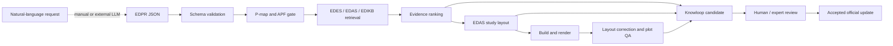

# Slay-ILS-Designer

Ontology-grounded engineering design support for subsea pipeline inline structures (ILS).

Slay-ILS-Designer turns a structured engineering problem into traceable retrieval, evidence-ranked study recommendations, inspectable EDAS layouts, plot-quality reports, and a Knowloop feedback candidate. It combines typed engineering knowledge with deterministic Python tools and defined LLM reasoning stages.

The current repository supports a complete run from an existing EDPR JSON file. Natural-language-to-EDPR parsing is specified by prompts and schemas, but still requires a manual or external LLM step.

## What the toolchain does

- Represents objectives, constraints, candidate families, evidence needs, and solver intent in EDPR.
- Validates EDPR schema structure and P-map/APF semantic completeness.
- Retrieves component knowledge from EDES, assembly rules and anchors from EDAS, and behavioral/numeric evidence from EDIKB.
- Produces a first-pass evidence ranking for retrieved study candidates.
- Maps a reviewed solver candidate to a known EDAS study layout without guessing unknown mappings.
- Builds and plots complete assemblies or individual components.
- Corrects bounded presentation issues such as label placement while preserving engineering geometry.
- Checks exported plots for missing content, clipping, scale, bounds, and unresolved layout problems.
- Records solution, layout, and visual findings as a Knowloop candidate for human/expert review.

The framework supports conceptual design inspection and evidence tracing. It does not replace project-specific calculations, FEA, fatigue assessment, installation analysis, or engineering approval.

## Workflow principles

1. **Represent the problem before retrieving.** EDPR must express APF intent, P-map nodes and links, formal requirements, retrieval targets, and the solver plan before knowledge is selected.
2. **Keep knowledge responsibilities separate.** EDPR defines the problem; EDES defines components; EDAS defines assemblies and layouts; EDIKB provides behavioral and numeric evidence; Knowloop records review candidates.
3. **Bound every conclusion by its evidence.** Study rankings apply only to the retrieved rows and stated domain. Missing or weak evidence becomes a limitation or future-study candidate.
4. **Do not invent layout mappings.** Solver-to-layout conversion uses exact EDAS anchors and explicit reviewed derivations. Unknown candidates fail with a machine-readable report.
5. **Keep engineering geometry immutable during plot QA.** The checker may move labels, leaders, legends, margins, or table presentation. It must not move components or change dimensions to make a plot look valid.
6. **Make every stage inspectable.** Runtime stages produce JSON or Markdown artifacts, explicit findings, exit codes, provenance, assumptions, and residual risks.
7. **Require review before knowledge promotion.** Knowloop candidates never modify official EDPR, EDES, EDAS, EDIKB, layouts, or tools automatically.
8. **Preserve source meaning and omissions.** Derived/default values are reported, while omitted design inputs remain omitted unless the model contract explicitly resolves them.

## Runtime workflow



The deterministic orchestrator is `tools/run_edpr_pipeline.py`. For an existing EDPR it runs validation, P-map/APF checking, retrieval, solving, optional layout/plot generation, and Knowloop emission.

Natural-language parsing remains outside the orchestrator. To prepare the parser input:

```bash
python tools/run_edpr_pipeline.py --problem-file problem.txt --output-dir runs/problem
```

This writes `edpr_parser_input.prompt.md`. Give that prompt to an LLM, validate the returned EDPR JSON, then run the deterministic pipeline.

## Knowledge layers

| Layer | Responsibility | Primary content |
| --- | --- | --- |
| EDPR | Problem representation and retrieval/solver intent | `schemas/EDPR_METASCHEMA.json`, parser prompts, examples |
| EDES | Component meaning, parameters, constraints, and behavior | `knowledge/edes/` |
| EDAS | Assembly topology, interfaces, rules, and layout anchors | `knowledge/edas/` |
| EDIKB | Behavior graph, uncertainty, guidance, and numeric evidence | `knowledge/edikb/` |
| Knowloop | Reviewable feedback candidates and promotion policy | `knowledge/knowloop/` |

APF-style requirements use `r = (Z, M, C)`:

| Field | Meaning |
| --- | --- |
| Z | Zone, domain, candidate set, condition, or evaluation region |
| M | Metric, response, feature, or validity measure |
| C | Constraint, comparison, objective, preference, or verification rule |

See [EDPR P-map/APF implementation](docs/EDPR_PMAP_APF_IMPLEMENTATION.md), [problem-map specification](docs/EDPR_Problem_Map_Spec.md), and [ontology crosswalk](docs/ONTOLOGY_CROSSWALK.md).

## Toolchain reference

| Tool | Application |
| --- | --- |
| `tools/EDPR_VALIDATOR.py` | JSON Schema and EDPR-specific validation |
| `tools/check_pmap_apf.py` | Semantic gate for usable P-map/APF content |
| `tools/retrieve_context.py` | Builds a traceable EDES/EDAS/EDIKB context package |
| `tools/solve_problem.py` | First-pass ranking of retrieved numeric study candidates |
| `tools/solution_to_layout.py` | Materializes a known solver candidate from EDAS anchors |
| `tools/plot_design.py` | Builds, renders, corrects, checks, and reports an assembly |
| `tools/plot_component.py` | Builds and reports an individual EDES component |
| `plotters/checkers/label_overlap_checker.py` | Bounded label, legend, margin, title, and table corrections |
| `plotters/checkers/plot_checker.py` | Export, content, bounds, clipping, and scale checks |
| `tools/generate_knowloop_candidate.py` | Records solution/layout/plot evidence for review |
| `tools/run_edpr_pipeline.py` | Orchestrates the deterministic workflow |

## Setup

Python 3.10 or newer is required.

```bash
python -m venv .venv
python -m pip install -r plotters/requirements.txt
```

On Windows, use `\.venv\Scripts\python.exe` instead of `python` if the environment is not activated. The requirements include NumPy, Matplotlib, PyYAML, and `jsonschema`. Validators can perform limited structural checks without `jsonschema`, but full schema validation requires it.

All commands below run from the repository root. Generated files under `runs/` are ignored by Git.

## Run the complete EDPR-to-plot workflow

```bash
python tools/run_edpr_pipeline.py --edpr-json knowledge/edpr/examples/EDPR_EXAMPLE_ILT_L_BRANCH_MIN_STRAIN.json --output-dir runs/ilt --solution-format json --plot
```

For the supplied example, the retrieved numeric evidence recommends `L-ST-PS`. The bridge reconstructs it from the reviewed `ILT-L-FT-PS` EDAS anchor and changes the branch support and association from fixed (`F`) to slotted (`S`) according to the stored FT/ST taxonomy.

The run writes artifacts using the EDPR filename stem:

| Artifact | Purpose |
| --- | --- |
| `*.retrieval_context.json` | Retrieved knowledge and evidence trace |
| `*.solution.json` or `*.solution.md` | Recommendation, basis, ranking, notes, and residual risk |
| `*.layout.json` | Materialized EDAS study definition |
| `*.layout.report.json` | Source anchor, derivation, warnings, and review requirement |
| `*.png` | Rendered assembly |
| `*.plot.report.json` | Build, correction, export, and visual QA findings |
| `*.knowloop_candidate.json` | Combined feedback candidate for review |

Using `--solution-format md --plot` also creates a structured JSON solution sidecar because layout generation consumes the solver JSON contract. Omit `--plot` to run validation, retrieval, solving, and Knowloop without layout rendering.

## Plot assemblies and components directly

```bash
python tools/plot_design.py --input plotters/examples/example_valve_layout.json --output runs/valve.png --report runs/valve.report.json
python tools/plot_design.py --input knowledge/edas/standard_ils_layouts.json --archetype ILS-ILT --output runs/ilt.png --report runs/ilt.report.json
python tools/plot_component.py --component GD-TP --set t_comp=0.042 --output runs/gd_tp.png
python tools/plot_design.py --input plotters/examples/example_boss_layout.json --output runs/boss.png
```

PNG, SVG, and PDF output are supported. Reports preserve builder findings, defaulted parameters, corrections, warnings, errors, and output paths. Input definitions are never rewritten.

Presentation lives in:

- `plotters/config/plot_style.yaml` for colors, fonts, line widths, figure sizes, and export DPI.
- `plotters/config/component_catalog.json` for component names, families, style mappings, renderer declarations, and plot support.
- `plotters/slay_config.yaml` for engineering defaults used by the existing geometry modules.

Presentation configuration must not contain engineering dimensions or redefine component meaning.

## Plot QA and status semantics

The CLI first builds the immutable engineering model, then applies bounded presentation correction, saves the figure, and runs basic QA.

- `passed`: implemented checks passed with no correction.
- `passed_with_corrections`: presentation changes resolved detected issues.
- `warning`: an image was produced, but findings or unresolved limitations remain.
- `failed`: construction, export, or QA failed.
- `not_applicable`: a check could not run for that output or execution stage.

The checker samples component nodes, extents, and contact envelopes; it is not an exhaustive geometry proof. PNG output is decoded and checked for visible variation. SVG is parsed as XML. PDF receives header/EOF checks but is not independently rasterized. Large parameter tables can produce tall figures, and leader-line crossings are not currently checked.

CLI exit codes are 0 for a produced image, including warnings; 1 for validation, execution, or QA failure; and 2 for command-line syntax errors.

## Knowloop feedback

Plot and layout reports can be passed to `tools/generate_knowloop_candidate.py` with `--layout-report` and `--plot-report`. Automated warnings or expert-review requirements make the design outcome partial; errors make it failed. The full report is retained in the evidence trace.

Human rating fields remain empty until a person supplies them. Promotion to an official knowledge layer requires expert acceptance and supporting evidence. See [Knowloop feedback workflow](docs/KNOWLOOP_FEEDBACK_WORKFLOW.md).

The orchestrated plotting path emits Knowloop feedback before returning a nonzero code for layout-mapping or plotting failures. Failures in earlier validation, retrieval, or solver stages remain fail-fast and are a current workflow gap.

## Engineering model notes

All 12 current EDES component codes have component and assembly rendering coverage. `GD-BrPipe` is a branch pipe part; `GD-B` is the multi-member branch subassembly.

`GD-BOSS` is modeled as a coaxial sleeve around the header. It does not replace the header. Its bore must be larger than the maximum enclosed header/thick-section OD across its full span. Boss steel contributes separately to mass and center of gravity. Sleeve-to-header attachment and load transfer remain unspecified, so every Boss assembly reports that limitation.

Solver-generated layouts are study reconstructions from EDAS anchors. They do not apply EDPR constraints to size a new design, create fabrication detail, or rerun structural analysis. Unknown candidate identifiers are rejected rather than matched heuristically.

## Repository layout

```text
framework_manifest.json                 Active manifest; read this first
superseded/                             Historical manifests only
schemas/                                EDPR, EDES, EDAS, and EDIKB metaschemas
knowledge/
  edpr/                                 Parser prompts and validated examples
  edes/                                 Component knowledge
  edas/                                 Assembly knowledge and standard layouts
  edikb/                                Behavior graph and numeric dataset
  knowloop/                             Candidate schema, templates, and review folders
plotters/
  config/                               Editable presentation catalog and style
  checkers/                             Layout correction and plot QA
  examples/                             Direct and solver-generated layout examples
  component_spec.py                     Geometry and engineering rules
  ils_builder.py                        Definition-to-assembly construction
  component_plotter.py                  Component rendering
  ils_plotter.py                        Assembly rendering
tools/                                  Validators, retrieval, solver, bridge, CLIs, tests
docs/                                   Framework and workflow documentation
runs/                                   Local generated artifacts; Git-ignored
```

Only the root [framework manifest](framework_manifest.json) is active. Files under `superseded/` are historical snapshots and must not be used as current runtime manifests.

## Verification

Run the plotter and solver integration suite:

```bash
python -m unittest discover -s tools -p "test_plot*.py"
```

The Phase 7 baseline is 29 tests. It covers CLI validation, configuration fallbacks, all 12 component renderers, Boss/header preservation, export checks, label correction, immutable geometry, solver-to-layout mapping, unknown-candidate failure, Knowloop schema validation, and the end-to-end EDPR plotting example.

The current framework release is manifest schema/version 0.4 with plotter migration Phases 1 through 7 implemented on `main`.

## Current limitations

- Natural-language parsing and the main reasoning step require an external/manual LLM integration.
- The first-pass solver groups retrieved rows by candidate and treats lower strain, moment, bending, or curvature responses as better. It does not yet apply full objective-specific weighting from EDPR `rankingCriteria`, and heterogeneous response values must not be treated as directly comparable without engineering review.
- EDIKB numeric evidence covers a bounded study domain. Recommendations outside that domain require project-specific evidence.
- Structured retrieval is implemented; vector-index retrieval is a future enhancement.
- Plot QA supports inspection and catches obvious presentation/export problems, but does not certify physical validity.
- Source-paper files referenced by knowledge provenance are not included in the current checkout.
