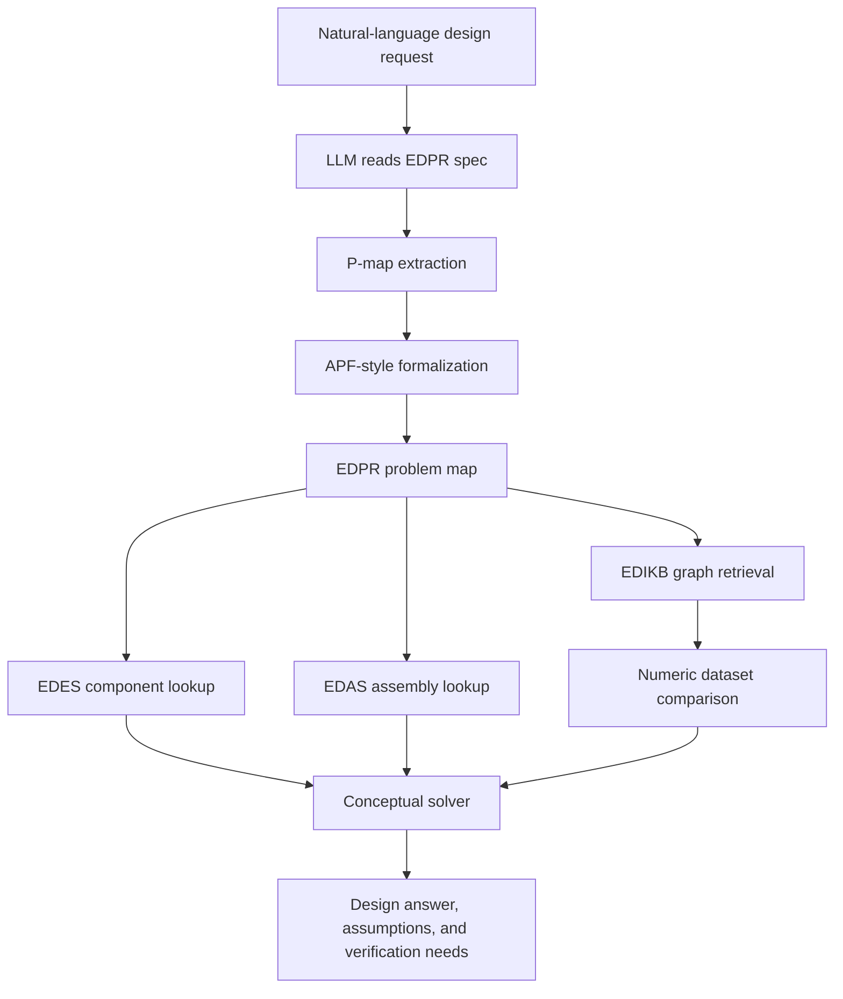
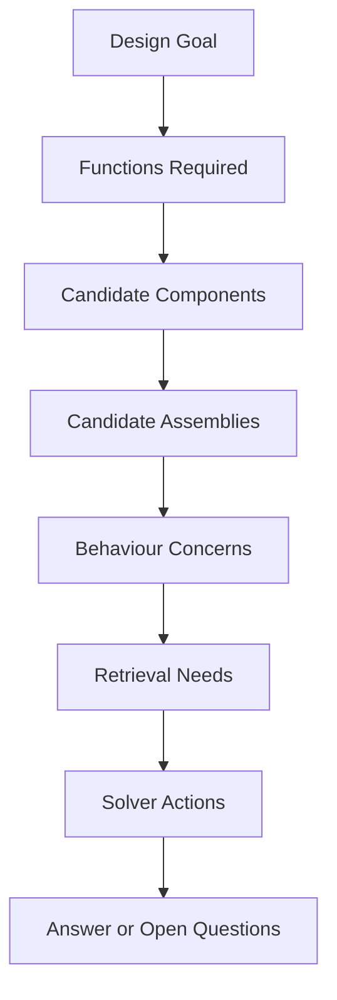

# EDPR Problem Map Specification v0.3

Working title: Engineering Design Problem Representation

Purpose: define how a natural-language engineering design request is converted into a structured, ontology-aligned problem map that can drive retrieval from EDES, EDAS, and EDIKB, and can later be formalized into solver-ready objectives, constraints, and evaluation logic.

This is a reviewable Markdown specification, not yet a strict JSON metaschema. The intent is to let us prototype the EDPR parser with LLM capability first, then formalize only the fields that prove useful.

## 1. Core Position

EDPR is the problem-understanding and problem-formalization layer of the AI4D design framework.

It does not replace the LLM. It gives the LLM a disciplined way to externalize what it understood from the user's design request.

Short definition:

> EDPR converts natural-language design intent into a structured problem map using the EDES, EDAS, and EDIKB ontology, then formalizes the mapped requirements into retrieval-ready and solver-ready checks.

Framework basis:

| Framework | Role Inside EDPR |
|---|---|
| P-Maps | Ontological structure for problem formulation: requirements, functions, artifacts, behaviours, and issues |
| APF via LLM | Formalization mechanism: converts natural-language requirements into objectives, constraints, executable/checkable functions, and ranking criteria |
| FBS | Engineering interpretation layer connecting function, expected behaviour, structure, and evaluation |
| Knowloop | Iterative reasoning loop for retrieval, inference, feedback, and refinement |

Layer responsibilities:

| Layer | Main Question | Content |
|---|---|---|
| EDES | What components exist? | Individual equipment/component knowledge under FBS-OAM |
| EDAS | How can components be assembled? | Assembly topology, ownership, nesting, chaining, placement, emit rules |
| EDIKB | What behaviour is expected? | Evidence-backed behaviour rules, numeric evidence rows, derived features, design guidance |
| Standard ILS Layout Library | What reusable full-layout templates can seed a design? | Archetypes and anchors such as ILS-EAST, ILS-EASB, and ILS-ILT, to be validated using EDAS and evaluated using EDIKB |
| EDPR | What is this problem asking, and how should it be formalized? | Design intent, knowns, unknowns, constraints, candidate components, candidate assemblies, retrieval plan, formalized checks, solver plan |

EDPR should be treated as a problem instance, not a permanent knowledge base.

## 1.1 Reference Basis

This EDPR draft uses two problem-formulation references as methodological support:

| Reference | EDPR Use |
|---|---|
| Dinar et al., "Problem Map: An Ontological Framework for a Computational Study of Problem Formulation in Engineering Design" | Provides the P-map entity model: requirement, function, artifact, behaviour, and issue; also supports hierarchy, sequence, alternatives, and problem/solution co-evolution |
| Li et al., "Solver-Independent Automated Problem Formulation via LLMs for High-Cost Simulation-Driven Design" | Provides the APF idea: use LLMs to convert natural-language requirements into formal objectives, constraints, evaluation variables, executable/checkable formulations, and candidate rankings without relying immediately on expensive solver feedback |

In this EDPR adaptation:

```text
P-Maps define the problem ontology.
APF defines the LLM formalization method.
EDPR combines both for ontology-bound, retrieval-ready, and solver-ready subsea structural design problems.
```

## 2. Why EDPR Exists

For an early prototype, an LLM can read:

- natural-language design question
- ontology crosswalk
- EDES schemas
- EDAS schemas
- EDIKB graph, Markdown, and dataset

Then it can reason directly.

That is enough to start. EDPR becomes useful when we want the reasoning step to be:

| Need | Why EDPR Helps |
|---|---|
| Repeatable | The same kind of request produces the same problem fields |
| Checkable | Missing inputs, assumptions, and selected ontology terms are visible |
| Debuggable | We can see whether an error came from parsing, retrieval, or reasoning |
| Automatable | A validated EDPR object can drive graph/database queries |
| Paper-worthy | It gives a formal middle layer between natural language and engineering knowledge |
| Reusable | The same pattern can later apply to other structural systems, not only subsea inline structures |

The practical philosophy is:

> Use the LLM for language understanding, require it to show its understanding as a structured P-map before solving, and use APF-style formalization when the problem needs objectives, constraints, ranking, FEA cases, or ML labels.

## 3. High-Level Workflow



The EDPR map should normally be produced before the final design answer.

Minimum solver sequence:

1. Parse the natural-language request into P-map entities.
2. Identify design goal, functions, constraints, known inputs, and unknown inputs.
3. Formalize requirements into objective requirements, constraint requirements, evaluation variables, and response metrics.
4. Select candidate EDES components.
5. Select candidate EDAS assembly patterns.
6. Identify behaviour concerns.
7. Retrieve applicable EDIKB behaviour rules and design guidance.
8. Retrieve comparable numeric evidence rows when quantitative comparison is needed.
9. State assumptions and confidence.
10. Recommend candidate concepts, ask clarifying questions, or generate FEA/ML evaluation cases.

## 4. EDPR Object Concept

An EDPR object should be a structured problem map containing nodes and links. In early use, a nested JSON object is acceptable. Later, the same information can be converted into a graph.

Recommended top-level sections:

| Section | Purpose |
|---|---|
| `problemIdentity` | Names this problem instance |
| `sourceRequest` | Preserves the user's original wording |
| `designContext` | Installation, pipeline, operational, and project context |
| `designIntent` | What the user wants to achieve |
| `knownInputs` | Values explicitly given by the user |
| `unknownInputs` | Required values that are missing |
| `requirements` | Required functions and performance outcomes |
| `constraints` | Limits, code criteria, fabrication limits, geometry limits, etc. |
| `requirementFormalization` | APF-style conversion of natural-language requirements into objectives, constraints, metrics, and check functions |
| `evaluationVariables` | Variables over which response is evaluated, such as arc length, station, component location, phase, or parameter sweep |
| `candidateComponents` | EDES components relevant to the problem |
| `candidateAssemblies` | EDAS topology patterns relevant to the problem |
| `standardLayoutCandidates` | Reusable standard layout archetypes or anchors relevant to the problem |
| `behaviourConcerns` | Responses that need checking |
| `retrievalPlan` | What EDES/EDAS/EDIKB information must be retrieved |
| `numericComparisonPlan` | What dataset rows or features are needed |
| `interactionEffectPlan` | How multi-component effects, feature interactions, and possible superposition are handled |
| `solverPlan` | How the design agent should reason or compare options |
| `rankingCriteria` | How candidate options should be ordered when several feasible options exist |
| `openQuestions` | Clarifications needed from the user |
| `assumptions` | Temporary assumptions made so reasoning can proceed |
| `evidenceTrace` | Records what knowledge sources support the solution |

## 5. Problem Map Node Types

EDPR should expose the problem as nodes. Each node should have an explicit ID, a node type, a human-readable label, and links to ontology terms where possible.

Suggested ID style:

```text
edpr:<problem_id>:<node_type>:<local_name>
```

Example:

```text
edpr:p001:component:gd_tp
edpr:p001:behaviour:peak_pipeline_strain
edpr:p001:retrieval:gdsh_gdtp_c1_rules
```

### 5.1 DesignGoal

Captures the main task.

Examples:

| Field | Example |
|---|---|
| `id` | `edpr:p001:goal:concept_design` |
| `type` | `DesignGoal` |
| `statement` | Design a conceptual subsea inline structure for S-lay installation |
| `goalClass` | `conceptual_design`, `option_comparison`, `screening`, `optimization`, `verification_planning` |

### 5.2 DesignContext

Captures where the problem lives.

Important context categories:

| Category | Examples |
|---|---|
| installation method | `S-lay`, `J-lay`, reel-lay |
| installation region | overbend, sagbend, touchdown |
| pipeline context | OD, WT, material, coating, water depth |
| vessel/stinger context | stinger radius, roller spacing, top tension |
| analysis context | conceptual screening, FE verification, code check |

For the current EDIKB Paper 1 work, the main context is:

```text
installation_method = S-lay
installation_region = overbend
roller_spacing_m = 9.0 where Paper 1 data is used
```

### 5.3 FunctionalRequirement

Captures what the design must do.

Examples:

| Function | Possible EDES/EDAS Link |
|---|---|
| provide local wall thickening | `edes:GD-TP` |
| provide tapered transition | `edes:GD-TT` |
| provide offset/contact shroud | `edes:GD-SH` |
| allow assembly nesting | `edas:GD-SH_contains_GD-TP` |
| reduce installation strain | EDIKB behaviour rules and dataset |

### 5.4 KnownInput

Captures explicit values in the user request.

Examples:

| Field | Example |
|---|---|
| `parameter` | `pipe_OD_m` |
| `value` | `0.4064` |
| `unit` | `m` |
| `source` | user request |
| `ontologyLink` | EDES/EDIKB feature name if available |

### 5.5 UnknownInput

Captures missing information that affects correctness.

Typical unknowns:

| Unknown | Why It Matters |
|---|---|
| pipe OD | Required for strain, length ratios, and local influence zones |
| pipe WT | Required for stiffness ratio and strain response |
| component WT | Required for GD-TP stiffness ratio |
| component length | Major GD-TP behaviour driver |
| shroud offset depth V | Major GD-SH behaviour driver |
| shroud L1/L2 | Needed for GD-SH region and contact regime |
| roller spacing | Needed for length/spacing features and multi-roller effects |
| stinger radius | Major installation context variable |
| top tension | Affects baseline and component response |
| code basis | Separates strain checks from component-body stress/BM checks |

Unknowns should not be silently invented. EDPR may carry assumptions, but assumptions must be visible.

### 5.6 CandidateComponent

Maps the problem to EDES components.

Examples:

| User Wording | Candidate EDES Component |
|---|---|
| thickened pipe, increased wall section, local wall build-up | `edes:GD-TP` |
| tapered transition, taper piece | `edes:GD-TT` |
| guide shroud, offset shroud, contact shroud | `edes:GD-SH` |
| valve, inline valve | `edes:GD-VLV` when available |
| HD pipe | `edes:GD-HdPipe` when available |
| top structure, top frame, external attachment top structure, EA-ST | `edes:GD-ST` |
| base structure, bottom frame, cradle below pipe, EA-SB | `edes:GD-SB` |
| connector, pin, slot, deadband, fixed support, F1/F2/PS/PSD | `edes:GD-Con` |
| branch layout, branch piping layout, inline tee, ILT | `edes:GD-B` |
| branch pipe, branch member, branch run, branch riser | `edes:GD-BrPipe` |
| boss, connector boss, pad, bulkhead interface | `edes:GD-BOSS` |

Each candidate component should include:

| Field | Meaning |
|---|---|
| `componentId` | EDES ID |
| `selectionReason` | Why the parser selected it |
| `confidence` | high, medium, low |
| `sourcePhrase` | User phrase that triggered the mapping |

### 5.7 CandidateAssembly

Maps the problem to EDAS topology.

Current useful EDAS patterns:

| Assembly Pattern | Meaning |
|---|---|
| `edas:chain` | Components arranged sequentially along pipe axis |
| `edas:nested` | One component region contains or overlaps another |
| `edas:off_line_contact` | Contact component affects pipe without owning pipe section |
| `edas:repeated_inline_components` | Repeated component set with spacing |
| `edas:GD-SH_contains_GD-TP` | GD-TP located inside GD-SH shroud/contact zone |
| `edas:external_attachment_top_structure` or unresolved local EDPR candidate | GD-ST connected to header pipe through connector system |
| `edas:external_attachment_base_structure` or unresolved local EDPR candidate | GD-SB below pipe, often contact-owning, connected back to pipe through connectors |
| `edas:branch_layout` or unresolved local EDPR candidate | Inline tee/branch layout with header, branch pipe, support connector, and top structure |

EDPR should not decide build validity by itself. It should identify likely assembly patterns and request EDAS validation.

### 5.7A StandardLayoutCandidate

Maps the problem to reusable full-layout archetypes. This is separate from EDAS:

- EDAS says whether an assembly can be built and how its parts connect.
- The standard layout library gives named starting templates/anchors.
- EDIKB says what behaviour has been observed or hypothesized for those layouts.

Current standard layout families:

| Standard Layout | Meaning |
|---|---|
| `ILS-TP` | thick pipe layout |
| `ILS-TT` | taper/thick transition layout |
| `ILS-SH` | shroud layout |
| `ILS-SHTP` | shroud plus thick pipe layout |
| `ILS-EAST` | external top structure family |
| `ILS-EASB` | external base structure family |
| `ILS-ILT` | inline tee / branch layout family |

Current useful anchors:

| Family | Anchors |
|---|---|
| `ILS-EAST` | `ILS-EAST-F1`, `ILS-EAST-F1D`, `ILS-EAST-F2`, `ILS-EAST-F2D`, `ILS-EAST-PS`, `ILS-EAST-PSD` |
| `ILS-EASB` | `ILS-EASB-F1`, `ILS-EASB-F1D`, `ILS-EASB-F2`, `ILS-EASB-F2D`, `ILS-EASB-PS`, `ILS-EASB-PSD` |
| `ILS-ILT` | `ILT-L-FT-F1p`, `ILT-L-ST-F1p`, `ILT-L-FT-F2`, `ILT-L-FT-F2D`, `ILT-L-FT-PS`, `ILT-L-FT-PSD`, `ILT-Z-FT-F1p`, `ILT-Z-ST-F1p`, `ILT-Z-FT-F2`, `ILT-Z-FT-F2D`, `ILT-Z-FT-PS`, `ILT-Z-FT-PSD` |

### 5.8 BehaviourConcern

Captures what the design needs to check.

Current EDIKB behaviour concerns:

| Behaviour Concern | Typical Trigger |
|---|---|
| `peak_pipeline_strain` | installation strain, overbend strain, DNV strain check |
| `peak_component_bending_moment` | thick body, component capacity, ASME VIII concern |
| `governing_phase` | phase of roller passage or contact state |
| `peak_location` | where the peak strain occurs |
| `source_response_region_relation` | whether source and response regions coincide |
| `contact_regime` | single-roller or dual-roller behaviour |
| `connection_system_effect` | F1/F1D/F2/F2D/PS/PSD connector arrangement changes response |
| `low_strain_pocket` | EA-ST or EA-SB creates locally low strain inside the structure span |
| `high_strain_penalty` | connection system reduces one region but increases another |
| `contact_ownership` | roller reaction is carried by pipe, shroud, or base structure |
| `branch_header_branch_response` | branch and header responses differ and must be evaluated separately |
| `added_mass_position_effect` | mass position/distribution modifies response |
| `feature_interaction` | combined layout behaviour depends on component coupling rather than simple effect addition |

Important current rule:

> Pipeline strain and component-body bending moment must remain separate behaviour concerns.

This follows from EDIKB Paper 1 cross-cutting rule `edikb:p1_cross_strain_bm_diverge_01`.

### 5.9 RequirementFormalization

This is the APF-inspired part of EDPR. It converts natural-language requirements into checkable forms.

APF uses the idea that an engineering requirement can be formalized as:

```text
r = (Z, M, C)
```

For our EDPR use:

| APF Element | EDPR Meaning | Subsea Example |
|---|---|---|
| `Z` | evaluation region, condition, or domain | overbend region, shroud X2, Phase 2, GD-TP length sweep |
| `M` | response metric or derived metric | peak pipeline strain, peak component BM, stiffness ratio |
| `C` | intent/check | minimize, keep below limit, compare, rank, avoid, maximize clearance |

This is useful because many design statements are not just component requests. They are hidden objectives and constraints.

Example:

```text
"Keep installation strain low for a thick pipe inside a guide shroud."
```

Formalized EDPR requirements:

| Requirement Type | Formal Meaning |
|---|---|
| objective | minimize `peak_pipeline_strain` in S-lay overbend |
| constraint | assembly must be valid under EDAS |
| constraint | do not estimate C1 by simple isolated-rule superposition |
| check | retrieve C1 Paper 1 behaviour and numeric comparison rows |
| secondary check | evaluate `peak_component_bending_moment` for GD-TP body |

Recommended fields:

| Field | Meaning |
|---|---|
| `requirementId` | local EDPR ID |
| `sourcePhrase` | phrase from user request |
| `requirementType` | `objective`, `constraint`, `preference`, `comparison`, `verification_need` |
| `evaluationRegion` | where the check applies |
| `metric` | response metric or derived feature |
| `condition` | threshold, minimize/maximize, rank, avoid, compare |
| `formalExpression` | optional expression or pseudo-code |
| `ontologyLinks` | EDES/EDAS/EDIKB IDs connected to the requirement |
| `confidence` | parser confidence |

## 5A. Interaction Effect Plan

For any layout containing more than one behaviour-producing component or assembly feature, EDPR should include an `interactionEffectPlan`.

Purpose: make the solver explicitly decide whether total layout response is supported by direct combined evidence, a validated superposition rule, a cautious conceptual assumption, or a future FEA/ML study candidate.

EDPR principle:

```text
Direct combined-case evidence > validated superposition rule > cautious assumption > future FEA/ML candidate
```

Recommended fields:

| Field | Meaning |
|---|---|
| `componentSet` | EDES components or EDAS subassemblies whose effects may interact |
| `assemblyPattern` | EDAS pattern that creates the interaction context |
| `isolatedEffectRules` | EDIKB rules for individual component effects |
| `combinedEffectRules` | EDIKB rules for directly studied combined behaviour |
| `interactionCandidateRules` | EDIKB `MLStudyCandidate` or `BehaviourCorrelationCandidate` nodes for missing/suspected interactions |
| `simpleSuperpositionAllowed` | `yes`, `no`, or `assumption_only` |
| `candidateEquationForms` | possible future ML/statistical equations for interaction terms |
| `verificationNeed` | `none`, `dataset_lookup`, or `future_fea_ml_study` |

The solver should not sum or subtract component effects as a proven result unless EDIKB contains evidence that the operation is valid for the current assembly pattern and response metric.

Candidate equation forms:

```text
Y = b0 + sum(bi*xi) + sum(bij*xi*xj)
DeltaY_layout = DeltaY_A + DeltaY_B + DeltaY_AB
Y = f(isolated_effects, interaction_terms, assembly_pattern)
```

Example handling:

| Layout | EDPR handling |
|---|---|
| GD-SH + GD-TP | retrieve known C1 non-additive combined evidence; block simple summation |
| EA-SB F2 + GD-TP + GD-SH-like elevation | retrieve available EA-SB/GD-TP/GD-SH evidence; mark interaction equation as future ML/FEA candidate |
| branch layout with top structure and connectors | retrieve branch layout combined evidence before isolated connector/structure effects |

### 5.10 EvaluationVariable

Evaluation variables define the independent domain over which a response or requirement is checked.

In the APF paper, the example domain is often a frequency range. For subsea installation design, the equivalent may be geometric position, installation phase, roller contact state, or parametric design variable.

Examples:

| Evaluation Variable | Meaning |
|---|---|
| `x_station` | pipe/assembly station along the longitudinal axis |
| `response_region` | X2, X3, X4, taper toe, weld edge, far field |
| `installation_phase` | Phase 1, Phase 2, Phase 3 |
| `component_length_D` | component length sweep in OD multiples |
| `shroud_V_D` | shroud offset/depth sweep |
| `roller_spacing_m` | stinger roller spacing |
| `stinger_radius_m` | installation curvature context |
| `connection_system` | F1, F1D, F2, F2D, PS, PSD |
| `connector_location` | connector parameters such as `P_c1`, `P_c2`, `P_bc`, `P_b1`, `P_b2` |
| `connector_gap` | deadband gap `P_gap` |
| `connector_stiffness` | connector stiffness `k_t` |
| `response_region` | Paper 2 labels such as `X_c`, `X_i`, `X_i1`, `X_i2`, and `X_e` |
| `branch_layout_id` | layout identifier such as `L-FT-F2` or `Z-FT-PS` |
| `combined_stiffness_ratio` | EA-ST/EA-SB frame plus pipe stiffness divided by same length of pipe stiffness |

### 5.11 FormalizedCheck

Formalized checks are APF-style outputs that can later become executable Python functions, graph filters, or dataset filters.

Check types:

| Check Type | Example |
|---|---|
| objective check | minimize peak pipeline strain |
| threshold constraint | peak strain must be below project limit |
| assembly validity check | validate topology using EDAS |
| behaviour applicability check | find whether EDIKB evidence covers requested case |
| ranking check | rank candidate layouts by strain first, then BM, then confidence |
| verification check | send outside-domain cases to FEA |

Example pseudo-expression:

```text
objective:
  minimize max(pipeline_strain_percent over overbend_region)

constraint:
  EDAS_validate(edas:GD-SH_contains_GD-TP) == true

evidence_check:
  retrieve EDIKB rules where appliesTo includes edas:GD-SH_contains_GD-TP
```

### 5.12 RankingCriteria

Ranking criteria are needed when the user asks to compare options or when the solver proposes alternatives.

APF's useful idea here is listwise ranking: compare all candidate instances together against the same requirement set.

For EDPR, candidate layouts should be ranked by:

1. Feasibility against hard constraints.
2. Satisfaction of primary objectives.
3. Satisfaction of secondary objectives.
4. Evidence confidence.
5. Need for additional FEA/ML verification.

Example:

| Rank Stage | Subsea Design Meaning |
|---|---|
| hard feasibility | assembly valid under EDAS, no section/contact conflict |
| primary objective | lower `peak_pipeline_strain` |
| secondary objective | lower `peak_component_bending_moment` |
| evidence confidence | candidate is inside Paper 1/EDIKB evidence domain |
| verification burden | fewer unresolved unknowns or outside-domain assumptions |

### 5.13 RetrievalQuery

Captures what the system should retrieve before solving.

Retrieval queries should be explicit and typed.

| Query Type | Example |
|---|---|
| `component_definition` | retrieve `edes:GD-TP` |
| `assembly_rule` | retrieve `edas:GD-SH_contains_GD-TP` |
| `behaviour_rule` | retrieve rules applying to `edes:GD-TP` and `peak_pipeline_strain` |
| `numeric_evidence` | retrieve rows for `componentSystem = GD-TP`, `responseMetric = peak_pipeline_strain` |
| `design_guidance` | retrieve guidance linked to selected behaviour rules |
| `missing_case_check` | check whether evidence exists for the requested geometry |

### 5.14 SolverDecision

Records key reasoning decisions made by the design agent.

Examples:

| Decision | Example |
|---|---|
| candidate accepted | `GD-SH + GD-TP is build-valid subject to EDAS nesting rule` |
| candidate rejected | `Do not use isolated GD-SH + isolated GD-TP superposition for C1 response` |
| clarification required | `Pipe OD and roller spacing missing; cannot compute ratio features` |
| analysis escalation | `Run FEA because requested geometry is outside Paper 1 evidence domain` |

## 6. Recommended EDPR JSON Shape

This is not final schema syntax. It is the recommended object shape for prototype parsing.

```json
{
  "schema": "edpr-problem-map/0.3-draft",
  "id": "edpr:p001",
  "sourceRequest": {
    "rawText": "Design an inline structure with guide shroud and thick pipe to reduce S-lay overbend strain.",
    "language": "en"
  },
  "problemIdentity": {
    "title": "GD-SH plus GD-TP conceptual design screening",
    "problemClass": "conceptual_design",
    "domain": "subsea_inline_structure"
  },
  "designContext": {
    "installationMethod": "S-lay",
    "installationRegion": "overbend",
    "analysisStage": "conceptual_screening"
  },
  "designIntent": [
    {
      "id": "edpr:p001:goal:reduce_installation_strain",
      "type": "DesignGoal",
      "statement": "Reduce peak pipeline strain during S-lay overbend installation."
    }
  ],
  "knownInputs": [],
  "unknownInputs": [
    {
      "id": "edpr:p001:unknown:pipe_od",
      "parameter": "pipe_OD_m",
      "reasonNeeded": "Required for OD-normalized features and comparison with Paper 1 evidence rows."
    }
  ],
  "requirementFormalization": {
    "basis": "APF-inspired requirement tuple r = (Z, M, C)",
    "objectiveRequirements": [
      {
        "id": "edpr:p001:req:obj_minimize_strain",
        "sourcePhrase": "reduce S-lay overbend strain",
        "requirementType": "objective",
        "evaluationRegion": "S-lay overbend",
        "metric": "peak_pipeline_strain",
        "condition": "minimize",
        "formalExpression": "minimize max(pipeline_strain_percent over overbend_region)",
        "ontologyLinks": ["edikb:p1_c1_shtp_location_01", "edikb:p1_cross_position_governs_01"],
        "confidence": "high"
      }
    ],
    "constraintRequirements": [
      {
        "id": "edpr:p001:req:constraint_valid_assembly",
        "sourcePhrase": "guide shroud and thick pipe",
        "requirementType": "constraint",
        "evaluationRegion": "assembly topology",
        "metric": "EDAS_build_validity",
        "condition": "must_be_valid",
        "formalExpression": "EDAS_validate(edas:GD-SH_contains_GD-TP) == true",
        "ontologyLinks": ["edas:GD-SH_contains_GD-TP"],
        "confidence": "medium"
      }
    ],
    "formalizedChecks": [
      {
        "id": "edpr:p001:check:no_c1_superposition",
        "checkType": "behaviour_applicability",
        "statement": "Use C1 assembly rules for GD-SH plus GD-TP; do not estimate response by simple addition of isolated GD-SH and GD-TP rules.",
        "ontologyLinks": ["edikb:p1_cross_no_simple_superposition_01", "edikb:p1_c1_shtp_nonadditive_01"]
      }
    ]
  },
  "evaluationVariables": [
    {
      "id": "edpr:p001:evalvar:response_region",
      "name": "response_region",
      "allowedValues": ["X2", "X3", "X4", "near_field", "far_field"],
      "reason": "C1 response depends on source and response region relation."
    }
  ],
  "candidateComponents": [
    {
      "id": "edpr:p001:component:gd_sh",
      "componentId": "edes:GD-SH",
      "selectionReason": "User requested a guide shroud.",
      "confidence": "high",
      "sourcePhrase": "guide shroud"
    },
    {
      "id": "edpr:p001:component:gd_tp",
      "componentId": "edes:GD-TP",
      "selectionReason": "User requested thick pipe.",
      "confidence": "high",
      "sourcePhrase": "thick pipe"
    }
  ],
  "candidateAssemblies": [
    {
      "id": "edpr:p001:assembly:gdsh_contains_gdtp",
      "assemblyPatternId": "edas:GD-SH_contains_GD-TP",
      "status": "requires_EDAS_validation",
      "reason": "The request combines a shroud/contact component with a thick pipe section."
    }
  ],
  "standardLayoutCandidates": [],
  "behaviourConcerns": [
    {
      "id": "edpr:p001:behaviour:peak_pipeline_strain",
      "responseMetric": "peak_pipeline_strain",
      "priority": "high",
      "reason": "User requested strain reduction."
    },
    {
      "id": "edpr:p001:behaviour:component_bm",
      "responseMetric": "peak_component_bending_moment",
      "priority": "medium",
      "reason": "GD-TP body bending moment can diverge from pipeline strain."
    }
  ],
  "retrievalPlan": [
    {
      "id": "edpr:p001:retrieval:component_defs",
      "queryType": "component_definition",
      "targets": ["edes:GD-SH", "edes:GD-TP"]
    },
    {
      "id": "edpr:p001:retrieval:assembly_rules",
      "queryType": "assembly_rule",
      "targets": ["edas:GD-SH_contains_GD-TP"]
    },
    {
      "id": "edpr:p001:retrieval:c1_behaviour",
      "queryType": "behaviour_rule",
      "targets": [
        "edikb:p1_c1_shtp_nonadditive_01",
        "edikb:p1_c1_shtp_location_01",
        "edikb:p1_cross_no_simple_superposition_01"
      ]
    }
  ],
  "numericComparisonPlan": [
    {
      "id": "edpr:p001:numeric:c1_rows",
      "dataset": "EDIKB_PAPER1_ML_DATASET_v0_2.csv",
      "filters": {
        "component_system": "GD-SH+GD-TP",
        "response_metric": ["peak_pipeline_strain", "peak_component_bending_moment"]
      },
      "purpose": "Compare C1 candidate layouts against Paper 1 evidence."
    }
  ],
  "interactionEffectPlan": [
    {
      "id": "edpr:p001:interaction:c1_shtp",
      "type": "feature_interaction_check",
      "componentSet": ["edes:GD-SH", "edes:GD-TP"],
      "assemblyPattern": "edas:GD-SH_contains_GD-TP",
      "isolatedEffectRules": ["edikb:p1_b1_sh_v_01", "edikb:p1_a1_tp_wt_01"],
      "combinedEffectRules": ["edikb:p1_c1_shtp_nonadditive_01", "edikb:p1_c1_shtp_location_01"],
      "interactionCandidateRules": [],
      "superpositionPolicy": "direct_combined_evidence_overrides_isolated_effect_summation",
      "simpleSuperpositionAllowed": "no",
      "candidateEquationForms": [
        "Y = b0 + sum(bi*xi) + sum(bij*xi*xj)",
        "DeltaY_layout = DeltaY_GDSH + DeltaY_GDTP + DeltaY_GDSH_GDTP"
      ],
      "requiredDatasetQueries": ["edpr:p001:numeric:c1_rows"],
      "verificationNeed": "dataset_lookup"
    }
  ],
  "rankingCriteria": [
    {
      "id": "edpr:p001:rank:default",
      "method": "APF-style listwise ranking",
      "order": [
        "satisfy hard constraints",
        "minimize peak pipeline strain",
        "check component bending moment",
        "prefer higher evidence confidence",
        "flag lower FEA/ML verification burden"
      ]
    }
  ],
  "openQuestions": [
    "What are pipe OD and WT?",
    "What are stinger radius, roller spacing, and top tension?",
    "What GD-SH offset depth V and GD-TP length are being considered?"
  ],
  "assumptions": [],
  "evidenceTrace": []
}
```

## 7. EDPR-APF Parser Behaviour

The EDPR-APF parser is the LLM instruction set that converts natural language to the EDPR object.

It has two internal stages:

| Stage | Basis | Output |
|---|---|---|
| P-map extraction | P-Maps | requirements, functions, artifacts, behaviours, issues, links, unknowns |
| APF formalization | APF via LLM | objective requirements, constraint requirements, evaluation variables, formalized checks, ranking criteria |

The parser should not jump directly from user text to final design recommendation. It should first expose the problem representation.

### 7.1 Parser Inputs

The parser should receive:

1. User natural-language request.
2. EDPR Problem Map Specification.
3. EDES/EDAS/EDIKB ontology crosswalk.
4. Available EDES component schemas or their indexed summaries.
5. Available EDAS assembly schema or indexed summary.
6. Available EDIKB graph/schema or indexed summary.

For a prototype, the parser can work with Markdown summaries and JSON files in context. Later, it should retrieve the relevant portions through vector search and graph lookup.

### 7.2 Parser Output

The parser should output:

1. EDPR JSON problem map.
2. A short human-readable parse summary.
3. APF-style requirement formalization.
4. Clarifying questions if blocking inputs are missing.
5. Retrieval targets for EDES, EDAS, EDIKB, and dataset rows.
6. Ranking criteria when options must be compared.

### 7.3 Parser Rules

The parser should follow these rules:

| Rule | Instruction |
|---|---|
| Preserve original request | Always keep the raw user text in `sourceRequest.rawText` |
| Use ontology IDs | Prefer IDs such as `edes:GD-TP`, `edas:GD-SH_contains_GD-TP`, `edikb:p1_c1_shtp_location_01` |
| Separate knowns and assumptions | Do not convert assumed values into known inputs |
| Separate component and assembly | EDES identifies parts; EDAS identifies valid assembly patterns |
| Check interaction before summing | For multi-component layouts, retrieve direct combined evidence and interaction candidates before adding/subtracting isolated effects |
| Mark uncertain superposition | If only isolated evidence exists, any summed estimate must be an explicit assumption and verification need |
| Separate semantic and numeric retrieval | EDIKB graph gives rules; dataset rows give numeric comparison |
| Formalize requirements | Convert user intent into objectives, constraints, metrics, and evaluation regions |
| Preserve requirement semantics | If requirements are paraphrased, preserve all numbers, units, conditions, and intent |
| Separate objectives and constraints | A target to optimize is not the same as a hard requirement |
| Use listwise ranking for alternatives | When comparing options, rank all candidates against the same requirement set |
| Do not superpose combined mechanisms blindly | If combined behaviour exists in EDIKB, retrieve assembly-level rules |
| Mark sparse evidence | If evidence is limited, preserve uncertainty and future evaluation need |
| Ask only blocking questions | If enough information exists for conceptual screening, proceed with assumptions clearly marked |

## 8. Problem Map Relationship Types

EDPR can later be represented as a graph. Suggested relationship vocabulary:

| Relationship | Meaning |
|---|---|
| `hasGoal` | Problem has design goal |
| `hasContext` | Problem has installation or project context |
| `hasKnownInput` | Problem includes explicit input |
| `hasUnknownInput` | Problem is missing an input |
| `requiresFunction` | Problem requires a function |
| `selectsComponentCandidate` | Problem may use an EDES component |
| `selectsAssemblyCandidate` | Problem may use an EDAS pattern |
| `requiresBehaviourCheck` | Problem must evaluate a behaviour response |
| `formalizesRequirementAs` | Natural-language requirement becomes objective, constraint, preference, or verification need |
| `hasEvaluationVariable` | Requirement is evaluated over a domain such as phase, region, station, or parameter sweep |
| `hasFormalizedCheck` | Problem includes solver-ready or retrieval-ready check |
| `hasRankingCriteria` | Problem has option-ranking logic |
| `requiresRetrieval` | Problem requires knowledge retrieval |
| `queriesGraphRule` | Retrieval points to EDIKB behaviour rules |
| `queriesDatasetRows` | Retrieval points to numeric evidence rows |
| `raisesOpenQuestion` | Parser needs clarification |
| `makesAssumption` | Solver proceeds with visible assumption |
| `recordsEvidenceTrace` | Final answer cites retrieved evidence |

## 9. Retrieval Planning

EDPR should make retrieval explicit. This is where EDPR becomes useful for hybrid RAG.

### 9.1 Semantic Retrieval

Semantic retrieval should use:

- EDES component descriptions
- EDAS assembly descriptions
- EDIKB Markdown behaviour rules
- ontology crosswalk
- design guidance text

This can be vector-indexed because the query may be natural language:

```text
"guide shroud with thick pipe inside and installation strain concern"
```

The vector index finds relevant text such as:

- `edes:GD-SH`
- `edes:GD-TP`
- `edas:GD-SH_contains_GD-TP`
- `edikb:p1_c1_shtp_location_01`
- `edikb:guidance_keep_gdtp_out_of_shroud_x2`

### 9.2 Graph Retrieval

Graph retrieval should use explicit IDs and edges:

```text
component = edes:GD-TP
response = peak_pipeline_strain
find BehaviourRule where appliesTo includes component
find DesignGuidance linked from those rules
find EvidenceDataRow supporting those rules
```

Graph retrieval is better when the problem has already been parsed into EDPR ontology terms.

### 9.3 Numeric Dataset Retrieval

Numeric retrieval should use tabular filters and computed features.

Examples:

| Need | Dataset Query |
|---|---|
| compare GD-TP length effect | `component_system = GD-TP`, `study_family = component_length` |
| compare GD-SH offset effect | `component_system = GD-SH`, `study_family = shroud_run_matrix` |
| compare C1 nested cases | `component_system = GD-SH+GD-TP` |
| compare source region effect | `source_region = X2/X3/X4` or equivalent C1 feature |
| compare strain and BM | retrieve both `peak_pipeline_strain` and `peak_component_bending_moment` |

The EDPR parser should not only ask for rules. If quantitative comparison is requested, it must include a `numericComparisonPlan`.

## 10. P-Map Interpretation

The P-map is the internal reasoning scaffold for EDPR.

For this framework, a P-map is not just a mind map. It is a structured map of the design problem:



Useful P-map clusters:

| Cluster | Typical Nodes |
|---|---|
| Intent cluster | Design goal, objective, target response |
| Context cluster | installation method, pipe data, stinger data, code basis |
| Structure cluster | EDES components, EDAS assembly patterns |
| Behaviour cluster | strain, BM, phase, location, contact regime |
| Evidence cluster | EDIKB rules, anchors, dataset rows, confidence |
| Decision cluster | candidate ranking, assumptions, FEA/ML needs |

The P-map lets us inspect the reasoning before the solver produces a final design answer.

## 11. EDPR and FBS

EDPR maps the user's problem into FBS language.

| FBS Element | EDPR Role |
|---|---|
| Function | Captured as required design functions and user intent |
| Expected Behaviour | Retrieved from EDIKB behaviour rules |
| Structure | Selected from EDES components and EDAS assemblies |
| Behaviour From Structure | Predicted by EDIKB, ML surrogate, or FEA program |
| Evaluation | Solver compares predicted behaviour against requirements and constraints |

Example:

| User Statement | EDPR FBS Interpretation |
|---|---|
| "Need a guide shroud" | Structure candidate: `edes:GD-SH` |
| "with thick pipe inside" | Assembly candidate: `edas:GD-SH_contains_GD-TP` |
| "reduce S-lay strain" | Function/performance intent: reduce `peak_pipeline_strain` |
| "compare two options" | Evaluation need: retrieve numeric evidence and rank options |

## 12. EDPR and APF

Automated Problem Formulation via LLMs is useful for EDPR because it addresses a specific gap: natural-language engineering requirements must eventually become formal objectives, constraints, and evaluation logic.

In our framework, APF is not the whole problem representation. It is the formalization mechanism inside EDPR.

| APF Concept | EDPR Adaptation |
|---|---|
| natural-language requirement | user design statement or requirement phrase |
| requirement tuple `r = (Z, M, C)` | evaluation region/condition, metric, and intent/check |
| design parameter `x` | EDES/EDAS design variables such as component length, wall thickness, offset depth, spacing |
| solver response `S(x)` | EDIKB evidence row, ML surrogate result, or Python FEA result |
| generated equation/code | formalized check, dataset filter, or future executable Python objective/constraint |
| test instance ranking | listwise ranking of candidate layouts/options |
| solver-independent evaluation | LLM/rule/dataset-based comparison before expensive FEA |

For subsea inline-structure conceptual design, the EDPR APF tuple becomes:

```text
r = (Z, M, C)

Z = evaluation region or design condition
M = response metric or derived feature
C = objective, constraint, preference, comparison, or verification rule
```

Examples:

| Natural-Language Requirement | Z | M | C |
|---|---|---|---|
| Keep overbend strain low | S-lay overbend | `peak_pipeline_strain` | minimize |
| Avoid placing thick pipe in the worst shroud region | GD-SH X2/X3/X4 regions | `source_response_region_relation` | avoid source overlapping X2 |
| Check component body demand | GD-TP body | `peak_component_bending_moment` | evaluate separately |
| Compare two layouts | candidate option set | strain, BM, evidence confidence | rank listwise |
| Use valid nested assembly only | EDAS topology | `EDAS_build_validity` | must be true |

This is where EDPR can later connect directly to your Python FEA program. The parser can convert the problem into formalized checks and candidate cases; the FEA program can evaluate `S(x)`; then EDPR/EDIKB can compare the responses against the requirement tuple.

APF also suggests a future training route:

1. Use historical FEA/EDIKB cases to create valid requirement-response examples.
2. Generate paraphrases of requirements while preserving numbers, units, and conditions.
3. Ask the LLM to produce formalized checks or Python-style objective/constraint functions.
4. Rank candidate cases using EDIKB/FEA evidence.
5. Keep only high-alignment examples for future parser fine-tuning.

For the current prototype, we do not need fine-tuning. We use APF as a prompting and structuring method. Fine-tuning can come later if repeated EDPR parsing becomes important enough.

## 13. EDPR and Knowloop

EDPR also supports Knowloop-style reasoning by separating:

| Knowloop Role | EDPR Equivalent |
|---|---|
| Question | Natural-language design request |
| Context | `designContext`, `knownInputs`, `constraints` |
| Knowledge retrieval | `retrievalPlan` |
| Evidence | `evidenceTrace`, dataset rows |
| Inference | `solverPlan`, `solverDecisions` |
| Feedback | `openQuestions`, assumptions, future FEA/ML needs |

This matters because a design problem often needs a loop:

1. User gives incomplete request.
2. EDPR parser maps knowns and unknowns.
3. Retrieval exposes relevant behaviour rules.
4. Solver finds missing inputs or risk areas.
5. User adds information.
6. EDPR is updated.
7. Solver refines the design.

## 14. Example Problem Maps

### 14.1 Example A: GD-TP Only

User request:

> I need to check whether increasing the thick pipe length will reduce installation strain.

EDPR interpretation:

| EDPR Field | Value |
|---|---|
| Design goal | compare GD-TP length options |
| Candidate component | `edes:GD-TP` |
| Assembly pattern | none or simple inline section |
| Behaviour concerns | `peak_pipeline_strain`, `peak_component_bending_moment` |
| EDIKB rules | `edikb:p1_a1_tp_length_01`, `edikb:p1_a1_tp_bm_diverge_01`, `edikb:p1_cross_strain_bm_diverge_01` |
| Numeric rows | `component_system = GD-TP`, `study_family = component_length` |
| Key warning | Long component length can change contact regime; BM may rise even if strain plateaus |

### 14.2 Example B: GD-SH Only

User request:

> I want to use a guide shroud but keep overbend strain low.

EDPR interpretation:

| EDPR Field | Value |
|---|---|
| Design goal | screen GD-SH geometry for strain |
| Candidate component | `edes:GD-SH` |
| Assembly pattern | contact-only shroud around pipeline |
| Behaviour concerns | `peak_pipeline_strain_X2`, `response_region`, `contact_phase` |
| EDIKB rules | `edikb:p1_b1_sh_v_01`, `edikb:p1_b1_sh_region_01`, `edikb:p1_b1_sh_phase_01` |
| Numeric rows | `component_system = GD-SH`, `study_family = shroud_run_matrix` |
| Key warning | Offset depth V dominates; X2 is governing |

### 14.3 Example C: GD-SH + GD-TP

User request:

> Compare two layouts: thick pipe inside the shroud near X2 versus near X4.

EDPR interpretation:

| EDPR Field | Value |
|---|---|
| Design goal | compare nested GD-SH + GD-TP source locations |
| Candidate components | `edes:GD-SH`, `edes:GD-TP` |
| Assembly pattern | `edas:GD-SH_contains_GD-TP` |
| Behaviour concerns | `peak_pipeline_strain`, `source_response_region_relation`, `peak_component_bending_moment` |
| EDIKB rules | `edikb:p1_c1_shtp_location_01`, `edikb:p1_c1_shtp_nonadditive_01`, `edikb:p1_cross_position_governs_01` |
| Numeric rows | `component_system = GD-SH+GD-TP`, C1 location rows |
| Key warning | C1 is non-additive; do not combine isolated GD-SH and GD-TP rules by simple summation |

## 15. Handling Incomplete Problems

Most real design requests will be incomplete. EDPR should classify missing inputs by importance.

| Missing Input Type | Parser Action |
|---|---|
| Blocking | Ask user before solving |
| Important but assumable | Proceed with assumption and mark confidence lower |
| Noncritical at concept stage | Record as open question |
| Outside current evidence | Proceed only as candidate and recommend FEA/ML evaluation |

Examples:

| Missing Input | EDPR Treatment |
|---|---|
| no pipe OD/WT | important; affects ratios and stiffness, but Paper 1 baseline may be used for qualitative screening |
| no stinger radius | important; must be retrieved/assumed for numeric comparison |
| no component length | blocking if comparing GD-TP options |
| no shroud offset V | blocking if ranking GD-SH strain effect |
| no code basis | not blocking for conceptual screening, but required before final acceptance |

## 16. Solver Modes

EDPR should identify what kind of solver response is needed.

| Solver Mode | Description |
|---|---|
| `clarification` | Ask for missing inputs |
| `concept_screening` | Qualitative or semi-quantitative ranking |
| `option_comparison` | Compare multiple candidate layouts using graph and dataset |
| `assembly_generation` | Use EDAS to emit buildable assembly candidate |
| `evidence_summary` | Summarize relevant behaviour rules and limits |
| `fea_plan` | Generate cases for the Python FEA program |
| `ml_feature_plan` | Identify features needed for surrogate/ML evaluation |

Early prototype default:

```text
solverMode = concept_screening
```

unless the user clearly asks for numerical comparison, assembly generation, or FEA planning.

## 17. EDPR Output Templates

### 17.1 Human-Readable Parse Summary

The LLM should present a compact parse before solving when useful:

```text
I read this as:
- Goal: compare GD-SH + GD-TP layouts for S-lay overbend strain.
- Components: GD-SH and GD-TP.
- Assembly pattern: GD-SH contains GD-TP.
- Behaviour checks: peak pipeline strain and component bending moment.
- Retrieval needed: C1 combined behaviour rules and Paper 1 C1 numeric rows.
- Missing inputs: pipe OD/WT, shroud V/L1/L2, GD-TP length/WT, stinger radius, top tension.
```

### 17.2 Machine-Readable EDPR JSON

The parser should emit JSON using the shape in Section 6.

### 17.3 Retrieval Query List

The parser should emit a separate list that can be sent to retrieval tools:

```json
[
  {
    "queryType": "graph_rule_lookup",
    "targets": ["edikb:p1_c1_shtp_location_01"]
  },
  {
    "queryType": "dataset_filter",
    "filters": {
      "component_system": "GD-SH+GD-TP",
      "study_family": "shtp_thick_pipe_location"
    }
  }
]
```

## 18. Prototype Implementation Plan

Recommended next build sequence:

| Step | Artifact | Purpose |
|---|---|---|
| 1 | `EDPR_Problem_Map_Spec_v0_1.md` | Human-reviewed P-map + APF hybrid EDPR concept |
| 2 | `EDPR_APF_PARSER_PROMPT_v0_1.md` | Instruction prompt for LLM parser/formalizer |
| 3 | `EDPR_example_GDTP.json` | Test parse for simple component problem, including objective/constraint formalization |
| 4 | `EDPR_example_GDSH.json` | Test parse for shroud problem, including evaluation region and response metric formalization |
| 5 | `EDPR_example_GDSH_GDTP.json` | Test parse for nested assembly problem, including C1 assembly checks and ranking criteria |
| 6 | `EDPR_METASCHEMA_v0_1.json` | Validation schema after examples stabilize |
| 7 | parser/formalizer script | Validate JSON and produce retrieval targets, formalized checks, and dataset filters |
| 8 | retrieval prototype | Use EDPR to query graph, vector index, and CSV dataset |
| 9 | FEA/ML case generator | Convert formalized checks and outside-domain gaps into Python FEA study cases |

Why examples before metaschema:

The problem representation is still being discovered. If we formalize too early, we may lock in fields that feel tidy but are not useful in actual design reasoning. Three to five examples will show which fields are essential.

## 19. Relation To Hybrid RAG

EDPR is the routing and formalization object for a hybrid RAG pipeline.

| Retrieval Type | EDPR Trigger |
|---|---|
| vector retrieval | natural-language phrases and semantic search needs |
| graph retrieval | ontology IDs, component IDs, rule IDs, assembly IDs |
| tabular retrieval | numeric comparison plan |
| FEA/ML call | evidence gap, outside-domain design, or optimization request |
| APF formalization | objective/constraint/check/ranking fields extracted from the user request |

In practical terms:

```text
EDPR tells the system what to search, where to search, why to search, and how the result will be evaluated.
```

It also prevents the LLM from treating all retrieved text as equal. EDPR separates:

- component definition
- assembly validity
- behaviour evidence
- numeric data
- design guidance
- formalized objectives and constraints
- ranking criteria
- assumptions
- uncertainty

## 20. Current Scope and Known Gaps

Current EDPR scope:

- subsea inline structure conceptual design
- S-lay overbend installation behaviour
- EDES components currently available or under preparation
- EDAS assembly-building knowledge
- EDIKB Paper 1 behaviour graph and ML dataset
- future Paper 2 assembly cases

Known gaps:

| Gap | Treatment |
|---|---|
| EDPR strict metaschema not yet prepared | prepare after example parses |
| EDPR-APF parser prompt not yet prepared | next practical artifact |
| No automated graph query layer yet | prototype after EDPR examples |
| No vector index implementation yet | prepare after stable Markdown/JSON corpus |
| No FEA/ML API connection yet | later integration with user's Python FEA program |
| Limited Paper 1 data domain | preserve confidence and future evaluation notes |

## 21. Draft Acceptance Criteria

EDPR v0.1 is successful if it can:

1. Preserve the original user request.
2. Identify design goal and context.
3. Separate known inputs, unknown inputs, and assumptions.
4. Represent the problem using P-map entities: requirement, function, artifact, behaviour, and issue.
5. Formalize key requirements using APF-style objective/constraint/check fields.
6. Select relevant EDES components.
7. Select relevant EDAS assembly patterns.
8. Identify behaviour concerns.
9. Produce retrieval targets for EDIKB graph rules.
10. Produce numeric dataset filters when quantitative comparison is needed.
11. Produce ranking criteria when several candidate options exist.
12. Expose uncertainty and evidence limitations.
13. Support an LLM design answer that is easier to inspect and debug.

## 22. Recommended Immediate Next Step

The next artifact should be:

```text
EDPR_APF_PARSER_PROMPT_v0_1.md
```

That file should instruct an LLM exactly how to:

1. Read a user design request.
2. Apply this EDPR specification.
3. Extract P-map entities.
4. Formalize requirements into objectives, constraints, evaluation variables, checks, and ranking criteria.
5. Emit EDPR JSON.
6. Emit a retrieval plan.
7. Ask clarifying questions only when needed.

After that, we should create three test EDPR examples and only then freeze the JSON metaschema.
