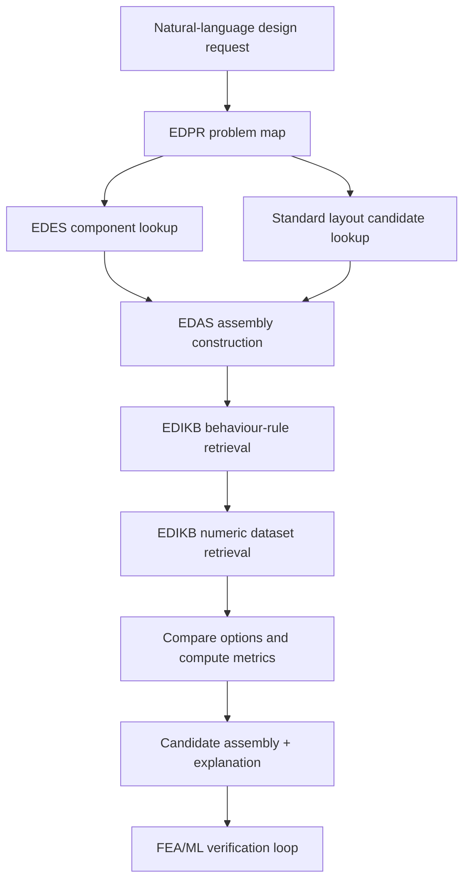

# EDES-EDAS-EDIKB-EDPR Ontology Crosswalk v0.4

Purpose: define how EDES, EDAS, EDIKB, and EDPR connect in the AI4D conceptual-design framework. This is an integration specification, not a component schema and not a problem instance.

## 1. Core Position

EDES, EDAS, and EDIKB are separate knowledge layers with different responsibilities.

| Layer | Main Question Answered | Primary Content | Framework Basis |
|---|---|---|---|
| EDES | What is each individual equipment/component? | Component identity, parameters, constraints, functions, assembly features, derived structural behaviour | FBS-OAM |
| EDAS | How can valid assemblies be built from components? | Topology, chaining, nesting, section/contact ownership, associations, header rules, emit format | FBS-OAM |
| Standard ILS Layout Library | What reusable full-layout templates can seed design generation? | Archetypes and anchors such as ILS-TP, ILS-EAST, ILS-EASB, and ILS-ILT | EDAS-compatible layout catalogue |
| EDIKB | What behaviour is expected from components or assemblies, based on evidence? | Behaviour rules, evidence anchors, numeric evidence rows, derived features, confidence/scope, design guidance | Knowloop + FBS Behaviour |
| EDPR | What is the current design problem asking for? | Natural-language request converted into ontology-bound objectives, constraints, candidate components, and required checks | Problem map + FBS + Knowloop |

Short form:

```text
EDES = equipment/component knowledge
EDAS = assembly-building knowledge
Standard ILS Layout Library = reusable layout templates/anchors
EDIKB = behaviour/evidence knowledge
EDPR = problem-instance representation using the above ontologies
```

## 2. FBS-OAM Responsibility Split

In FBS terms:

| FBS Element | Where It Primarily Lives | Notes |
|---|---|---|
| Function | EDES, with problem-specific use in EDPR | EDES records what a component is for. EDPR selects which functions matter for the current problem. |
| Behaviour, expected (`Be`) | EDIKB | Expected behaviour comes from evidence-backed rules and design-intuition knowledge. |
| Behaviour, structure-derived (`Bs`) | EDES and analysis tools | EDES carries mechanism-level derived behaviour from structure/geometry. FEA/ML later provide evaluated behaviour. |
| Structure (`S`) of component | EDES | Component geometry, parameters, constraints, sections, contact ownership, assembly features. |
| Structure (`S`) of assembly | EDAS | How components are placed, nested, chained, associated, and emitted into buildable assembly JSON. |
| Evaluation | Solver / EDPR workflow | Compares expected behaviour, derived behaviour, numeric evidence, and design requirements. |

In OAM terms:

| OAM Concept | EDES/EDAS Mapping |
|---|---|
| Part / Assembly / Sub-Assembly | EDES component artifact typing, with project-specific usage notes |
| AssemblyFeature | EDES `assemblyFeatures` on components |
| Connection / FixedConnection / MovableConnection / IntermittentConnection | EDES connection vocabulary and EDAS associations |
| AssemblyAssociation / ArtifactAssociation | EDAS association layer |
| PositionOrientation | EDAS placement and non-welded positioning relations, especially for contact-only or off-line components |
| Section versus contact ownership | EDAS build-validity rule using EDES component behaviour |

## 3. Layer Boundaries

### 3.1 EDES Boundary

EDES should contain:

- individual equipment/component identity
- free and derived parameters
- constraints and validation rules
- OAM/FBS classification
- component assembly features such as `weldL`, `weldR`, `conMid`, slots, and contact regions
- structure-derived mechanism notes such as stiffness step, contact ownership, or offset effect

EDES should not contain:

- assembly-level placement decisions
- evidence-backed quantified behaviour rules
- design recommendations derived from paper datasets
- ML rows or parametric-study evidence tables

Example:

`edes:GD-TP` knows it is a thick pipe component, has `t_comp`, `L_comp`, `centre_x`, weld features, and section/contact ownership. It does not decide whether a 20D thick pipe is advisable in overbend; EDIKB handles that.

### 3.2 EDAS Boundary

EDAS should contain:

- assembly construction rules
- component placement logic
- topology types: chain, nested, off-line, branch
- header model rule: continuous versus chain
- section-versus-contact ownership arbitration
- association vocabulary and emit format
- connector attachment rules

EDAS should not contain:

- behavioural goodness of a layout
- strain or bending-moment trends
- paper evidence rows
- final design judgement

Example:

EDAS knows that `edes:GD-SH` can nest over `edes:GD-TP` because `GD-SH` claims contact only and `GD-TP` claims the pipe section. EDAS does not decide whether placing the thick pipe in shroud region X2 is a bad idea; EDIKB handles that.

### 3.3 EDIKB Boundary

EDIKB should contain:

- evidence-backed behaviour rules
- evidence anchors to papers, tables, figures, datasets, or FEA runs
- numeric evidence rows
- scope conditions
- evidence status: sample count, confidence, valid domain, uncertainty notes
- derived feature definitions such as `EI_component / EI_pipe`
- behaviour correlation candidates for future ML evaluation
- spatial influence patterns
- design guidance nodes

EDIKB should not contain:

- full EDES component definitions
- assembly emit format
- ungrounded design requests
- user-specific problem requirements

Example:

EDIKB knows that GD-TP component length strongly increases peak strain in Paper 1 and that the rule is supported by specific evidence rows from Table XXIII. It points back to `edes:GD-TP`, but does not duplicate the full GD-TP component schema.

### 3.4 EDPR Boundary

EDPR should contain:

- a specific design problem expressed in ontology terms
- requested function and performance intent
- constraints, preferences, unknowns, and assumptions
- candidate component families from EDES
- required assembly patterns from EDAS
- required behaviour checks from EDIKB
- links to numeric comparison queries against the EDIKB dataset

EDPR should not contain:

- the master ontology
- permanent component definitions
- permanent assembly-building rules
- permanent behaviour rules

EDPR uses the ontology; it does not define the ontology.

## 4. Allowed References Between Layers

| From | To | Allowed Relationship | Example |
|---|---|---|---|
| EDES | EDIKB | component has expected behaviour resolved from EDIKB | `edes:GD-TP` -> query behaviour rules applying to GD-TP |
| EDAS | EDES | assembly uses component definitions | EDAS asks GD-TP for `halfExtent`, section ownership, and assembly features |
| EDAS | EDIKB | assembly asks if a valid structure is advisable | nested GD-SH + GD-TP queries C1 behaviour rules |
| EDIKB | EDES | behaviour rule applies to component | `edikb:p1_a1_tp_length_01` applies to `edes:GD-TP` |
| EDIKB | EDAS | behaviour rule applies to topology | C1 rule applies to EDAS nested topology |
| EDPR | EDES | problem selects components/functions | problem asks for a pipe-wall build-up or shroud |
| EDPR | EDAS | problem requests assembly construction | problem requires nested shroud over thick pipe |
| EDPR | Standard ILS Layout Library | problem requests standard/reusable full layout | choose `ILS-EAST-F2`, `ILS-EASB-F2D`, or `ILT-L-FT-PS` as starting candidates |
| EDPR | EDIKB | problem requests behaviour evaluation | compare candidate layouts for peak strain |
| Standard ILS Layout Library | EDAS | standard layout must still be build-valid | anchors are checked against EDAS constraints before use |
| Standard ILS Layout Library | EDIKB | standard layout may have behaviour evidence | branch and EA-ST/EA-SB anchors query Paper 2 behaviour rules/datasets |
| Solver | EDIKB dataset | quantitative retrieval | get rows for `GD-TP`, `L/D = 10`, `R = 70 m` |

Disallowed relationships:

| Disallowed Move | Reason |
|---|---|
| Put strain trend rules into EDAS | EDAS should validate buildability, not behavioural advisability |
| Put assembly topology rules into EDIKB | EDIKB can reference topology, but EDAS owns construction logic |
| Put all ontology definitions into EDPR | EDPR is a problem instance layer |
| Make EDES duplicate paper evidence rows | EDES should remain component knowledge, not evidence storage |
| Let LLM infer missing dimensions silently | Missing required inputs should become EDPR unknowns or clarification questions |

## 5. Solver Workflow



The problem-solver LLM should follow this order:

1. Convert the user request into EDPR terms.
2. Identify relevant EDES components.
3. Use EDAS to build only valid assembly structures.
4. Use EDIKB graph to identify applicable behaviour rules and evidence scope.
5. Use EDIKB dataset for numeric comparison.
6. Explain the result with confidence, limitations, and cited evidence anchors.
7. Send unresolved or high-risk cases to FEA/ML verification.

## 6. Example: GD-SH + GD-TP

### 6.1 EDES View

| Component | EDES Meaning |
|---|---|
| `edes:GD-SH` | Offset shroud; contact-only component; no pipe section; free inputs include `V`, `L1`, and `L2` |
| `edes:GD-TP` | Thick pipe; section-owning component; free inputs include `t_comp`, `L_comp`, and `centre_x` |

### 6.2 EDAS View

EDAS says the combination is build-valid if the topology is nested correctly:

```text
GD-SH overlaps GD-TP
GD-SH claims contact only
GD-TP claims pipe section
ownership = lowest for contact
no section conflict exists
```

This is valid nesting, not a general permission for any components to overlap.

### 6.3 EDIKB View

EDIKB says the combination has Type C1 behaviour:

| EDIKB Rule | Meaning |
|---|---|
| `edikb:p1_c1_shtp_nonadditive_01` | Combined GD-SH + GD-TP response exceeds isolated component rules |
| `edikb:p1_c1_shtp_location_01` | GD-TP at X2 is worse than X3/X4 |
| `edikb:p1_c1_shtp_size_01` | Increasing GD-TP length inside the shroud increases strain and BM |
| `edikb:p1_c1_shtp_phase_01` | C1 cases govern in Phase 2 |
| `edikb:p1_c1_shtp_peakloc_01` | X2 remains the peak response region |

### 6.4 Dataset View

The EDIKB dataset supplies the numbers:

| Case | Configuration | Peak Strain | BM |
|---|---|---:|---:|
| Shroud only | `V = 1D`, `L1 = 10D` | 0.70% | -- |
| C1, GD-TP at X2 | `L_GDTP = 2.5D` | 0.901% | 1362 kNm |
| C1, GD-TP at X3 | `L_GDTP = 2.5D` | 0.744% | 1310 kNm |
| C1, GD-TP at X4 | `L_GDTP = 2.5D` | 0.744% | 1271 kNm |
| C1, GD-TP 5D | centred in X3, extends into X2/X4 | 0.952% | 1405 kNm |
| C1, GD-TP 10D | spans X2-X4 | 1.26% | 1555 kNm |

### 6.5 Solver Interpretation

A solver comparing two C1 options should say:

```text
Both layouts are build-valid under EDAS if GD-SH is nested over GD-TP.
However, EDIKB indicates that placing GD-TP at X2 is behaviourally worse.
The dataset shows 0.901% strain for X2 placement versus 0.744% for X3/X4.
Therefore X3/X4 is preferred within the Paper 1 study domain.
```

## 7. Hybrid RAG Interpretation

This architecture is a hybrid retrieval-augmented generation pipeline:

| Retrieval Type | Source | Use |
|---|---|---|
| Ontology retrieval | EDES / EDAS / EDIKB graph | Identify relevant concepts and relationships |
| Structured-data retrieval | EDIKB ML dataset | Quantitative comparison |
| Source evidence retrieval | Paper anchors and source PDFs | Citation and audit trail |
| Problem retrieval | EDPR | Current task requirements and constraints |

The LLM should not answer quantitative questions from prose alone. It should retrieve the relevant numeric dataset rows.

## 8. Crosswalk Rules For Future Schema Design

The later formal EDIKB and EDPR schemas should support at least these cross-layer fields:

| Field | Purpose |
|---|---|
| `appliesToComponent` | Links EDIKB rule to EDES component IDs |
| `appliesToAssemblyPattern` | Links EDIKB rule to EDAS topology/pattern IDs |
| `requiresComponentKnowledge` | Lists EDES files needed by an EDPR problem |
| `requiresAssemblyKnowledge` | Lists EDAS sections needed by an EDPR problem |
| `requiresBehaviourKnowledge` | Lists EDIKB rule families needed by an EDPR problem |
| `requiresDatasetQuery` | Defines numeric rows needed for comparison |
| `sourceRegion` | Location causing behaviour |
| `responseRegion` | Location where behaviour is measured |
| `responseOwner` | Pipeline, component body, or assembly |
| `evidenceStatus` | Case count, confidence, scope, uncertainty |
| `derivedFeatures` | Ratios and computed features for ML/FEA screening |

## 9. EDPR Role

EDPR should convert natural language into a problem object such as:

```json
{
  "id": "edpr:example_shtp_compare_01",
  "type": "DesignProblem",
  "intent": "compare candidate placements for thick pipe inside shroud",
  "candidateComponents": ["edes:GD-SH", "edes:GD-TP"],
  "assemblyPattern": "edas:nested_topology",
  "behaviourChecks": [
    "peak_pipeline_strain",
    "peak_component_bending_moment",
    "source_region_vs_response_region"
  ],
  "requiredKnowledge": {
    "component": ["EDES_GD-SH_KNOWLEDGE", "EDES_GD-TP_KNOWLEDGE"],
    "assembly": ["EDAS_SHARED_KNOWLEDGE.sectionVersusContact", "EDAS_SHARED_KNOWLEDGE.topologyTypes"],
    "behaviour": ["edikb:p1_c1_shtp_location_01", "edikb:p1_c1_shtp_size_01"],
    "dataset": ["EDIKB_PAPER1_ML_DATASET"]
  }
}
```

EDPR should not restate what `GD-SH`, `GD-TP`, or `C1` mean. It should point to the ontology nodes that define them.

## 10. Practical Development Sequence

Recommended build order:

1. Keep EDES and EDAS as validated knowledge schemas.
2. Use Markdown review files for new EDIKB evidence extraction.
3. Convert reviewed EDIKB into graph JSON and ML dataset CSV/JSONL.
4. Prepare this crosswalk as the integration spec.
5. Draft `EDIKB_METASCHEMA.json`.
6. Draft `EDPR_METASCHEMA.json`.
7. Build a problem-solver prototype that retrieves EDES + EDAS + EDIKB graph + EDIKB dataset.
8. Add FEA/ML verification loop using the user's Python FEA program.

## 11. Open Design Questions

| Question | Current Position |
|---|---|
| Should EDAS include behaviour fields? | No. It may reference EDIKB, but should remain structure/assembly focused. |
| Should EDPR define the ontology? | No. EDPR should instantiate the ontology for a specific problem. |
| Should the EDIKB graph duplicate the ML dataset? | Partly. It should include evidence nodes and links, but the CSV/JSONL remains the preferred numeric table for computation. |
| Should `GD-SH` become a third OAM-like artifact category? | Still open in EDES; crosswalk should preserve the issue and avoid overclaiming. |
| Should final implementation use RDF/OWL? | Not required for v0.1. JSON/JSON-LD-style graph is sufficient for LLM retrieval and validation. |


## 12. Full EDIKB Consolidation v0.1

This section records the current consolidated EDIKB artifact set. It turns the earlier layer crosswalk into an implementation crosswalk for the full graph and full ML dataset.

| Consolidated artifact | Role | Source inputs |
|---|---|---|
| `EDIKB_FULL_KNOWLEDGE_GRAPH_v0_3.json` | Full semantic graph for rule retrieval, graph traversal, evidence scoping, design guidance, and future ML-study candidate retrieval | Paper 1 v0.2 graph; Paper 2 EA-ST graph; Paper 2 EA-SB graph; Paper 2 assembly/mass/branch graph |
| `EDIKB_FULL_WITH_EAST_EASB_COMBINED_DEDUPED_v0_1.csv` | Full numeric evidence table for quantitative comparison and future ML training/analysis | Paper 1 v0.2 dataset; Paper 2 EA-ST, EA-SB, added mass, and branch datasets |
| `standard_ils_layouts-9.json` | Standard ILS layout/archetype library for reusable starting concepts | EDAS-compatible archetypes/anchors for TP, TT, SH, SHTP, EAST, EASB, and ILT layouts |
| `EDPR_APF_PARSER_PROMPT_v0_3.md` | LLM parser prompt for converting natural-language requests into EDPR problem maps | P-map/APF method plus latest EDES/EDAS/EDIKB/standard-layout vocabulary |
| `EDPR_Problem_Map_Spec_v0_3.md` | Human-readable EDPR specification | Problem-map sections, APF tuple, standard-layout candidate field, interaction policy |
| `EDES_EDAS_EDIKB_ONTOLOGY_CROSSWALK_v0_4.md` | Human-readable integration map across EDES, EDAS, standard layouts, EDIKB, and EDPR | This document plus the latest graph/dataset consolidation |

### 12.1 Consolidated Graph Scope

| Source graph | Knowledge family | Included content |
|---|---|---|
| `EDIKB_PAPER1_KNOWLEDGE_GRAPH_v0_2.json` | Paper 1 inline-component behaviour | plain pipe, GD-TP, GD-TT, GD-SH, combined GD-SH + GD-TP, behaviour correlation candidates, spatial effect rules |
| `EDIKB_PAPER2_EAST_KNOWLEDGE_GRAPH_v0_1.json` | EA-ST behaviour | connector systems F1/F1D/F2/F2D/PS/PSD, low-strain pockets, deadband redistribution, high-strain penalties |
| `EDIKB_PAPER2_EASB_KNOWLEDGE_GRAPH_v0_1.json` | EA-SB behaviour | contact-owning base structure, local elevation/contact transfer, low-strain pockets, PS-not-plain-like behaviour, shroud-like curvature interaction candidate |
| `EDIKB_PAPER2_ASSEMBLY_KNOWLEDGE_GRAPH_v0_1.json` | Added mass and branch layout behaviour | added-mass position/distribution effects, L/Z branch layouts, branch connector effects, header/branch response separation, future Z-slot and connector-offset studies |

### 12.1A Current Standard Layout Scope

| Layout family | Meaning | Key anchors |
|---|---|---|
| `ILS-TP` | thick pipe layout | family archetype |
| `ILS-TT` | taper/thick transition layout | family archetype |
| `ILS-SH` | shroud/contact layout | family archetype |
| `ILS-SHTP` | shroud plus thick pipe nested layout | family archetype |
| `ILS-EAST` | external top structure family | `ILS-EAST-F1`, `ILS-EAST-F1D`, `ILS-EAST-F2`, `ILS-EAST-F2D`, `ILS-EAST-PS`, `ILS-EAST-PSD` |
| `ILS-EASB` | external base structure family | `ILS-EASB-F1`, `ILS-EASB-F1D`, `ILS-EASB-F2`, `ILS-EASB-F2D`, `ILS-EASB-PS`, `ILS-EASB-PSD` |
| `ILS-ILT` | inline tee / branch layout family | `ILT-L-FT-F1p`, `ILT-L-ST-F1p`, `ILT-L-FT-F2`, `ILT-L-FT-F2D`, `ILT-L-FT-PS`, `ILT-L-FT-PSD`, `ILT-Z-FT-F1p`, `ILT-Z-ST-F1p`, `ILT-Z-FT-F2`, `ILT-Z-FT-F2D`, `ILT-Z-FT-PS`, `ILT-Z-FT-PSD` |

Standard layouts are not a substitute for EDAS. They are reusable templates that EDPR may select, EDAS must validate, and EDIKB may evaluate.

### 12.2 Consolidated Dataset Scope

| Source dataset | Row count | Main quantitative use |
|---|---:|---|
| `EDIKB_PAPER1_ML_DATASET_v0_2.csv` | 117 | inline component installation strain/BM comparison and behaviour-rule support |
| `EDIKB_PAPER2_EAST_ML_DATASET_v0_1.csv` | 29 | EA-ST regional strain response by connection system |
| `EDIKB_PAPER2_EASB_ML_DATASET_v0_1.csv` | 33 | EA-SB regional strain response by connection system/contact-owning base behaviour |
| `EDIKB_PAPER2_ADDED_MASS_ML_DATASET_v0_1.csv` | 3 | added mass strain amplification evidence |
| `EDIKB_PAPER2_BRANCH_ML_DATASET_v0_1.csv` | 18 | branch/header strain comparison by branch layout and support connection |
| Full dataset | 200 | hybrid RAG quantitative evidence retrieval and future ML preparation |

### 12.3 How the Full Graph and Dataset Work Together

| Task | Use graph for | Use dataset for |
|---|---|---|
| Identify relevant knowledge | component, assembly, rule, evidence, and guidance retrieval | not primary |
| Compare two options numerically | find applicable case family and response metric | retrieve rows and compute ratios/differences |
| Explain confidence | evidence status, sample count, source family, rule scope | number of matching rows and parameter coverage |
| Propose future study | retrieve `MLStudyCandidate` and `BehaviourCorrelationCandidate` nodes | identify missing/sparse parameter combinations |
| Produce final paper references | evidence anchors and source graph provenance | table/row-level numeric support |

### 12.4 Current Ontology Binding

| EDIKB concept | EDES link | EDAS link | EDPR use |
|---|---|---|---|
| `BehaviourRule` | `appliesTo` component such as `edes:GD-TP`, `edes:GD-ST`, `edes:GD-SB`, `edes:GD-B`, `edes:GD-BrPipe`, `edes:GD-Con`, `edes:GD-BOSS` | may reference topology/association/ownership rules | selected as required behaviour check |
| `EvidenceCase` | indirectly via applied component | indirectly via assembly pattern | used to justify answer and retrieve dataset rows |
| `DesignVariable` | component parameter or derived ratio | assembly placement/association parameter | parsed from problem statement or asked as unknown |
| `ResponseMetric` | behaviour of component/header/branch/pipe | assembly-level response owner | objective/constraint metric in EDPR |
| `DesignGuidance` | advises component choice/use | advises topology/connection choice | converted into solver recommendation |
| `MLStudyCandidate` | identifies missing component/feature parameters | identifies missing topology/association sweep | converted into future FEA/ML action item |

### 12.5 Recommended Solver Query Pattern

For a natural-language question, the solver should use both consolidated artifacts:

1. EDPR parses the request into component/assembly/objective terms.
2. The graph retrieves applicable `BehaviourRule`, `DesignGuidance`, and `MLStudyCandidate` nodes.
3. The graph identifies source families and evidence rows/case IDs.
4. The dataset retrieves matching numeric rows from `EDIKB_FULL_WITH_EAST_EASB_COMBINED_DEDUPED_v0_1.csv`.
5. The solver compares response values, normalised ratios, and confidence/scope.
6. The solver explains the answer and marks sparse areas as future FEA/ML candidates.

Example: for a branch option comparison, EDIKB graph retrieves `edikb:p2_branch_support_connector_01` and `edikb:p2_branch_header_branch_independence_01`; the dataset then supplies header and branch strain rows for `L-FT-F2`, `L-ST-F2`, `L-FT-PS`, etc.

### 12.5A EDPR-APF Parser Verification Against Latest Vocabulary

The EDPR-APF parser should now recognise the following latest terms as first-class parse targets:

| User wording | EDPR parse target | Downstream use |
|---|---|---|
| EA-ST, top structure, top frame | `edes:GD-ST` and `ILS-EAST` anchors | retrieve EDES component knowledge, EDAS connector assembly, and EDIKB EA-ST rules |
| EA-SB, base structure, bottom cradle | `edes:GD-SB` and `ILS-EASB` anchors | retrieve contact-ownership rules, connector effects, and EA-SB numeric evidence |
| connector system, F1, F1D, F2, F2D, PS, PSD | `edes:GD-Con` plus connection-system design variable | retrieve connector-response rules and numeric rows |
| inline tee, branch layout | `edes:GD-B` and `ILS-ILT` anchors | retrieve branch layout evidence and EDAS branch validation |
| branch pipe, branch run/riser | `edes:GD-BrPipe` | separate branch response from header pipeline response |
| boss, pad, bulkhead connector point | `edes:GD-BOSS` | preserve connector-offset/bulkhead transfer as future ML/FEA candidate where evidence is sparse |
| full layout / standard layout | `standardLayoutCandidates` | retrieve standard layout JSON before EDAS validation and EDIKB evaluation |

Important EDPR variables for Paper 2 parsing:

| Variable | Meaning |
|---|---|
| `connection_system` | F1/F1D/F2/F2D/PS/PSD |
| `P_c1`, `P_c2` | connector location parameters for EA-ST/EA-SB |
| `P_gap` | deadband gap for F1D/F2D/PSD |
| `P_bc`, `P_b1`, `P_b2` | branch layout location parameters |
| `k_t` | connector stiffness parameter |
| `X_c`, `X_i`, `X_i1`, `X_i2`, `X_e` | Paper 2 response-region labels relative to connector/structure locations |
| `combined_stiffness_ratio` | frame/base plus pipe stiffness divided by same-length pipe stiffness |

### 12.6 Classification of the Current EDIKB Method

The current EDIKB method is best described as an ontology-grounded expert knowledge base implemented as a knowledge graph, supplemented by numeric evidence datasets. In AI terms it sits between a classical expert system and a hybrid RAG/ML design-support system:

| Aspect | Classification |
|---|---|
| Explicit rules | expert-system / knowledge-based AI |
| Ontology links | knowledge graph / semantic retrieval |
| Markdown explanations | vector-indexed RAG corpus |
| CSV numeric evidence | structured retrieval / ML-ready dataset |
| EDPR + LLM reasoning | neuro-symbolic problem solving |
| Future FEA/ML loop | active learning / surrogate modelling candidate |

## 13. Feature Interactions and Superposition Policy

EDIKB should not assume that the total behaviour of a full layout is the simple sum of isolated component effects. A multi-component layout may contain interaction effects: the influence of one component depends on the presence, location, stiffness, contact condition, or connector state of another component.

Recommended terminology:

| Term | Use in this framework |
|---|---|
| `component effect` | behaviour observed for an individual component or isolated feature |
| `assembly effect` | behaviour observed for a directly studied assembly/layout |
| `feature interaction` | ML/statistical term for a coupled effect between two or more input features |
| `non-additive effect` | combined response is not equal to simple addition/subtraction of isolated responses |
| `superposition assumption` | temporary conceptual estimate made only when direct combined evidence is unavailable |

EDIKB graph policy:

| Node / relation | Meaning |
|---|---|
| `edikb:policy_direct_combined_evidence_over_superposition_01` | Direct combined-case evidence overrides isolated component-effect summation |
| `edikb:policy_superposition_requires_evidence_01` | Simple addition/subtraction requires evidence or must be marked as an assumption |
| `edikb:feature_interaction_term_general` | General derived feature for future ML interaction terms |
| `edikb:candidate_full_layout_feature_interactions_01` | Future ML/FEA study candidate for full-layout feature interactions |
| `candidate_subtype = feature_interaction` | Marks an ML candidate as specifically about feature interactions |

The preferred reasoning order is:

1. Retrieve EDES component knowledge.
2. Use EDAS to identify the assembly pattern and possible load-path/contact relationships.
3. Retrieve EDIKB isolated component rules.
4. Retrieve EDIKB combined assembly rules.
5. If combined evidence exists, use it before isolated-effect summation.
6. If combined evidence is missing, record an interaction-effect candidate and mark any additive estimate as an assumption.

In equation form:

```text
Y = base_response + component_effect_A + component_effect_B + interaction_effect_AB
```

For ML exploration:

```text
Y = b0 + sum(bi*xi) + sum(bij*xi*xj)
```

where `xi*xj` terms are feature interactions. In the current EDIKB package these are generally future-study candidates unless directly supported by combined Paper 1 or Paper 2 evidence.

Example:

| Situation | Correct handling |
|---|---|
| GD-SH + GD-TP C1 | Use direct combined C1 evidence; do not add isolated GD-SH and GD-TP effects |
| EA-SB F2 + GD-TP + GD-SH-like elevation | Treat stiffness/elevation/contact coupling as a feature-interaction ML candidate |
| branch layout with EA-ST and connector supports | Use Paper 2 branch layout evidence before isolated branch/support assumptions |
