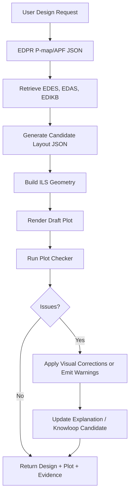

# Plotter Restructure Plan

## 1. Purpose

The plotter package should become a structured, LLM-usable plotting framework for ILS conceptual design.

It should allow a design agent to:

- read a proposed ILS layout JSON;
- build the component and assembly geometry;
- plot individual EDES components;
- plot complete EDAS assemblies;
- label components, connectors, dimensions, contact regions, and design assumptions clearly;
- run plot quality checks;
- export the final figure and a machine-readable plot QA report.

The plotter is not intended to replace FEA or numerical verification. Its role is to make proposed designs inspectable during concept selection and to catch obvious visual/layout issues before a design is presented.

## 2. Current State

Current files in `plotters/`:

| File | Current Role |
|---|---|
| `component_spec.py` | Main component geometry/data model. Defines pipeline, component classes, connection systems, assemblies, nodes, lines, contacts, and layout helpers. |
| `component_plotter.py` | Draws one component using geometry exposed by `component_spec.py`. |
| `ils_builder.py` | Builds an ILS object from a Python dictionary layout definition. Includes validation and layout helper functions. |
| `ils_plotter.py` | Draws an ILS assembly using the built ILS object. |
| `config.py` | Loads constants from `slay_config.yaml`. |
| `slay_config.yaml.txt` | YAML-like config file currently stored with `.txt` extension. |
| `plotting tools and spec` | Placeholder file. Should be replaced by README/spec documentation. |

Current strengths:

- Component geometry is already mostly centralized.
- Assembly plotting works after config filename correction.
- `standard_ils_layouts.json` contains useful archetypes that can be used as plot/test fixtures.
- `build_ils(spec)` provides a clear bridge from JSON-like data to plottable assembly objects.
- `plot_component(...)` and `plot_ils(...)` already support saving to file.

Current gaps:

- `config.py` expects `slay_config.yaml`, but the repo file is currently `slay_config.yaml.txt`.
- There is no simple command-line interface for LLMs to call.
- Plot style and component display properties are embedded in Python rather than separated into editable config/catalog files.
- There is no plot QA/checker layer yet.
- `GD-BOSS` exists in EDES but is not yet represented as a plottable component class/builder entry.
- Imports currently assume `PYTHONPATH=plotters` or execution from a specific working context.

## 3. Target Architecture

Recommended target structure:

```text
plotters/
  README.md
  config/
    plot_style.yaml
    component_catalog.json
    default_geometry.yaml
  core/
    models.py
    geometry.py
    layout.py
    registry.py
  renderers/
    component_renderer.py
    assembly_renderer.py
    connector_renderer.py
    label_renderer.py
  checkers/
    plot_checker.py
    label_overlap_checker.py
    scale_checker.py
    geometry_checker.py
  examples/
    example_ilt_layout.json
    example_valve_layout.json
  legacy/
    component_spec.py
    component_plotter.py
    ils_builder.py
    ils_plotter.py
    config.py
```

This can be migrated gradually. The first refactor does not need to move all existing code. It can add the new wrapper/config/checker layer around the current working modules, then migrate internals later.

## 4. Design Principles

### 4.1 Separate Meaning From Rendering

Component meaning belongs in EDES/EDAS and geometry models.

Rendering choices belong in plot style/catalog files.

Examples:

- component code: `GD-TP`
- ontology class: `InlineWallBuildUp`
- renderer: `inline_pipe_renderer`
- fill color: defined in `plot_style.yaml`
- label priority: defined in `component_catalog.json`

Changing a component color should not require editing plotting logic.

Adding a new component should normally require:

1. Add or confirm component geometry model.
2. Add catalog entry.
3. Reuse an existing renderer where possible.
4. Add a specialized renderer only when geometry cannot be represented by existing renderer types.

### 4.2 Keep Engineering Geometry Immutable During Plot QA

Plot checking may adjust presentation only:

- label offsets;
- leader-line placement;
- legend position;
- margins;
- figure size;
- zoom/window limits;
- annotation placement.

Plot checking should not silently move components, change dimensions, or hide physical overlaps.

If the physical layout has a geometry problem, it should emit a warning/error instead of visually correcting the design.

### 4.3 Agent-Usable Interfaces

An LLM should be able to use the plotter without reading all source code.

Minimum interface:

```bash
python tools/plot_design.py --input layout.json --output plot.png --report plot_report.json
```

The tool should return:

- image path;
- plot QA status;
- warnings;
- corrections applied;
- unresolved component/rendering issues.

## 5. Data Contracts

### 5.1 Input Layout JSON

The plotting input should stay close to the existing `build_ils(spec)` shape:

```json
{
  "schema_version": 1,
  "ils": {
    "name": "example-layout",
    "frame": "local",
    "ownership": "strict",
    "connection_system": "F2"
  },
  "pipeline": {
    "OD_pipe": 0.4064,
    "t_pipe": 0.021,
    "provenance": "PAPER"
  },
  "components": [
    {
      "id": "tp1",
      "code": "GD-TP",
      "centre_x": 0.0
    }
  ],
  "associations": []
}
```

A wrapper may fill plotting defaults, but should clearly report which values were defaulted.

### 5.2 Output QA Report

Recommended plot QA report:

```json
{
  "plot_status": "passed_with_corrections",
  "input_file": "layout.json",
  "output_image": "plot.png",
  "checks": [
    {
      "id": "label_overlap",
      "status": "corrected",
      "message": "Moved two labels to avoid overlap."
    },
    {
      "id": "scale_check",
      "status": "passed",
      "message": "All components fit inside plot bounds."
    }
  ],
  "corrections": [
    "Moved GD-Con label upward by 0.18 m.",
    "Expanded y-axis margin to include EA-SB lower face."
  ],
  "warnings": [],
  "errors": []
}
```

## 6. Plot Checker Scope

| Check | Purpose | Auto-Correct? |
|---|---|---|
| Label overlap | Detect overlapping component/connector labels | Yes, adjust label offsets |
| Label outside plot | Detect labels clipped by axes | Yes, expand margin or move label |
| Component clipping | Detect geometry outside visible bounds | Yes, expand plot limits |
| Wrong aspect ratio | Detect distorted geometry | Yes, enforce equal physical scale |
| Legend overlap | Detect legend covering geometry | Yes, move legend or change columns |
| Missing renderer | Detect component without registered renderer | No, warn or use generic fallback |
| Physical geometry overlap | Detect actual component overlap/contact ambiguity | No, report as design warning/error |
| Missing connector label | Detect active connector without visible symbol/label | Yes, add label or warning |
| Excessive empty space | Detect plot dominated by whitespace | Yes, tighten view with minimum margins |

Recommended status values:

- `passed`
- `passed_with_corrections`
- `warning`
- `failed`
- `not_applicable`

## 7. Component Catalog

Create `plotters/config/component_catalog.json`.

Example entry:

```json
{
  "component_code": "GD-TP",
  "display_name": "Thick Pipe",
  "ontology_source": "EDES_GD-TP_KNOWLEDGE.json",
  "component_family": "inline_component",
  "renderer": "inline_pipe_renderer",
  "label_priority": "medium",
  "default_style_key": "gd_tp",
  "supports_component_plot": true,
  "supports_assembly_plot": true
}
```

Initial catalog should cover:

- `GD-HdPipe`
- `GD-BrPipe`
- `GD-TP`
- `GD-TT`
- `GD-SH`
- `GD-PIP`
- `GD-VLV`
- `GD-ST`
- `GD-SB`
- `GD-B`
- `GD-Con`
- `GD-BOSS` once implemented

## 8. Plot Style Config

Create `plotters/config/plot_style.yaml`.

It should contain:

- component colors;
- connector colors/symbols;
- line widths;
- label font sizes;
- dimension font sizes;
- warning colors;
- default figure width;
- export DPI.

## 9. CLI Tools

### 9.1 `tools/plot_design.py`

Responsibilities:

1. Read input layout JSON.
2. Build ILS using `build_ils`.
3. Render assembly plot.
4. Run plot checker.
5. Save image.
6. Save QA report JSON.
7. Print compact status to stdout.

Example:

```bash
python tools/plot_design.py \
  --input knowledge/edas/standard_ils_layouts.json \
  --archetype ILS-ILT \
  --output output/ils_ilt.png \
  --report output/ils_ilt_plot_report.json
```

### 9.2 `tools/plot_component.py`

Responsibilities:

1. Accept component code and parameter overrides.
2. Build component using defaults and overrides.
3. Render component detail plot.
4. Save image and QA report.

Example:

```bash
python tools/plot_component.py \
  --component GD-TP \
  --set centre_x=0.0 \
  --output output/gd_tp.png
```

## 10. Migration Phases

### Phase 1: Packaging Fixes

- Rename `plotters/slay_config.yaml.txt` to `plotters/slay_config.yaml`.
- Replace `plotters/plotting tools and spec` with `plotters/README.md`.
- Update `framework_manifest.json` paths from old folder names to `plotters/`.
- Confirm imports and smoke plots work from repo root.

### Phase 2: LLM-Usable CLI

- Add `tools/plot_design.py`.
- Add `tools/plot_component.py`.
- Add examples under `plotters/examples/`.
- Add command examples to `plotters/README.md`.

### Phase 3: Catalog and Style Extraction

- Add `plotters/config/component_catalog.json`.
- Add `plotters/config/plot_style.yaml`.
- Move hardcoded colors and labels into style/catalog files.
- Keep legacy constants as fallback during transition.

### Phase 4: Plot Checker Skeleton

- Add `plotters/checkers/plot_checker.py`.
- Generate QA report even if only basic checks are active.
- Implement checks for clipping, output image existence, empty image, and basic bounds.

### Phase 5: Label and Scale Correction

- Add label bounding-box detection.
- Add iterative label offset correction.
- Add legend relocation.
- Add whitespace/zoom checks.
- Add before/after correction notes in QA report.

### Phase 6: Component Expansion

- Add missing `GD-BOSS` plotting support.
- Confirm `GD-BrPipe` and `GD-B` distinction remains clear:
  - `GD-BrPipe` = branch pipe part;
  - `GD-B` = branch piping subassembly.
- Add tests for every EDES component.

### Phase 7: Solver Integration

- Connect solver output JSON to plotter input.
- Add EDPR-to-layout plotting example.
- Add Knowloop visual feedback candidate output when plot/design checks fail or need expert review.

## 11. Acceptance Tests

| Test ID | Input | Expected Result |
|---|---|---|
| `plot_ils_tp` | `ILS-TP` archetype | PNG generated, no fatal errors |
| `plot_ils_tt` | `ILS-TT` archetype | PNG generated, taper visible |
| `plot_ils_sh` | `ILS-SH` archetype | PNG generated, shroud/contact envelope visible |
| `plot_ils_shtp` | `ILS-SHTP` archetype | PNG generated, combined component visibility clear |
| `plot_ils_east` | `ILS-EAST` archetype | PNG generated, top frame visible |
| `plot_ils_easb` | `ILS-EASB` archetype | PNG generated, base structure visible |
| `plot_ils_ilt` | `ILS-ILT` archetype | PNG generated, branch + frame relationship visible |
| `plot_valve_no_contact` | Valve inline example | Valve visible and roller-contact exclusion note preserved |
| `plot_gd_boss` | Boss example | PNG generated once `GD-BOSS` support exists |

## 12. LLM Usage Workflow



## 13. Knowloop Link

Plot QA should feed Knowloop when it reveals one of these:

- component missing from plotter catalog;
- recurring label/scale issue;
- layout ambiguity;
- missing EDES/EDAS mapping;
- component geometry unsupported;
- design accepted despite weak evidence;
- design rejected because visualization exposed a problem.

This lets the plotting tool contribute to framework growth, not just figure generation.

## 14. Immediate Next Actions

Recommended next commit batch:

1. Rename `plotters/slay_config.yaml.txt` to `plotters/slay_config.yaml`.
2. Add `plotters/README.md`.
3. Add `tools/plot_design.py`.
4. Add `plotters/config/component_catalog.json`.
5. Add `plotters/config/plot_style.yaml`.
6. Add initial `plotters/checkers/plot_checker.py` skeleton.
7. Update `framework_manifest.json` to point to `plotters/` and remove `Reference Papers/` entries if that folder has been intentionally removed.

This gives the LLM a stable execution surface first. The deeper internal refactor can then happen safely in small steps.
