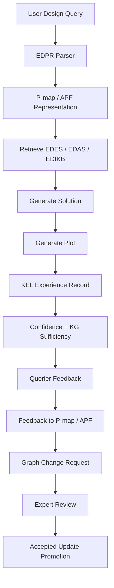

# KEL Workflow

## Purpose

KEL turns design interactions into reviewed, traceable, promotable knowledge updates.

## Workflow

Before running this workflow, an LLM should read
`knowledge/kel/KEL_LLM_WORKFLOW_INSTRUCTIONS.md`.

```text
1. Receive user design query.
2. Parse the query using EDPR.
3. Represent the query using P-map/APF.
4. Retrieve EDES, EDAS, and EDIKB context.
5. Generate a design solution.
6. Generate or reference the design plot.
7. Create a KEL experience record.
8. Evaluate LLM confidence and knowledge sufficiency.
9. Capture querier feedback in natural language.
10. Convert feedback into P-map/APF issue/action form.
11. Generate one or more graph change requests.
12. Send the change requests for expert review.
13. Promote expert-accepted changes into official framework layers.
14. Keep rejected and superseded records for traceability.
```

## Workflow Gate

An LLM must not treat an engineering design query as a regular free-form
prompt when framework knowledge exists.

For layout design, the required gate is:

```text
EDPR/P-map/APF -> EDES/EDAS/EDIKB retrieval -> EDAS layout JSON
-> build_ils findings -> repository plotter output if requested
```

If the query cannot be represented by current schemas, standard layouts, or
plotter components, the LLM must report the representability gap and create a
KEL feedback or graph-change candidate. It must not replace the missing model
with an unlabelled custom sketch.

## Output And Presentation Policy

KEL also captures feedback about how a proposed solution is presented. These
records are separate from engineering behavior updates but still require expert
review before becoming official tool behavior.

Default presentation requirements:

| Requirement | Policy |
|---|---|
| Initial response | Give a compact text-based layout overview before detailed reasoning. |
| Plot question | Ask the human whether a plot is needed unless the human directly asks for one. |
| Connections | State connection type, location, and count; distinguish piping connections from support/structural connections. |
| Assumptions | State default assumptions used in the proposed design. |
| Stress/strain | Prefer layouts that minimize strain and stress; mark likely maximum stress/strain locations and identify missing analysis when values are not available. |
| Plot readability | Use a scale and resolution that supports zooming and inspection. |
| Plot authority | Use the repository plotter for framework-backed components; label any fallback sketch as non-authoritative. |

## Workflow Diagram



## Status Model

### Experience Records

```text
generated
querier_reviewed
needs_evidence
expert_accepted
expert_rejected
implemented
superseded
```

### Feedback Records

```text
candidate
querier_confirmed
expert_accepted
expert_rejected
implemented
superseded
```

### Graph Change Requests

```text
pending
accepted
rejected
needs_evidence
needs_revision
implemented
superseded
```

## Promotion Policy

Generated KEL records are exploratory.

Official updates require:

| Update Type | Required Gate |
|---|---|
| New behavior rule | Expert review and evidence trace |
| Revised behavior rule | Expert review and explanation of changed condition |
| New dataset row | Traceable numerical evidence |
| EDES/EDAS schema update | Schema validation and example |
| EDPR parser update | Test input and expected parsed output |
| Plotting rule update | Before/after plot validation |
| Output/presentation policy | Querier feedback trace and expert review |
| Default design assumption | Expert review and applicability scope |
| Future FEA/ML candidate | Clear unresolved question and parameters |
