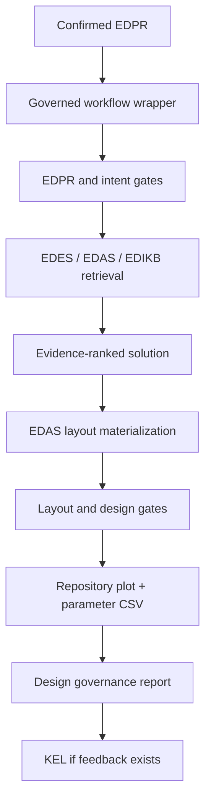
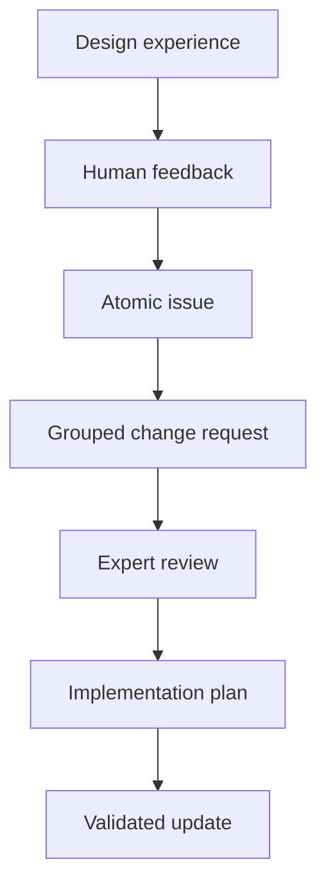

# Knowledge-Graph-Governed AI4D for Industrial Structural Design: A Subsea Inline Structure Case Study

**Working manuscript:** Paper 01AB, Draft v0.1  
**Planned use:** Preprint planning draft; bridge between engineering-practice Paper 01A and governed-workflow repository evidence  
**Primary author:** Sreekanth Manakkattil Sivaraman  
**Draft date:** 15 September 2026  

> **Draft status.** This manuscript is a technical draft for review. It is not submission-ready. It deliberately avoids claiming validated comparative performance until controlled examples are executed and archived through the governed workflow. Citations are represented as reference groups and source placeholders where final bibliographic details are still required.

## Abstract

Industrial structural design organizations accumulate valuable knowledge in drawings, calculation reports, finite element analysis records, spreadsheets, review comments, and expert memory. Much of this knowledge is difficult to reuse because it is document-centered rather than queryable: geometry, load cases, assumptions, response locations, and design reasoning are often distributed across separate artifacts. This paper presents Slay-ILS-Designer as a case study in applying artificial intelligence for design (AI4D) principles to subsea inline structure conceptual design. The framework treats useful engineering AI as a knowledge-management, ontology, retrieval, tool-use, and governance problem before it is treated as a model-training problem. It separates the current design problem, component definitions, assembly rules, and behavior evidence into EDPR, EDES, EDAS, and EDIKB layers. A large language model is used as a constrained reasoning interface for natural-language interpretation, problem decomposition, ontology mapping, query planning, tool orchestration, explanation, and feedback interpretation. Deterministic tools validate the problem representation, retrieve graph and numeric evidence, materialize valid layouts, plot repository-backed assemblies, export parameter sidecars, and stamp the result with design-governance status. Feedback enters a Knowledge Evolution Loop (KEL), where observations are decomposed, grouped, reviewed, implemented, and retained with provenance rather than being written directly into approved knowledge. The manuscript argues that historical design records, even when structured into a knowledge graph, may remain insufficient for confident coverage of rare topologies, scale effects, missing parameters, and coupled structural interactions. It therefore proposes a future path in which the governed knowledge graph is extended by parametric FEA generation, active learning, and uncertainty-aware ML surrogates. The framework is positioned as conceptual-design support and knowledge-governance infrastructure, not as a replacement for project-specific structural verification.

**Keywords:** AI4D; knowledge graph; engineering ontology; subsea inline structure; S-lay installation; large language model; FBS-OAM; problem map; human-in-the-loop; Knowledge Evolution Loop; conceptual design; engineering knowledge management

## 1. Introduction

Industrial structural design rarely starts from first principles alone. Engineers reuse earlier drawings, calculation reports, installation records, lessons learned, standard arrangements, and the judgement of specialists who remember why a design decision succeeded or failed. In subsea oil and gas engineering, this experience is particularly valuable because installation and operation combine geometry, contact, stiffness, mass, connection details, fabrication constraints, and project-specific boundary conditions.

However, the way this experience is stored is often not well suited for systematic reuse. A report may describe a strain reduction trend, but the geometry, load case, connector system, response location, and applicability conditions may be scattered across figures and tables. A drawing may show the arrangement, but not the behavioral evidence that made it preferable. A review comment may correct an error, but may never become a reusable engineering rule. A spreadsheet may contain valuable numeric evidence, but without an explicit link to component identity, topology, units, and validity range.

Large language models (LLMs) create a tempting interface to this fragmented knowledge. They can read natural language, summarize documents, map terms, and produce explanations. Yet fluent language is not engineering validity. An LLM can describe a plausible design while omitting a required support, confusing a connector orientation with a drawing direction, inventing a freehand sketch, or applying evidence outside its domain. For structural engineering practice, the question is not whether an LLM can produce a confident answer. The question is whether the answer is traceable, evidence-bounded, tool-checkable, and reviewable.

This paper presents Slay-ILS-Designer as a case study in applying AI4D principles to subsea inline structure conceptual design. The case study focuses on inline structures installed with an S-lay pipeline, including inline tees, branch structures, valve protection, strongback or top-frame support, base protection, shrouds, connectors, and local thick or stiff components. These are assembly-heavy designs: the object of interest is not a single component, but a configuration of interacting piping and structural artifacts.

The central thesis is simple:

> Useful AI for industrial structural design is first a disciplined knowledge-management and governance problem. LLM reasoning becomes credible only when constrained by ontology, retrieval, deterministic tools, evidence scope, and expert-reviewed knowledge evolution.

The contribution of this manuscript is a framework draft. It describes how the project separates problem representation, component knowledge, assembly knowledge, behavior evidence, and knowledge evolution into distinct layers; how FBS-OAM concepts help represent structural assemblies; how P-map/APF problem formulation helps convert natural-language design requests into structured retrieval and reasoning tasks; how a governed workflow prevents unsupported layout and plot outputs; and why future ML should be built on top of governed data rather than treated as a substitute for engineering structure.

The paper does not claim that the current prototype performs final design sizing, replaces FEA, demonstrates code compliance, or provides project approval. Its purpose is to show how a professional engineering knowledge system can be organized so that LLMs, knowledge graphs, deterministic tools, and human review work together.

## 2. Industrial Context: Subsea Inline Structures

Subsea pipelines may include inline structures to support flowline routing, valve operation, pigging, tie-ins, branch connections, protection, installation handling, and local structural support. During S-lay installation, a pipeline passes across the firing line and stinger overbend region. The pipe contacts rollers while curvature, tension, local stiffness, and contact sequence interact. Inline structures can disturb this response because they introduce local changes in diameter, weight, bending stiffness, elevation, connection behavior, and roller-contact geometry.

For the framework discussed here, the important design objects include:

| Repository term | General meaning |
|---|---|
| `GD-HdPipe` | Header pipe or main pipeline segment. |
| `GD-BrPipe` | Branch pipe part. |
| `GD-B` | Branch subassembly, including L or Z branch topology. |
| `GD-VLV` | Inline or branch valve component and envelope. |
| `GD-ST` | Top structure or strongback-type support/protection frame. |
| `GD-SB` | Base structure or stiffener-bracket/protection frame. |
| `GD-SH` | Shroud or offset protective/contact envelope. |
| `GD-TP` | Thick pipe simplified component. |
| `GD-TT` | Tapered thick pipe component. |
| `GD-Con` | Connector interface between component features. |
| `GD-Boss` | Boss or sleeve-type local component. |

The source papers and engineering discussions may use terms such as EA-ST and EA-SB. The repository normalizes them to GD-ST and GD-SB so that all schemas, tools, plots, and records use the same identifiers. This is a naming decision, not a change in physical meaning.

The conceptual design problem is assembly-driven. A human request may specify a header size, a branch size, connector orientation, a valve, a required protection scheme, a strain objective, or a preferred connection type. Several assemblies may appear to satisfy the same functional request, but they can differ substantially in load path, contact behavior, stiffness distribution, response region, and evidence support. A design assistant must therefore know not only what components exist, but also how they may be assembled, what evidence applies, which inputs are missing, and when the workflow must stop.

## 3. AI4D as Engineering Data Management and Smart Querying

In this project, AI4D is not treated as a synonym for "train a model." It is treated as a practical engineering workflow for making design knowledge structured, queryable, inspectable, and improvable.

The key problem is that engineering knowledge is often present but not machine-actionable. A calculation report may contain a useful trend, but a tool cannot safely apply that trend unless it knows the component type, parameter range, load case, response metric, comparison basis, and uncertainty. A drawing may show a support, but a solver cannot infer whether a branch connector is fixed, pinned, slotted, or part of a composite connection system. A review comment may identify a design mistake, but the official knowledge base should not change until an expert has reviewed the proposed correction.

The framework therefore treats each useful engineering fact as a structured package:

| Element | Purpose |
|---|---|
| Stable identifier | Distinguishes one object, rule, evidence row, or issue from similar items. |
| Controlled type | States whether the item is a component, assembly, behavior rule, evidence row, requirement, issue, or feedback record. |
| Parameters and units | Make geometry, loads, and responses comparable. |
| Relations | Capture attachment, containment, contact, support, sequence, ownership, and topology. |
| Evidence anchor | Links a claim to a paper, table, figure, dataset, calculation, or review. |
| Applicability | Defines the domain where the claim can be used. |
| Version and status | Separates proposed, reviewed, implemented, superseded, and rejected knowledge. |
| Missing-data state | Prevents omitted values from being treated as design defaults. |

The LLM is valuable because it can bridge human language and structured records. It can interpret a request, identify likely artifacts, expose ambiguities, propose retrieval targets, and explain results. But it should not silently complete missing inputs or invent geometry. The controlled role of the LLM is summarized below.

| LLM role | Control mechanism |
|---|---|
| Interpret human design query | EDPR schema and P-map/APF parser instructions. |
| Map terms to engineering objects | EDES, EDAS, and EDIKB identifiers. |
| Plan retrieval | Explicit retrieval targets and evidence scope. |
| Reason over context | Retrieved graph nodes, numeric rows, and documented limitations. |
| Emit tool inputs | JSON schemas, validators, and layout gates. |
| Explain assumptions and gaps | Governance reports, solution notes, and residual-risk fields. |
| Interpret feedback | KEL atomic feedback, grouping, and graph-change records. |

This framing matters for professional engineering adoption. A company does not only need an impressive answer. It needs a way to reuse experience, preserve assumptions, identify missing evidence, prevent unapproved knowledge drift, and explain why a recommendation is valid or incomplete.

## 4. Knowledge Architecture

Slay-ILS-Designer uses a layered knowledge architecture. Each layer has a distinct responsibility so that component meaning, assembly validity, behavioral evidence, and current problem state are not mixed into one large text memory.

| Layer | Full name | Responsibility |
|---|---|---|
| EDPR | Engineering Design Problem Representation | Represents the current design request, objectives, constraints, knowns, unknowns, P-map/APF interpretation, retrieval plan, and solver intent. |
| EDES | Engineering Design Equipment Schema | Stores individual equipment/component identity, parameters, geometry, functions, constraints, interfaces, and local behavior notes. |
| EDAS | Engineering Design Assembly Schema | Stores assembly topology, valid layout anchors, associations, connection systems, contact/section ownership, and emit/build rules. |
| EDIKB | Engineering Design Intelligence Knowledge Base | Stores behavior rules, evidence rows, design guidance, uncertainty, correlation candidates, and future ML study candidates. |
| KEL | Knowledge Evolution Loop | Records design experiences, feedback, graph-change requests, expert reviews, implementation plans, and lifecycle reconciliation. |
| Governed tools | Deterministic workflow tools | Validate, retrieve, solve, materialize, plot, export sidecars, and stamp design-governance status. |

The separation is deliberate. EDES answers "what is this component?" EDAS answers "how can components form a valid assembly?" EDIKB answers "what behavior evidence exists?" EDPR answers "what is being asked now?" KEL answers "how should the knowledge system evolve after this experience?"

This architecture also makes failure diagnosis possible. If the output is weak, the root cause can be located: problem parsing, component definition, assembly representation, evidence retrieval, evidence applicability, deterministic tool execution, visualization, or missing data. This diagnostic property became central during KEL development, because many observed errors were not primarily model-intelligence failures. They were failures to enforce a gate that the system already knew should exist.

## 5. FBS-OAM for Structural Assembly Knowledge

Function-Behavior-Structure (FBS) provides a useful engineering lens. A subsea inline structure is not only a shape. It exists to perform functions, such as routing flow, connecting a branch, supporting a valve, protecting a component from roller contact, permitting installation, and reducing strain or bending moment. It produces behavior, such as stiffness changes, contact loads, bending moments, peak strain, support reactions, and load redistribution. It has structure, including pipe, branch, valve, shroud, support, base, top frame, connectors, and local thickness changes.

For inline structures, FBS is necessary but not sufficient. These designs are assemblies. They require an object and assembly modeling layer: parts, subassemblies, features, connections, associations, positions, orientations, and methods of load transfer. In this manuscript, that role is described as FBS-OAM: FBS provides the function-behavior-structure logic, while OAM-style concepts make assembly objects, actions, methods, features, and associations explicit.

| FBS concept | ILS/ILT interpretation |
|---|---|
| Function | Route flow, connect branch, protect valve, support pipe, permit installation, reduce strain and bending moment. |
| Expected behavior | Lower strain, acceptable moment, safe roller passage, controlled load path, protected contact envelope. |
| Structure-derived behavior | Stiffness transition, local contact region, shroud/stiff-body interaction, connector stiffness effect. |
| Structure | Header pipe, branch pipe, valve, branch subassembly, shroud, top frame, base frame, connectors, thick pipe. |

| OAM concept | ILS/ILT interpretation |
|---|---|
| Object / part | Pipe segment, valve, connector, frame member, support item. |
| Assembly | ILT, branch assembly, top-frame support, base protection, shroud system. |
| Assembly feature | Weld end, connector slot, support interface, branch terminal, roller-contact area. |
| Association | Branch-to-header, connector-to-frame, support-to-pipe, valve-to-protection, shroud-to-stiff-component relation. |
| Position/orientation | L branch, Z branch, vertical terminal, horizontal terminal, valve station, connector spacing, shroud region. |

This representation is important because structural performance is often driven by interactions. A branch connector is not simply "near" a top frame; it must terminate at a declared feature through a compatible association. A valve may be present on a header or on a branch, and that distinction changes whether header GD-SB protection is triggered. A shroud around a stiff component is not only a visual cover; it changes contact and stiffness behavior and may require analogical evidence from shroud plus thick-pipe cases.

By making assembly features and associations explicit, the ontology prepares the system for future optimization and ML. A model cannot learn reliably from a label such as "valve structure" if the actual variables are branch topology, connector type, top-frame span, base geometry, valve envelope, shroud offset, contact height, and response location.

## 6. EDPR, P-map, and APF

Natural-language design requests are compact but ambiguous. A user may ask for "an ILT with a vertical connector, header valve, branch valves, and minimum strain." This contains product intent, component requirements, topology clues, performance objectives, missing assumptions, and evidence needs. A direct answer risks jumping from text to design without showing how the problem was understood.

The framework therefore uses EDPR as the problem-instance layer, supported by P-map and APF concepts.

APF separates:

| APF item | Example |
|---|---|
| Action | Design, compare, rank, validate, explain, or ask for clarification. |
| Product | ILT layout, valve protection concept, branch assembly, shroud system. |
| Function | Route flow, protect valve, support connector, reduce strain, permit installation. |

P-map exposes:

| P-map item | Example |
|---|---|
| Requirement | Vertical connector, no valve roller contact, minimize strain, preserve clearances. |
| Artifact | GD-B, GD-ST, GD-SB, GD-VLV, GD-SH, ILT-Z anchor. |
| Behavior | Peak strain, bending moment, contact load, clearance, support stiffness. |
| Issue | Missing roller geometry, unresolved two-branch-valve topology, weak connector evidence. |
| Link | Requirement-to-artifact, artifact-to-behavior, issue-to-retrieval target, feedback-to-change request. |

P-map/APF adds something that FBS alone does not provide: a live representation of the current problem state. FBS describes engineering concepts; P-map records what this particular user request requires, what is unknown, what evidence must be retrieved, and what tradeoffs or gaps are present. This is also why P-map/APF connects naturally to KEL. When a user corrects an answer, the correction can be mapped to a problem issue, target artifact, target layer, and proposed change.

The current governed workflow requires EDPR confirmation before design/layout generation. This prevents a common failure mode: the assistant proceeds directly to a concept while the problem representation is still unreviewed. In engineering terms, this is similar to checking the design basis before starting a calculation.

## 7. Governed Workflow and Tool Chain

The authoritative design entry point in the current repository is `tools/run_design_workflow.py`. Lower-level tools can validate, retrieve, solve, materialize layouts, and plot, but a design/layout/plot output is not treated as authoritative unless it passes through the governed wrapper and receives a design-governance stamp.

The workflow can be summarized as:

The governance report identifies whether the workflow passed or blocked, what outputs are allowed, what gates failed, which artifacts were emitted, and what human actions remain. This matters because a blocked result can still be useful. It tells the engineer why a concept cannot yet be treated as design evidence.

Key gates include:

| Gate | Purpose |
|---|---|
| EDPR confirmation | Prevent concept generation before the problem understanding is reviewed. |
| Vertical connector gate | Ensure vertical connector intent selects Z branch topology and compatible ILT-Z anchors. |
| Branch-to-GD-ST gate | Ensure branch assemblies terminate at declared GD-ST features. |
| Header valve GD-SB gate | Require protection context when a header valve cannot ride rollers or accept contact loads. |
| Support-sizing gate | Prevent default GD-ST/GD-SB dimensions from being treated as fitted support geometry. |
| Shroud-stiff evidence gate | Retrieve and apply analogous shroud plus stiff-component evidence when GD-VLV is combined with GD-SH. |
| Branch-valve containment gate | Keep branch valve and branch terminal inside GD-ST span, and require evidence for F2/F2D selection. |
| Plot authority gate | Treat direct plotter outputs as non-authoritative unless stamped by the governed workflow. |
| Parameter sidecar policy | Keep figures readable by moving long parameter details into CSV/report sidecars. |

This tool chain is intentionally conservative. It fails closed when a topology cannot be represented, when evidence is missing, or when a layout cannot be generated from repository-backed component and assembly definitions. In engineering practice, this behavior is more valuable than a fluent answer that hides missing assumptions.

## 8. Knowledge Evolution Loop

KEL is the active governance mechanism for learning from experience. It extends the front-end idea of capturing feedback into a full lifecycle for knowledge evolution.

A KEL record can include:

- original user query;
- EDPR/P-map/APF interpretation;
- retrieved EDES, EDAS, and EDIKB context;
- solution and layout artifacts;
- plot report and parameter CSV;
- design-governance stamp;
- confidence and sufficiency assessment;
- human feedback;
- atomic feedback decomposition;
- grouped issue record;
- graph-change request;
- expert review;
- implementation plan;
- validation and lifecycle closeout.

The KEL lifecycle can be represented as:

The important principle is that feedback is not automatically promoted into official knowledge. A user correction becomes a candidate issue. Candidate issues may be grouped, reviewed, accepted, rejected, revised, implemented, or superseded. This is essential for engineering integrity. A useful comment may reveal a true framework error, but it may also be incomplete, project-specific, or unsupported by evidence.

The implemented KEL lessons currently show a pattern:

| KEL group | General lesson |
|---|---|
| Q1/Q2 | Enforce EDPR confirmation, repository plotter use, branch orientation, GD-ST association, GD-SB valve protection, and strain/moment screening. |
| Q3 | Support/protection structures must be sized to the supported component envelope, not blindly defaulted. |
| Q4/Q5 | GD-VLV inside GD-SH should retrieve and apply analogous stiff-component/shroud evidence. |
| Q6 | Branch valves require top-frame containment and an evidence basis for connector-system choice. |
| Q7 | Engineering figures should remain readable; parameter-heavy review content belongs in CSV/report sidecars. |

These lessons are not presented here as final performance evaluation. They are development evidence showing how feedback can be converted into tool, schema, workflow, and documentation changes. The research value is the traceable transformation from observed failure to implemented gate.

## 9. Controlled Example Plan

The paper should not rely on informal conversational trials as final evidence. The controlled example section should be produced after running selected EDPR files through the governed workflow and preserving all artifacts.

Recommended examples are:

| Example | Purpose | Required artifacts |
|---|---|---|
| L-branch strain-minimizing ILT | Demonstrate EDPR/P-map/APF, EDIKB evidence ranking, EDAS anchor selection, layout materialization, plot, and governance stamp. | EDPR JSON, retrieval context, solution JSON, layout, plot report, parameter CSV, governance report. |
| Inline valve that cannot ride rollers | Demonstrate GD-VLV limitation, GD-SB protection gate, missing input/evidence blockers, and human remaining actions. | EDPR JSON, blocked governance report, future-study candidate if evidence is missing. |
| Valve with shroud / stiff-body analogy | Demonstrate retrieval of analogous GD-SH plus GD-TP/GD-TT evidence and evidence-application gate. | Retrieval context, selected EDIKB nodes, design-basis fields, layout gate report. |
| Branch valve on L or Z branch | Demonstrate branch-valve containment inside GD-ST span and connector-system evidence requirement. | EDPR JSON, layout report, top-frame containment report, F2/PS evidence basis. |

The controlled comparison should include three modes:

| Mode | Expected evaluation question |
|---|---|
| Unguided LLM | Does the model produce plausible but unsupported design prose or sketches? |
| RAG-only LLM | Does retrieval improve terminology while still allowing unsupported synthesis? |
| Governed workflow | Does the system either produce repository-backed artifacts or fail closed with actionable gaps? |

The final paper can then measure artifact completeness, gate outcomes, traceability, evidence citation, plot authority, and human remaining actions. This is more defensible than claiming that a single chat example proves design quality.

## 10. Dataset Sufficiency and the Need for Parametric Studies

A central lesson from this project is that a knowledge graph is not automatically sufficient just because it is structured. If the underlying evidence is sparse, biased, or missing key combinations, a clean ontology can expose the gap but cannot remove it.

Even 50-60 historical designs may be inadequate for confident reasoning because:

- rare topologies may not appear;
- outlier behavior may not be represented;
- diameter, stiffness, valve size, branch layout, support span, and connector-system scaling may be weakly covered;
- historical reports may omit parameters needed for future reasoning;
- rejected design alternatives may be missing;
- project cycles are too long to naturally accumulate dense design-space coverage;
- coupled effects such as shroud offset, support stiffness, valve mass, branch valve position, and connector type may be under-sampled;
- evidence may be relative to a simplified study model rather than a complete project assembly.

This means the historical KG should be treated as the initial engineering memory, not as a complete predictive model. Its most important early function may be to identify what is known, what is only analogous, what is missing, and what should be studied next.

The next layer should therefore generate supplementary evidence:

- parametric FEA studies;
- simplified physics-engine sweeps using the overbend analysis program;
- controlled variation of dimensions, connection systems, support spans, and component positions;
- explicit recording of failed or rejected alternatives;
- active learning to choose the most informative next simulations;
- ML surrogate models with explicit applicability domains and uncertainty.

This view is important for professional credibility. It avoids the weak claim that a small historical dataset can support fully confident design automation. Instead, it presents the knowledge graph as the organizer and governor of evidence generation.

## 11. Where ML Fits

Machine learning should be introduced after the framework has defined variables, topology classes, evidence domains, and governance rules. ML is not a replacement for EDES, EDAS, EDIKB, EDPR, or KEL. It is a later layer that can operate on the structured data those layers create.

| ML role | Use in the framework |
|---|---|
| Surrogate response prediction | Estimate strain, bending moment, contact load, or utilization for EDAS-valid candidates. |
| Similarity retrieval | Find historical or simulated cases closest to a new EDPR problem. |
| Gap detection | Identify sparse regions in topology, parameter, and evidence space. |
| Active learning | Select parametric FEA cases that most improve coverage. |
| Uncertainty estimation | Warn when recommendations leave known evidence domains. |
| Optimization | Rank EDAS-valid candidates after behavior prediction and constraint screening. |

The overbend physics engine becomes important in this path. A validated physics program can generate structured simulation data across candidate regions of the design space. KEL can then record where the graph was insufficient, define future study candidates, and govern how new FEA/ML evidence enters EDIKB.

The principle is:

> ML becomes useful only after the framework has defined what the variables mean, which assemblies are valid, what evidence exists, and where uncertainty remains.

## 12. Professional Engineering Practice Relevance

The framework is designed around engineering practice rather than only AI novelty. Its value to a company would come from:

- making past design experience searchable and comparable;
- giving engineers a structured way to query historical evidence;
- making assumptions and missing inputs visible;
- preventing unsupported design sketches from being treated as engineering evidence;
- preserving review feedback in a reusable form;
- identifying whether a failure is due to workflow, ontology, retrieval, evidence, plotting, or missing study data;
- providing a path from historical knowledge to parametric studies and ML without losing human review.

For a practicing structural engineer, this is important because design intuition is often learned through exposure to many cases and corrections. KEL provides a mechanism for turning those corrections into structured knowledge. The LLM does not "develop intuition" in the human sense. Instead, the system develops a governed record of experience, failure modes, evidence limits, and updated rules that can support future reasoning.

This distinction is useful in professional communication. The work demonstrates an integrated capability across subsea structural engineering, ontology design, knowledge graphs, Python tooling, LLM workflow design, validation gates, plotting/reporting, and human-in-the-loop governance.

## 13. Limitations

The current framework has important limitations:

- It supports conceptual design reasoning and evidence tracing, not final design approval.
- EDPR natural-language parsing still requires controlled prompt execution or an external LLM step.
- Current evidence coverage is incomplete and must be expanded.
- Direct FEA, fatigue, installation, fabrication, and code-compliance checks remain necessary.
- Expert review is required before graph changes become official knowledge.
- Current KEL lessons should be treated as framework-development evidence until controlled examples are executed.
- The plotted geometry is an inspectable conceptual representation, not a fabrication drawing.
- ML components are future work and should not be implied as already validated.

These limitations are not weaknesses to hide. They define the boundary between a credible engineering assistant and an unsafe automation claim.

## 14. Future Work

Immediate work should focus on turning this draft into a citation-ready preprint:

1. Complete references for FBS, OAM, engineering knowledge graphs, RAG, tool-using LLMs, human-in-the-loop KG evolution, active learning, surrogate modeling, and subsea pipeline/ILS behavior.
2. Run controlled examples through `tools/run_design_workflow.py`.
3. Archive EDPR files, retrieval contexts, solutions, layouts, plot reports, parameter CSVs, and governance reports.
4. Add a claim-evidence register for every technical claim.
5. Produce publication-quality figures from repository artifacts rather than screenshots.

Framework development should focus on:

- expanding EDES and EDAS coverage for more ILS/ILT components and layout families;
- strengthening EDIKB with more numeric evidence and uncertainty metadata;
- integrating the overbend physics engine as a parametric study generator;
- adding active-learning selection of FEA cases;
- developing uncertainty-aware ML surrogates;
- adding optimization over EDAS-valid assembly candidates;
- building KEL dashboards for expert review and implementation tracking.

## 15. Conclusion

This manuscript presents Slay-ILS-Designer as a practical AI4D case study for industrial structural design. The central idea is that useful AI for engineering practice begins with disciplined knowledge representation and governance. A large language model can help interpret requests, map terms, plan retrieval, reason over context, call tools, and explain results, but it must be constrained by schemas, ontology, deterministic tools, evidence scope, and expert review.

For subsea inline structures, this approach is especially relevant because the design object is an assembly of interacting piping and structural components. Component identity, assembly topology, connection systems, support/protection assumptions, and behavior evidence must be represented explicitly. EDPR, EDES, EDAS, EDIKB, and KEL provide a layered architecture for doing so.

The framework also shows why historical design data alone may be insufficient. A knowledge graph can organize experience and expose gaps, but it cannot invent dense evidence for rare topologies or coupled structural interactions. The future path is therefore not simply "LLM plus documents." It is governed knowledge graphs plus parametric FEA, active learning, ML surrogates, uncertainty reporting, and human review.

The intended outcome is not autonomous final design. It is a traceable engineering assistant that can help engineers reuse experience, identify gaps, produce inspectable conceptual outputs, and evolve the knowledge system through controlled feedback.

## References To Complete

Final references should include:

- FBS design theory.
- NIST/OAM or assembly ontology references.
- Knowledge graphs for engineering design.
- Retrieval-augmented generation and tool-using LLM agents.
- KnowLoop or human-in-the-loop knowledge evolution references.
- Active learning and surrogate modeling in engineering design.
- Subsea pipeline installation and inline structure behavior references.
- The two domain source papers used to build EDIKB.

## Appendix A - Planned Controlled Artifact Set

For each controlled example, archive:

| Artifact | Purpose |
|---|---|
| EDPR JSON | Confirmed problem representation. |
| Retrieval context JSON | Retrieved EDES, EDAS, EDIKB evidence. |
| Solution JSON | Recommended candidate, assumptions, evidence basis, residual risks. |
| Layout JSON | EDAS-compatible materialized layout. |
| Layout report JSON | Builder and design-gate findings. |
| Plot image | Repository-backed visual output when allowed. |
| Parameter CSV | Readable sidecar for component and connector parameters. |
| Plot report JSON | Plot QA, warnings, errors, and output references. |
| Design governance JSON | Passed/blocked status, allowed output, gates, human actions. |
| KEL record | Feedback, sufficiency, graph change, review, and implementation trace if applicable. |

## Appendix B - Draft Figure Plan

| Figure | Content |
|---|---|
| Figure 1 | AI4D knowledge workflow from human query to KEL. |
| Figure 2 | EDPR, EDES, EDAS, EDIKB, KEL layer separation. |
| Figure 3 | FBS-OAM mapping for a representative ILT assembly. |
| Figure 4 | Governed workflow and design-governance stamp. |
| Figure 5 | KEL lifecycle from feedback to implemented update. |
| Figure 6 | Historical KG to parametric FEA and ML surrogate expansion loop. |

