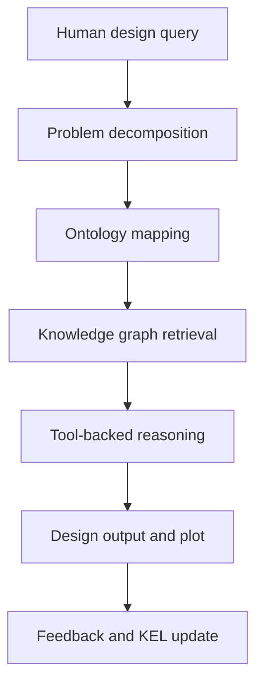
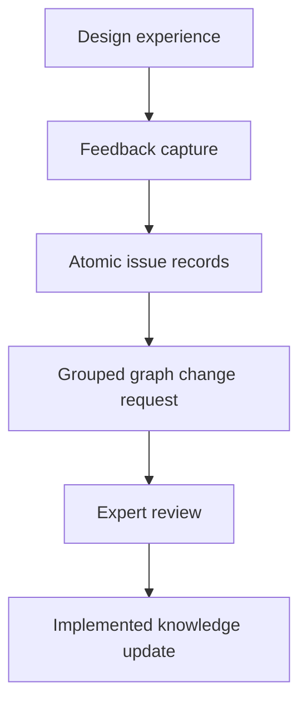

# Paper 1A Outline - User-Directed Case Study Version

## Working Title

**Knowledge-Graph-Governed AI4D for Industrial Structural Design: A Case Study in Subsea Inline Structure Conceptual Design**

Alternative titles:

1. **Applying Knowledge Graphs and Human-in-the-Loop LLMs to Industrial Structural Design: An AI4D Case Study for Subsea Inline Structures**
2. **From Historical Designs to Governed Design Assistance: A Knowledge-Graph AI4D Framework for Subsea Inline Structures**
3. **Ontology-Grounded AI4D for Engineering Practice: Knowledge Graphs, LLM Querying, and Knowledge Evolution in Subsea Structural Design**

Preferred title direction: include **knowledge graph**, **AI4D**, and **industrial structural design**. These are recognizable terms for job screening and future expansion into ML.

## Core Thesis

This paper presents Slay-ILS-Designer as a case study in applying established AI4D principles to a real industrial structural-design domain. The central argument is that useful engineering AI is not mainly "chatbot creativity"; it is disciplined data management, ontology-grounded knowledge graph construction, traceable querying, tool use, and governed knowledge evolution.

The case study uses subsea inline structures (ILS/ILT) from oil and gas engineering. These are practical industrial assemblies where design decisions depend on component geometry, assembly topology, fabrication constraints, installation behavior, strain/stress response, and accumulated project experience. The framework shows how historical engineering experience can be structured so that an LLM can parse a human design request, map it into an engineering problem representation, retrieve relevant knowledge, use deterministic tools, produce an inspectable design output, and record feedback for expert-reviewed graph evolution.

## Abstract Draft

Industrial structural design organizations often hold valuable engineering experience in reports, drawings, calculations, design notes, and tacit expert judgement, but this knowledge is difficult to retrieve and reuse systematically. This paper presents a case study of an AI4D framework for subsea inline structure conceptual design, where large language models are used not as unconstrained design authorities but as ontology-guided agents for problem decomposition, knowledge graph querying, tool orchestration, explanation, and feedback capture. The framework combines an Engineering Design Problem Representation (EDPR), component and assembly knowledge layers (EDES and EDAS), an evidence-oriented behavior knowledge base (EDIKB), P-map/APF problem formulation, and a Knowledge Evolution Loop (KEL) for human-in-the-loop governance. The study shows how historical design experience can be recorded as graph-structured engineering knowledge and used to support professional design reasoning. It also identifies a critical limitation: datasets generated from tens of historical designs may still be inadequate for high-confidence coverage of industrial outliers, scaling effects, missing parameters, and rare topology combinations. The paper therefore proposes a pathway in which knowledge graphs are supplemented by automated parametric studies, FEA evidence generation, and future ML models. The result is a practical architecture for AI-assisted structural design that emphasizes traceability, evidence scope, expert review, and continuous knowledge evolution.

## Target Contribution

| Contribution | What the paper should claim |
|---|---|
| Industrial AI4D case study | Demonstrates how AI4D principles apply to a specialized structural engineering workflow rather than a generic software task. |
| Knowledge graph design framework | Shows how component, assembly, behavior, and problem knowledge can be separated into EDES, EDAS, EDIKB, and EDPR. |
| LLM role definition | Positions the LLM as a parser, graph builder, query planner, reasoning interface, tool orchestrator, and explanation generator. |
| FBS-OAM ontology use | Explains why function, behavior, structure, object, assembly, and manufacturing/assembly features matter for ILS/ILT assemblies. |
| P-map/APF problem formulation | Shows how a natural-language query becomes actionable design requirements, issues, artifacts, behaviors, and retrieval targets. |
| KEL governance | Demonstrates how design feedback becomes candidate graph changes under expert review rather than unverified automatic memory. |
| Dataset limitation insight | Shows why 50-60 historical designs can still be insufficient for full KG confidence and why parametric studies/ML are needed. |
| Future ML integration path | Defines where ML fits: surrogate behavior prediction, gap detection, topology recommendation, uncertainty estimation, and active study generation. |

## Proposed Paper Structure

### 1. Introduction

Key points:

- Industrial structural design depends on accumulated experience, but this experience is often fragmented across documents, drawings, spreadsheets, calculations, and expert memory.
- For subsea ILS/ILT conceptual design, the same design intent can be realized through several possible assemblies, layouts, support arrangements, and protection schemes.
- LLMs are valuable in this context when they are constrained by ontology, retrieval, deterministic tools, evidence records, and human review.
- The paper presents Slay-ILS-Designer as an applied AI4D case study.
- The main claim is practical: AI for engineering design is first a problem of organizing, querying, validating, and evolving engineering knowledge.

Suggested introduction close:

> This paper does not claim that an LLM can replace engineering verification. It argues that LLMs can become useful engineering assistants when embedded inside an ontology-grounded, tool-using, human-reviewed knowledge system.

### 2. Industrial Design Context: Subsea Inline Structures

Explain:

- Subsea pipelines require local structures such as inline tees, connectors, supports, protection frames, thick pipe regions, branch piping, valves, and installation interfaces.
- ILS/ILT conceptual design is an assembly problem with many valid configurations.
- Design quality depends on geometry, load path, installation contact, bending stiffness changes, stress/strain concentration, valve protection, and connector positioning.
- Industrial projects may reuse proven layouts, but project-specific constraints often create variants.

Important phrase:

> The design object is not a single component but an assembly of interacting structural and piping artifacts.

### 3. AI4D as Data Management and Smart Querying

Explain the paper's philosophy:

- AI4D is not only model training.
- In industrial engineering, much of the value comes from making data findable, structured, reusable, and checkable.
- The LLM helps convert human language into graph queries and tool actions.
- The knowledge graph provides a controlled memory of engineering objects, evidence, assumptions, and limitations.

Core workflow:

### 4. Framework Overview

Use the repo's actual layer names:

| Layer | Role in the paper |
|---|---|
| EDPR | Represents the current design problem, including objectives, constraints, issues, behaviors, retrieval plan, and solver plan. |
| EDES | Stores component knowledge: geometry, parameters, constraints, functions, interfaces, and local structure-derived behavior. |
| EDAS | Stores assembly knowledge: topology rules, layout anchors, connection logic, section/contact ownership, and emit/build rules. |
| EDIKB | Stores behavior and evidence knowledge: study rows, trends, uncertainty, evidence anchors, and behavior guidance. |
| Knowloop | Captures front-end feedback candidates. |
| KEL | Converts experience and feedback into expert-reviewed graph evolution. |
| Plotter/toolchain | Ensures visual outputs come from the repository's component/assembly definitions rather than freehand LLM sketches. |

### 5. FBS-OAM Ontology for Structural Assemblies

Purpose of this section:

- Show why FBS alone is useful but not enough for this domain.
- Explain why OAM matters because ILS/ILT structures are assemblies, not isolated parts.
- Connect the ontology to optimization and design exploration.

Recommended explanation:

FBS provides a natural way to organize engineering reasoning:

| FBS concept | ILS/ILT interpretation |
|---|---|
| Function | Route flow, support pipe, connect branch, protect valve, permit installation, control strain. |
| Behavior | Stress, strain, contact load, bending moment, stiffness transition, roller interaction, installation response. |
| Structure | Pipe, valve, branch, connector, top frame, side base, protection frame, thick pipe, boss, support. |

OAM adds what is essential for assembly design:

| OAM concept | ILS/ILT interpretation |
|---|---|
| Part | Valve body, pipe segment, connector, support, frame member. |
| Assembly | ILT, ILS, EA-ST, EA-SB, branch subassembly, protection frame. |
| Assembly feature | Weld end, connector slot, support interface, contact patch, branch take-off. |
| Association | Branch-to-header, connector-to-frame, support-to-pipe, valve-to-protection relation. |
| Position/orientation | Z-branch, L-branch, vertical connector, inline valve placement, roller contact region. |

Why this matters:

- Multiple assemblies can satisfy the same function.
- Geometry, parameters, and assembly methods must be nodes, not hidden text.
- Optimization requires explicit candidate sets, constraints, metrics, and topology variables.
- Structural performance is often driven by interactions, not isolated component properties.

### 6. EDES and EDAS Relevance to Knowledge Graph Preparation

EDES and EDAS are relevant because a KG for engineering design must separate what a component **is** from how components may be **assembled**.

EDES should contain:

- component identity;
- canonical parameters;
- geometry and derived dimensions;
- connection features;
- constraints and validation rules;
- component-level function and structure-derived behavior.

EDAS should contain:

- valid topology patterns;
- assembly anchors and reusable layout templates;
- connection and association rules;
- ownership rules for pipe section, contact, support, and protection;
- build/plot emit contracts.

This separation prevents two common KG failures:

1. Duplicating component facts inside every assembly record.
2. Letting an LLM infer a plausible-looking assembly that violates component geometry or connection logic.

### 7. P-map/APF Problem Formulation

P-map/APF is used because natural-language design queries are usually incomplete and mixed: they contain actions, objects, constraints, preferences, missing information, and hidden evaluation criteria.

APF contributes:

| APF item | Role |
|---|---|
| Action | What the agent must do: design, compare, select, validate, explain, or ask. |
| Product | The design object: component, subassembly, assembly, layout, or candidate set. |
| Function | The intended engineering purpose of the object. |

P-map contributes:

| P-map item | Role |
|---|---|
| Requirement | Stated objective or constraint. |
| Artifact | Component, assembly, or layout under consideration. |
| Behavior | Stress, strain, bending, contact load, clearance, support load, etc. |
| Issue | Missing input, ambiguity, tradeoff, or knowledge gap. |
| Link | Trace from requirement to artifact, behavior, retrieval target, or evaluation variable. |

What P-map adds beyond FBS:

- It makes problem-specific issues explicit.
- It captures missing information without pretending it is known.
- It links human feedback to exact failure points.
- It feeds KEL because every correction can be mapped to an issue, action, target layer, and graph change.

### 8. KEL: Knowledge Evolution Loop

KEL is the paper's strongest differentiator.

Explain:

- Knowloop captures the front half: candidate feedback and human review signal.
- KEL closes the loop by converting experience into governed graph evolution.
- The system records the query, parsed EDPR, retrieval context, proposed solution, plot, assumptions, confidence, sufficiency rating, human feedback, graph change request, expert review, and implementation trace.

KEL lifecycle:

Why it matters:

- It turns mistakes into structured learning.
- It prevents unreviewed feedback from contaminating the official KG.
- It reveals missing data, weak evidence, and representability gaps.
- It supports engineering governance: traceable, auditable, reviewable updates.

### 9. Case Study: Q1 Inline Tee / Branch / Valve Layout

Use the Q1 interaction as the running case.

Original design request:

- 12 inch pipeline header.
- Valve on header line.
- 8 inch branch going to vertical connector.
- Two valves on branch line.
- Need ILT layout.

Observed framework lesson:

- A normal LLM response can generate a plausible-looking but incorrect layout.
- It may draw the branch below the pipeline, assume an unsupported EA-SB protection arrangement, ignore EA-ST association for branch connectors, use incorrect component shapes, omit parameters/connections, and produce a plot that is not repository-backed.
- Under KEL, these are not just errors; they become structured feedback records and graph change requests.

Case-study table:

| Feedback lesson | Framework update direction |
|---|---|
| Branch location and vertical connector misunderstood | EDPR/EDAS design-intent gate for connector orientation and Z-branch selection. |
| Valve protection unsupported or omitted | EDPR clarification/evidence gate; use canonical GD-SB only when roller scope, protection mode, envelopes, clearances, load cases, connector basis, and compatible moment evidence support EA-SB. |
| Branch connector not associated with EA-ST | EDAS association rule and plot/report exposure gate. |
| Freehand plot too small and wrong geometry | Mandatory repository plotter use and plot quality checks. |
| Component parameters and connections missing | EDES/EDAS parameter and association exposure in report. |
| Strain optimization was inferred without being requested | Do not create an optimization objective. Evaluate stress/strain only against explicit objectives or acceptance constraints and state evidence limits. |

### 9.1 Repository-Verified KEL v0.2 Behavior

The current repository demonstrates the following behavior at commit `c3157c6`:

- explicit vertical connector intent restricts selection to `ILT-Z-*` and emits GD-B variant Z;
- the Q1 vertical-connector regression emits `ILT-Z-FT-PS` rather than an L branch;
- complete EA-ST reports expose canonical GD-ST parameters, active and inactive slots, modeled GD-Con parts, pipe landings, and associations;
- the incomplete 12-inch valve request stops with `VALVE_PROTECTION_INPUTS_MISSING` and does not emit a misleading layout;
- P-S valve support without compatible combined evidence produces a `needs_evidence` FEA study candidate;
- valve moment evidence is checked using capacity utilization for every supplied load case;
- two branch valves remain `TWO_BRANCH_VALVE_TOPOLOGY_UNRESOLVED` until expert review fixes their ownership topology.

These statements are repository-demonstrated prototype behavior. They are not claims of code compliance, structural adequacy, or final engineering approval.

### 10. Dataset Sufficiency and the Need for Parametric Studies

This is a key paper argument.

Even if a company has 50-60 historical designs, the dataset may still be inadequate because:

- some topologies are rare;
- outlier dimensions may not be represented;
- scaling from one diameter or layout family to another may be invalid;
- historical records may omit parameters that later become important;
- project timescales may be too long to accumulate dense evidence;
- negative cases and rejected designs are often under-recorded;
- stress/strain interactions may be nonlinear and topology-dependent.

Therefore, a KG built from historical design records should be treated as a starting evidence graph, not a final predictive model.

Recommended extension:

- Generate supplementary engineering candidates using automated parametric studies.
- Run FEA or simplified structural analysis to populate missing response regions.
- Use active learning to select the next most informative design cases.
- Use ML for surrogate prediction only after the evidence domain is explicit.

Where ML can help:

| ML role | Example |
|---|---|
| Surrogate behavior prediction | Estimate strain/stress response for candidate layouts. |
| Gap detection | Identify under-covered regions of the design space. |
| Candidate generation | Propose additional study points for FEA. |
| Similarity retrieval | Find historical designs closest to a new EDPR. |
| Uncertainty estimation | Flag cases where KG/ML confidence is weak. |
| Design ranking | Rank candidate assemblies after EDAS validity and evidence checks. |

### 11. Professional Engineering Practice Relevance

Emphasize:

- The framework does not bypass the engineer.
- It supports disciplined reuse of engineering experience.
- It makes assumptions visible.
- It separates conceptual assistance from final verification.
- It gives a practical method for companies to capture lessons from design reviews.

Job-application angle:

> The work demonstrates the ability to combine domain engineering, ontology design, Python tooling, LLM workflow design, validation gates, and human-in-the-loop governance into a practical AI4D engineering system.

### 12. Future Work

Include:

- Complete EDPR natural-language parser integration.
- Expand EDES/EDAS coverage for additional ILS/ILT components and connection systems.
- Build a larger EDIKB from historical projects, reports, FEA cases, and published studies.
- Add automated parametric FEA generation for missing topology/parameter regions.
- Develop ML surrogates with explicit applicability domains and uncertainty reporting.
- Add optimization workflows that combine EDAS-valid candidate generation with behavior prediction.
- Add review dashboards for expert KEL decisions.
- Produce benchmark cases for comparing unguided LLM, RAG-only LLM, and full governed AI4D workflow.
- Explore integration with company design standards, document management systems, and calculation templates.

## Independent Thoughts To Consider

1. The strongest academic framing is probably **neuro-symbolic engineering design**, not just "LLM for design." The symbolic part is EDPR/EDES/EDAS/EDIKB/KEL; the neural part is LLM parsing, synthesis, and future ML.
2. The strongest professional framing is **engineering knowledge management with AI interfaces**. This will resonate with companies because their pain is usually fragmented experience, not lack of chatbots.
3. The paper should avoid claiming design automation too early. The safer and stronger claim is "traceable conceptual design assistance and knowledge evolution."
4. A very good paper figure would compare three modes: unguided LLM answer, RAG-only answer, and governed KEL answer. Q1 is a perfect demonstration.
5. The dataset-sufficiency argument is valuable. It shows maturity: you are not assuming that a small historical KG magically produces reliable engineering intelligence.

## Citation Needs Before Preprint

This outline still needs citation support for:

- AI4D / AI for design principles;
- knowledge graphs in engineering design;
- FBS and FBS ontology;
- OAM or assembly ontology/modeling references;
- P-map/APF or problem formulation references;
- human-in-the-loop knowledge evolution / KnowLoop paper;
- RAG and tool-using LLM agent references;
- active learning / surrogate modeling for engineering design;
- subsea ILS/ILT or pipeline structural design evidence papers.
