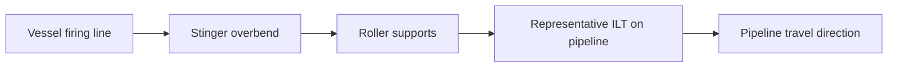
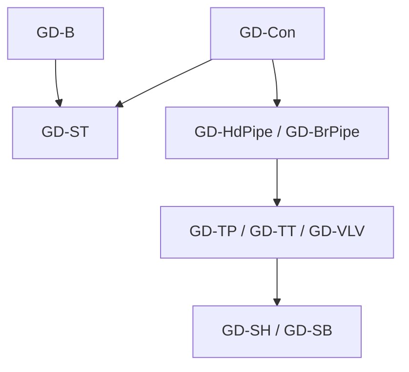
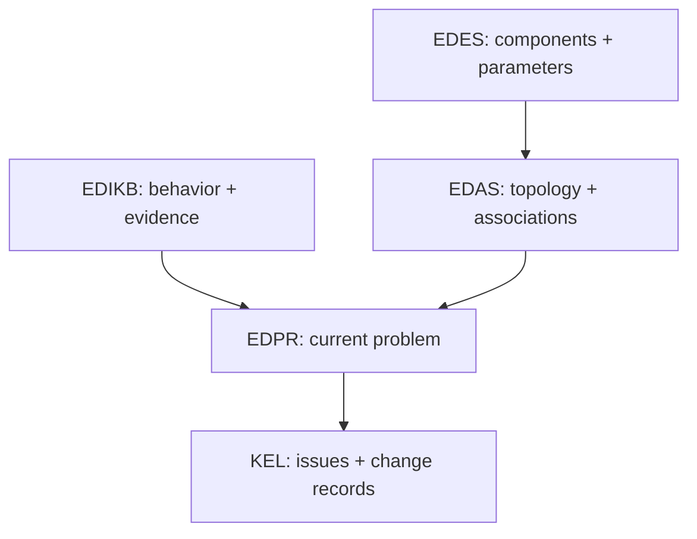
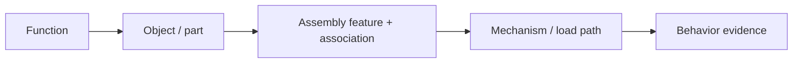
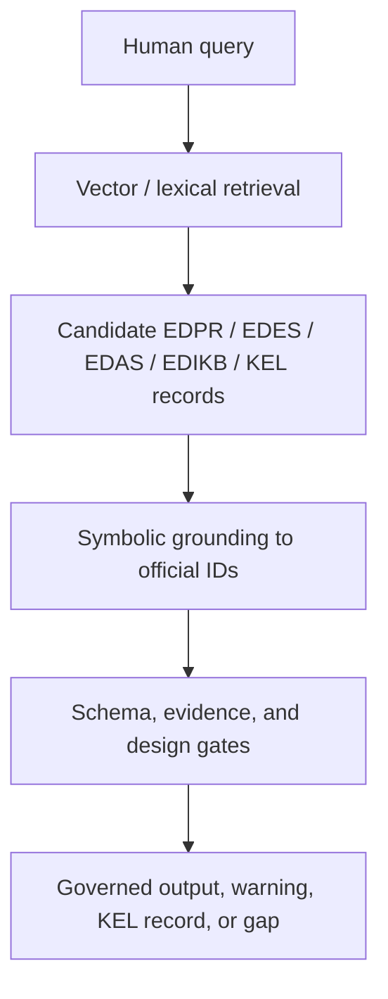
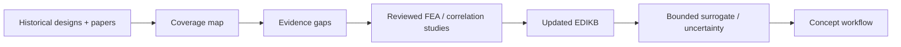

# Knowledge-Graph-Governed AI4D for Industrial Structural Design: An S-Lay Inline Structure Framework

**Working manuscript:** Paper 01A, Draft v0.1
**Planned venue:** engrXiv
**Authors:** Sreekanth Manakkattil Sivaraman; Jagannatha Venkataramana Reddy
**Corresponding author:** <u>[TO BE COMPLETED]</u>
**Draft date:** 14 September 2026

> <u>**Draft status / originator note.** This manuscript is a framework draft for technical and narrative review. It is not submission-ready and does not yet present validated example results. Figures are represented by production notes or preliminary sketches, quantitative EDIKB statements still require claim-level checks, and the controlled example section remains to be produced after the workflow is verified through further trials. Bracketed [AUTHOR REVIEW] notes identify required decisions or evidence.</u>
>
> <u>**Editorial convention for this draft.** Underlined text marks pending author/originator work, figure-production instructions, or submission-preparation actions. These notes should be resolved, converted to normal prose, or removed before preprint submission.</u>

## Abstract

Engineering organizations accumulate valuable design knowledge in drawings, calculations, finite element analysis reports, specifications, spreadsheets, review comments, and expert experience. Much of that knowledge is difficult to reuse because documents describe similar objects with different terms, omit the assumptions needed to interpret a result, or record a conclusion without a machine-readable link to its geometry and load case. This paper presents Slay-ILS-Designer, an ontology-grounded artificial intelligence for design (AI4D) framework for conceptual reasoning about subsea inline structures installed with an S-lay pipeline. The framework treats engineering AI first as a data- and knowledge-management problem. It separates component definitions, assembly rules, behavior evidence, and the current design problem into four governed layers: the Engineering Design Equipment Specification (EDES), Engineering Design Assembly Specification (EDAS), Engineering Design Intuition Knowledge Base (EDIKB), and Engineering Design Problem Representation (EDPR). A large language model interprets requests and explains results, while deterministic validators, retrieval tools, layout builders, plotting tools, and design gates control operations that require repeatability. Human feedback enters a Knowledge Evolution Loop (KEL), where it is decomposed, grouped, reviewed, implemented, and retained with provenance rather than being written directly into approved knowledge. The manuscript describes the ontology, data architecture, workflow controls, and adoption path for practicing engineers. It does not yet present validated design examples, comparative evaluation results, design-code compliance, or evidence that the workflow improves design quality. Those claims are reserved for a later controlled example and review section after the workflow has been stabilized.

**Keywords:** engineering knowledge management; artificial intelligence for design; ontology; knowledge graph; large language model; subsea inline structure; S-lay installation; human-in-the-loop engineering; conceptual design; design provenance

## Preliminary Visual Guide

The final manuscript will use publication-quality figures. The draft keeps only symbolic placeholders so the paper remains readable while figures are rebuilt.

| Figure | Purpose | Draft status |
|---|---|---|
| Figure 1 | Governed AI4D workflow from query to KEL | <u>Replace symbolic workflow with final lane diagram.</u> |
| Figure 2 | GD component vocabulary | <u>Replace with repository-scale component schematic.</u> |
| Figure 3 | FBS-OAM mapping for an ILT assembly | <u>Replace with final ontology/assembly graphic.</u> |
| Figure 4 | Hybrid RAG and symbolic grounding pipeline | <u>Replace with final retrieval/governance diagram.</u> |
| Figure 5 | Evidence expansion path to FEA/correlation/ML | <u>Replace with final study-planning diagram.</u> |

## 1. Introduction

Industrial structural design rarely starts from a blank sheet. Engineers consult earlier drawings, calculation reports, fabrication lessons, installation records, standard details, and the judgment of colleagues who remember why a previous arrangement succeeded or failed. This experience is valuable, but its storage is usually document-centered. A report may state that one support arrangement reduced strain, while the geometry, connector type, response location, and assumptions needed to reuse the result are scattered across figures, tables, and appendices. A drawing may define the arrangement but not the behavior observed during installation. A review comment may correct a decision without being converted into a reusable rule.

The problem is often described as poor retrieval, but retrieval is only one part of it. Finding the correct report does not guarantee that a new problem matches the old case. The engineer still has to determine whether the component type, dimensions, topology, boundary conditions, installation phase, and response definition are compatible. A language model can summarize documents and translate requests, but fluent text does not supply missing engineering data or make unlike cases comparable.

This paper examines that problem through subsea inline structures, including inline tee structures (ILTs), installed as part of an S-lay pipeline. These structures combine header piping, branches, valves, thick sections or anchor features, top and base structures, supports, connectors, and sometimes mudmats. During installation, the assembly passes through the vessel firing line and stinger overbend. Local changes in stiffness, elevation, mass, contact, and connection location can change pipeline curvature, strain, and component bending moment. The design object is therefore an interacting assembly rather than a collection of independent parts [7], [8].

Slay-ILS-Designer is a repository-based experiment in organizing this knowledge for AI-assisted conceptual engineering. Its premise is practical: an engineering assistant becomes useful when it can identify objects consistently, preserve requirements, retrieve compatible evidence, construct only representable assemblies, disclose unknowns, and produce outputs an engineer can inspect. These abilities depend on data structure and governance before they depend on generative sophistication.

The paper asks four questions:

1. How can fragmented engineering information become reusable and reviewable design knowledge?
2. How do separate component, assembly, behavior, and problem representations improve conceptual-design reasoning?
3. Which tasks suit a large language model, and which require deterministic tools or engineering review?
4. How can design feedback improve the knowledge system without turning an unreviewed comment into approved knowledge?

The contribution is an applied framework draft. It connects a physical S-lay ILT ontology, derived from two preceding domain studies [7], [8], to a layered data architecture; explains how a natural-language request becomes an explicit problem record; shows how repository-backed plotting and validation constrain output; and demonstrates how feedback passes through a governed knowledge-evolution lifecycle. It does not claim that the software sizes a project design, replaces FEA, demonstrates code compliance, or learns validated rules autonomously.

## 2. S-Lay Inline Structures and Their Ontology

**Notation used in this paper.** The source studies [7], [8] use the identifiers `EA-ST` and `EA-SB` for the external top and base structures. This paper normalizes those identifiers to the repository terms `GD-ST` and `GD-SB` and uses the `GD-` notation from this point onward. The change is terminological; it does not alter the component concepts, geometry, mechanical classification, or meaning of the cited evidence.

### 2.1 The physical engineering problem

An S-lay pipeline leaves the installation vessel through a firing line and passes across a curved stinger before entering the suspended catenary. The overbend is a displacement-dominated region in which the pipeline changes curvature while being supported by rollers. When an inline component or structural assembly reaches this region, its local stiffness, outside profile, connection system, and mass distribution may alter the contact sequence and load path.

The first domain study [7] introduced two linked classifications. The physical classification distinguishes inline-welded items from externally attached items. Inline-welded items interrupt or form part of the pipeline load path; externally attached items include structural frames, rings, and offset contact elements. The mechanical classification groups behavior by the mechanism that changes the overbend response:

- **Type A - stiffness-dominant behavior:** the component or attachment restricts bending or changes sectional stiffness. Distributed stiffness is Type A1 and stiffness concentrated at discrete attachments is Type A2.
- **Type B - elevation-dominant behavior:** the object changes pipeline contact elevation and therefore curvature. Distributed elevation is Type B1 and elevation applied at discrete points is Type B2.
- **Type C - combined behavior:** stiffness and elevation mechanisms act together.

A base structure and top structure can use nominally similar connectors but behave differently because the base can contact the rollers and apply an offset load path [8]. An isolated thick section and the same section nested inside an elevated shroud likewise cannot be treated as interchangeable cases [7].

> <u>**Figure 1 production note - S-lay ILT physical context.** Redraw the vessel firing line, stinger rollers, overbend, pipeline travel direction, and a representative ILT. A temporary internal crop may use Figure 4 or Figure 7 of [7]. The final figure should be a rights-cleared vector reconstruction.</u>

### 2.2 Component primer: what the GD codes represent

The repository gives every reusable component class a stable identifier beginning with `GD-`. The prefix is a local machine-readable namespace; it is not proposed as universal industry notation. Authors and engineers can continue to use readable names, while data records use the code to distinguish objects that may look similar in a small schematic but have different geometry, load paths, or assembly behavior. This paper uses the repository identifiers consistently so that one component has one name in the narrative, data records, plots, and validation reports.

**Figure 2. Canonical GD component vocabulary (preliminary).** The symbols introduce the ten established component classes used in these papers. They communicate identity and mechanical role; they are not fabrication drawings or proof of design adequacy.

| Code | Readable component | What it represents in the engineering model | Key data or relationship |
|---|---|---|---|
| `GD-HdPipe` | Header pipe | A uniform segment of the main pipeline and its structural section/contact reference | Pipe outside diameter and wall thickness, segment length, axial position |
| `GD-BrPipe` | Branch pipe | One uniform pipe segment within a branch run | Branch section and length; it does not own roller contact |
| `GD-TP` | Thick pipe | A square-shouldered reduced-order thick section for concept studies | Body length, thickness, center position, stiffness and mass ratios |
| `GD-TT` | Tapered thick pipe | A thick body connected to the header through explicit tapered transitions | Thick-body and taper dimensions, section continuity, center position |
| `GD-VLV` | Valve | An enlarged inline valve body with stem and installation envelope | Body length and diameter, stem envelope, mass, parent line; direct roller passage is prohibited |
| `GD-B` | Branch piping assembly | A multi-member L or Z branch from the header tee toward a supported endpoint | Branch dimensions, orientation, valve position, terminal support connector |
| `GD-SH` | Shroud | An offset protective/contact envelope around an inline component | Offset and end dimensions; it can own contact but does not replace the pipe section |
| `GD-ST` | Top structure | A closed structural frame above the header for support or protection | Frame length/height, stiffness, active connector slots and associations |
| `GD-SB` | Base structure | A structural frame below the header whose lower surface can contact rollers | Base length/depth, slopes, stiffness, contact geometry and active connectors |
| `GD-Con` | Connector | The interface through which two component features transfer load | Endpoints, fixed/pinned/slotted/deadband/welded type, degrees of freedom and stiffness |

Three distinctions prevent common interpretation errors. `GD-TP` is the deliberately simplified square-shouldered concept representation, whereas `GD-TT` makes the tapered transitions explicit. `GD-BrPipe` is one straight pipe part, whereas `GD-B` is the complete L- or Z-shaped branch assembly. `GD-SH` and `GD-SB` may alter the roller-contact path without becoming the header structural section.

EDES defines these reusable component objects, their parameters, interfaces, and local constraints. EDAS then states how selected instances may be positioned, nested, chained, and connected in a complete ILS. This separation lets a drawing show the same component vocabulary while an assembly record distinguishes valid and invalid combinations.

### 2.3 Parameters, connectors, and associations

For GD-ST, relevant data include connector locations, stiffness between connections, frame elevation relative to the pipe centerline, geometry, and active connection system. GD-SB additionally needs the dimensions of the roller-contacting base and any deadband. A branch layout requires its shape, dimensions, tee-relative positions, valve instances, and support connections [8].

The connector taxonomy in [8] includes fixed (F), pinned (P), slotted (S), and deadband (D) behavior. These primitives form systems such as F1, F2, F1D, F2D, PS, and PSD. The notation separates the component from the way load is transferred. The same GD-ST geometry with different connection systems is not the same mechanical case.

Branch anchoring is an assembly rule independent of branch family. Every `GD-B` branch assembly emitted as part of an ILS must terminate at a declared `GD-ST` feature. An L branch has a horizontal terminal connector, while a Z branch has a vertical terminal connector. In both families, the association must identify the compatible `GD-ST` feature defined by the selected layout anchor. Omission of the top frame or its terminal association fails the same gate for either branch family.

Associations are equally important. A connector identifies both objects it joins and the feature used at each end. A branch valve belongs to a particular branch instance. A base structure may provide a contact envelope while the pipeline or an inline component retains ownership of the structural section. These relations cannot be inferred reliably from drawing proximity and must be explicit.

### 2.4 The S-lay ILT ontology

| Engineering question | Layer | Typical record |
|---|---|---|
| What is this component? | EDES | Identity, geometry, parameters, functions, constraints, assembly features |
| How can these objects form a valid assembly? | EDAS | Topology, placement, chaining, nesting, associations, contact and section ownership |
| What behavior is supported by evidence? | EDIKB | Trend, numeric row, source, case, parameter range, response location, limitation |
| What is being requested now? | EDPR | Objectives, constraints, knowns, unknowns, candidate objects, retrieval and verification plan |

A Standard ILS Layout Library sits beside EDAS as reusable starting arrangements. A standard layout remains subject to assembly validation, evidence checks, problem constraints, and project-specific verification.

> <u>**Figure 4 production note - ontology map.** Map objects visible in Figure 3 to function, component, parameter, connection, assembly, behavior/evidence, requirement, and issue nodes. Show EDES, EDAS, EDIKB, and EDPR ownership.</u>

The first domain paper supplies the IW/EA taxonomy, Type A/B/C taxonomy, and evidence on distributed stiffness, elevation, and selected combined cases [7]. The second extends the basis to GD-ST, GD-SB, connector systems, branch assemblies, and added-mass position [8]. A paper citation establishes lineage; a quantitative design statement still requires the precise figure or table, case, parameter range, response location, and limitation.

This is where the FBS-OAM view is useful. A subsea ILT is not only a set of shapes; it is an object, action, and mechanism system. A valve may function as an inline flow-control object, but its assembly action may require support, roller-contact protection, shroud transition, or branch-frame containment. A GD-ST and GD-SB may both be called support structures in ordinary language, while their OAM roles differ because one sits above the header and one may interact with installation rollers. FBS-OAM therefore gives the repository a way to represent function, behavior, structure, object identity, assembly action, and mechanism/load-path role without collapsing them into a drawing label.

## 3. Knowledge architecture

Slay-ILS-Designer separates knowledge by responsibility. This avoids treating a component definition, an assembly rule, a behavior trend, a current user request, and a review comment as the same kind of record.

| Layer | Responsibility |
|---|---|
| EDES | Component identity, geometry, parameters, interfaces, local constraints |
| EDAS | Assembly topology, valid layout anchors, associations, connection systems, contact and section ownership |
| EDIKB | Behavior rules, numeric evidence, uncertainty, guidance, future study candidates |
| EDPR | Current problem, objectives, constraints, knowns, unknowns, retrieval plan, solver intent |
| Governed tools | Validation, retrieval, solving, layout materialization, plotting, reporting, governance stamps |
| KEL | Experience, feedback, root cause, expert review, implementation, promotion, supersession |

The separation also helps diagnose failures. If a layout is wrong, the root cause may be problem parsing, component definition, assembly representation, evidence retrieval, evidence applicability, tool execution, visualization, workflow bypass, or missing study data. That diagnosis is essential for improving the toolchain.

## 4. FBS-OAM for structural assembly knowledge

Function-Behavior-Structure (FBS) gives a useful engineering lens. An inline structure exists to perform functions such as routing flow, connecting a branch, supporting a valve, protecting equipment from roller contact, permitting installation, and reducing strain or bending moment. It produces behavior such as stiffness changes, contact loads, bending moments, peak strain, support reactions, and load redistribution. It has structure: pipe, branch, valve, shroud, support, base, top frame, connectors, and local thickness changes.

For inline structures, FBS is necessary but not sufficient. These designs are assemblies. They require an object and assembly modeling layer: parts, subassemblies, features, connections, associations, positions, orientations, and methods of load transfer. This manuscript refers to that combined view as **FBS-OAM**. FBS provides the function-behavior-structure logic; OAM-style concepts make assembly objects, actions, methods, features, and associations explicit.

| FBS/OAM item | ILS interpretation |
|---|---|
| Function | Route flow, protect valve, support connector, permit installation, reduce strain |
| Behavior | Strain, moment, contact load, support reaction, stiffness transition |
| Structure | Pipe, valve, branch, shroud, GD-ST, GD-SB, connector, thick section |
| Object/part | Pipe segment, valve, connector, support item, frame member |
| Assembly | ILT, branch assembly, top-frame support, base protection, shroud system |
| Feature | Weld end, connector slot, support interface, branch terminal, roller-contact area |
| Association | Branch-to-header, branch-to-GD-ST, support-to-pipe, valve-to-protection |
| Position/orientation | L branch, Z branch, horizontal terminal, vertical terminal, valve station, connector spacing |

This is important because structural behavior is driven by interactions. A branch connector is not simply near a top frame; it must terminate at a declared feature through a compatible association. A valve on a header and a valve on a branch trigger different support and containment requirements. A shroud around a stiff component changes contact and stiffness behavior and may require evidence from shroud-plus-thick-component cases.

> <u>**Figure 3 production note.** Rebuild as an FBS-OAM mapping for one representative ILT assembly.</u>

## 5. EDPR, P-map, and APF

Natural-language design requests are compact but ambiguous. A user may ask for an ILT with a vertical connector, header valve, branch valve, and minimum strain. That sentence contains product intent, component requirements, topology clues, performance objectives, missing assumptions, and evidence needs. A direct answer risks jumping from text to design without showing how the problem was understood.

The framework therefore uses EDPR as the problem-instance layer, supported by P-map and APF concepts.

APF separates:

| APF item | Example |
|---|---|
| Action | Design, compare, rank, validate, explain, ask for clarification |
| Product | ILT layout, valve protection concept, branch assembly, shroud system |
| Function | Route flow, protect valve, support connector, reduce strain, permit installation |

P-map exposes:

| P-map item | Example |
|---|---|
| Requirement | Vertical connector, no valve roller contact, minimize strain |
| Artifact | `GD-B`, `GD-ST`, `GD-SB`, `GD-VLV`, `GD-SH`, `ILT-Z-*` |
| Behavior | Peak strain, bending moment, contact load, clearance, support stiffness |
| Issue | Missing roller geometry, unresolved topology, weak connector evidence |
| Link | Requirement-to-artifact, artifact-to-behavior, issue-to-retrieval target |

P-map/APF adds something FBS alone does not provide: a live representation of the current problem state. FBS describes engineering concepts; P-map records what this request requires, what is unknown, what evidence must be retrieved, and which gaps or tradeoffs are present. This is why P-map/APF connects naturally to KEL. When a user corrects an answer, the correction can be mapped to a problem issue, target artifact, target layer, and proposed change.

The governed workflow requires EDPR confirmation before design or layout generation. In engineering terms, this is a design-basis check before calculation or drawing.

## 6. Hybrid RAG pipeline

The repository is structured around symbolic engineering records: EDPR, EDES, EDAS, EDIKB, KEL records, schemas, gates, and deterministic tools. That structure is necessary for authority, but exact keyword or ID matching is not enough. Engineers may say "strongback" when the repository term is `GD-ST`, or "valve cannot ride rollers" when the required symbolic grounding includes `GD-VLV`, `GD-SB`, valve-contact limits, missing roller geometry, moment evidence, and prior KEL lessons.

The hybrid RAG pipeline is:

| Layer | Role |
|---|---|
| Vector or lexical retrieval | Finds semantically related chunks, records, prior problems, feedback, and evidence candidates |
| Symbolic grounding | Maps retrieved candidates to official IDs, schemas, components, assemblies, behaviors, issues, and evidence rows |
| Governance and gates | Decide whether grounded records may be used, whether evidence is sufficient, or whether KEL/future study is required |

Examples of the semantic bridge are:

| Natural-language phrase | Candidate symbolic grounding |
|---|---|
| "strongback" or "top frame" | `GD-ST`, EDAS top-structure associations, connector slots |
| "base frame" or "roller protection" | `GD-SB`, valve/base protection gates, roller-contact assumptions |
| "valve cannot ride rollers" | `GD-VLV`, `GD-SB`, missing clearance/load/moment inputs |
| "vertical connector" | `GD-B.variant = Z`, `ILT-Z-*`, branch-to-GD-ST association |
| "similar past mistake" | KEL root-cause records and implemented workflow gates |
| "is this sizing optimized?" | EDIKB evidence rows, future-study candidates, correlation-gap records |

Vector retrieval is semantic recall, not engineering authority. A semantically similar paragraph becomes useful only after grounding, evidence checking, and governance. The target is hybrid RAG for recall, symbolic grounding for engineering meaning, deterministic gates for validity, and KEL for continuous loophole detection.

## 7. Governed workflow and toolchain

The authoritative design entry point is `tools/run_design_workflow.py`. Lower-level tools validate EDPR, check P-map/APF quality, retrieve EDES/EDAS/EDIKB context, solve, materialize known layouts, plot, and package review artifacts. A direct plot or lower-level output is not treated as authoritative unless it passes through the governed workflow and receives the required design-governance stamp.

The workflow is:

1. Confirm EDPR problem understanding.
2. Retrieve and ground EDES, EDAS, EDIKB, KEL, and relevant documents.
3. Check intent, topology, evidence, support/protection, and plot/report gates.
4. Emit an EDAS-compatible layout, an explicit gap, or a request for missing information.
5. Generate a repository-backed plot and machine-readable report.
6. Capture feedback through KEL when the user or reviewer identifies a correction or gap.

The current KEL experience has produced recurring principle-level lessons:

| Experience class | Principle captured |
|---|---|
| EDPR not shown before design | Problem understanding must be confirmed before concept generation |
| Header valve without support/protection | Header equipment needs explicit GD-SB/protection logic where applicable |
| Branch connector outside GD-ST | Every `GD-B` branch must terminate at a declared `GD-ST` association |
| Evidence available but missed | Retrieval must include EDIKB/KEL evidence and limitations |
| Plot visibility failure | Plot readability and report completeness are review gates |
| Missing correlation data | Create future-study candidates instead of claiming optimization |
| KEL without specific RCA | Record root cause per implemented KEL candidate |

## 8. Controlled examples template

<u>**Originator note.** Do not fill this section with exploratory chat results. Add only controlled examples after prompts, tool versions, artifacts, reviewer notes, KEL records, root-cause analysis, knowledge updates, and future-study candidates are frozen.</u>

Three examples are planned. Each should be reported compactly in the paper and archived fully in repository artifacts or supplementary material.

| Item | Example 1 | Example 2 | Example 3 |
|---|---|---|---|
| Full prompt and confirmed EDPR | <u>TBD</u> | <u>TBD</u> | <u>TBD</u> |
| LLM response and follow-up prompts | <u>TBD</u> | <u>TBD</u> | <u>TBD</u> |
| Plot, report, and parameter artifacts | <u>TBD</u> | <u>TBD</u> | <u>TBD</u> |
| KEL candidate and expert decision | <u>TBD</u> | <u>TBD</u> | <u>TBD</u> |
| Root-cause analysis | <u>TBD</u> | <u>TBD</u> | <u>TBD</u> |
| KB/tool update | <u>TBD</u> | <u>TBD</u> | <u>TBD</u> |
| ML/correlation/future-study candidate | <u>TBD</u> | <u>TBD</u> | <u>TBD</u> |
| Reviewer conclusion | <u>TBD</u> | <u>TBD</u> | <u>TBD</u> |

Reviewers should score requirement fidelity, topology validity, evidence precision, traceability, plot readability, appropriate clarification/refusal, KEL traceability, and whether future-study candidates are created when evidence is insufficient.

## 9. Application in an Engineering Organization

### 9.1 Start from a bounded use case

An organization should begin with one decision family where historical evidence exists and where conceptual support has value. For example, the first scope might compare known GD-ST connection arrangements within a fixed installation model. Beginning with a bounded domain makes terminology, evidence applicability, and review responsibilities manageable.

### 9.2 Build a source register before a graph

The first practical artifact is a source inventory:

- drawings and layout schematics;
- design bases and specifications;
- calculation and FEA reports;
- parameter-study tables;
- fabrication and installation lessons;
- review comments and deviations;
- design codes and company practices;
- subject-matter experts and document owners.

Each source needs an identifier, revision, status, owner, confidentiality classification, and permitted use. Graph construction should not remove document control.

### 9.3 Define ontology ownership

Component specialists should own EDES definitions. System/layout engineers should own EDAS topology and association rules. Analysis specialists should own EDIKB evidence and applicability. Project engineering should own EDPR acceptance and project constraints. A designated knowledge-governance group can administer identifiers, schemas, and KEL state transitions, but technical acceptance remains with the appropriate discipline authority.

### 9.4 Convert evidence with scope

Historical results should be extracted with their context. A strain value without model geometry, load case, response location, and limitations should remain a document reference rather than becoming a reusable numeric rule. Conflicting evidence should be preserved and qualified, not averaged automatically.

### 9.5 Integrate with existing engineering systems

The knowledge layers can reference existing document management, product lifecycle management, requirements, simulation, and calculation systems. The repository need not become the sole data store. Its role can be to maintain controlled identifiers and relations while source documents and large analysis datasets remain in their authoritative systems.

The same principle applies to human review. A KEL package can be exported as JSON for review, attached to an engineering change workflow, or stored in a separate governed repository. Integration should preserve the chain from source design run to feedback, decision, implementation evidence, and released knowledge version.

### 9.6 Treat adoption as an engineering change

The system should enter service through staged assurance:

1. read-only retrieval and evidence tracing;
2. problem-structure drafting with mandatory human confirmation;
3. candidate generation from reviewed standard layouts;
4. deterministic topology and reporting gates;
5. behavior screening within documented evidence domains;
6. integration with project analysis and design-code checks;
7. monitored release with audit and rollback.

At each stage, the organization should define who may create, review, accept, and use each record type.

## 10. Limitations and Development Path

### 10.1 Current technical limitations

The natural-language parser and main reasoning step still require an external or manually operated LLM. The repository contains schemas, prompts, tools, and examples rather than a fully deployed multi-user application. The vector-search index is implemented as a local deterministic fallback, not as a production embedding service. It improves recall for repository terminology and review records, but it does not validate engineering applicability.

The solver performs first-pass grouping and ranking. It does not yet implement complete objective-specific weighting, and heterogeneous responses must not be compared without engineering interpretation. The current EDIKB covers a bounded set of S-lay studies. Its evidence cannot be generalized automatically across pipe sizes, stinger configurations, component geometries, top tensions, contact models, or omitted assembly features.

The source studies themselves state important boundaries. The Type A/B/C work uses defined FEA models and reports relative trends, with limitations in roller modeling, mesh comparability, and parameter coverage [7]. The assembly study intentionally excludes thick anchoring components, places studied connectors on the pipe centerline, and uses a limited set of branch and connector combinations [8]. Complete project behavior may be non-additive, and combined evidence has priority over isolated-component inference.

Plot QA detects selected export, scale, clipping, label, and overlap conditions. It does not validate a load path, check fabrication feasibility, or certify structural adequacy.

### 10.2 Research limitations

The current paper is a single-domain case study. The ontology has been shaped by S-lay ILT practice and by the two supplied domain studies. Generalization to other engineering systems has not been demonstrated.

The manuscript does not yet quantify LLM accuracy, reviewer agreement, time savings, design quality, or error reduction. The planned example and evaluation package in Section 7 must be completed before performance claims are made.

The manuscript's literature base is sufficient for this draft's P-map, assembly-model, human-in-the-loop, APF, and domain framing [1]-[8]. <u>A submission version should add canonical Function-Behavior-Structure sources, broader engineering knowledge-graph literature, tool-using and retrieval-augmented language-model research, engineering lessons-learned literature, and the project-relevant subsea design standards.</u> <u>[AUTHOR REVIEW: approve and supply the intended code editions before adding compliance language.]</u>

### 10.3 Parametric analysis and machine learning

A knowledge graph built from historical projects will contain sparse regions and outliers. Even dozens of past designs may not cover the combinations created by pipe diameter, wall thickness, stinger radius, top tension, component stiffness, offset, length, connector position, gap, mass, and topology. Missing coverage should drive an analysis programme.

<u>Pending future-study workflow to be completed after controlled examples and additional analyses:</u>

1. query EDIKB for the applicable evidence domain;
2. identify gaps around the proposed design;
3. generate a reviewed parametric FEA plan;
4. validate and ingest the results with provenance;
5. train surrogate models only where the dataset and validation support them;
6. estimate uncertainty and refuse extrapolation beyond the qualified domain;
7. use active-study selection to target the most valuable new cases.

Machine learning would then support behavior approximation, sensitivity analysis, gap detection, and optimization. It would not replace geometry, topology, provenance, or engineering acceptance.

> <u>**Figure 8 production note - evidence expansion loop.** Show historical designs and published studies feeding a coverage map, gaps generating parametric FEA cases, reviewed results extending EDIKB, and a bounded surrogate model serving the conceptual workflow with uncertainty and out-of-domain checks.</u>

## 11. Conclusions

Slay-ILS-Designer demonstrates an engineering-centered approach to AI-assisted conceptual design. It begins by representing the physical assembly: header, inline components, branch piping, structures, connectors, contact surfaces, parameters, and associations. It then separates component definition, assembly construction, behavior evidence, and the current problem into EDES, EDAS, EDIKB, and EDPR.

This separation changes the role of the LLM. The model interprets language, proposes structured records, plans queries, and explains results. Deterministic tools validate schemas, enforce selected topology and evidence gates, compute defined checks, construct layouts, and produce inspectable plots and reports. Engineers confirm intent, judge evidence applicability, define project criteria, approve knowledge changes, and retain responsibility for verification.

<u>The next evidence step is a controlled set of reviewed examples across representative prompts. The longer-term step is to use knowledge gaps to direct parametric analysis and qualified surrogate modeling.</u> The enduring requirement is that every recommendation remain connected to the design problem, assembly definition, evidence scope, tool result, and human decision that supports it.

## Data, Software, and Reproducibility Statement

The Slay-ILS-Designer source, schemas, knowledge records, validation tools, plotting tools, and paper planning artifacts are available at:

https://github.com/sreekx007/Slay-ILS-Designer-V1.0

The two source-paper PDFs are not redistributed in the repository. Bibliographic records, checksums, and EDIKB source-family mappings identify the reviewed copies. <u>Generated run artifacts should be curated and frozen before manuscript submission.</u> <u>[AUTHOR REVIEW: select a release tag and archival DOI for the submission package.]</u>

## AI-Assistance Statement

AI assistance was used to help organize the manuscript, draft and revise prose, inspect repository records, and propose figure descriptions. The named authors remain responsible for verifying every citation, engineering statement, numerical value, figure, interpretation, and final submission. AI-generated text and diagrams are not treated as engineering evidence.

## Conflict of Interest Statement

<u>[AUTHOR REVIEW: insert the authors' conflict-of-interest declaration.]</u>

## Acknowledgments

<u>[AUTHOR REVIEW: insert acknowledgments, employer or institutional review information, and any required funding statement.]</u>

## References

[1] M. Dinar, A. Danielescu, C. MacLellan, J. J. Shah, and P. Langley, "Problem Map: An Ontological Framework for a Computational Study of Problem Formulation in Engineering Design," Journal of Computing and Information Science in Engineering, vol. 15, no. 3, 031007, 2015. doi:10.1115/1.4030076.

[2] S. Rachuri, Y.-H. Han, S. Foufou, S. C. Feng, U. Roy, F. Wang, R. D. Sriram, and K. W. Lyons, "A Model for Capturing Product Assembly Information," Journal of Computing and Information Science in Engineering, vol. 6, no. 1, pp. 11-21, 2006. doi:10.1115/1.2164451.

[3] S. Rachuri, M. M. Baysal, U. Roy, S. Foufou, C. Bock, S. J. Fenves, E. Subrahmanian, K. W. Lyons, and R. D. Sriram, Information Models for Product Representation: Core and Assembly Models, NISTIR 7173, National Institute of Standards and Technology, 2004. doi:10.6028/NIST.IR.7173.

[4] M. Dinar, Y.-S. Park, and J. J. Shah, "Challenges in Developing an Ontology for Problem Formulation in Design," Proceedings of the 20th International Conference on Engineering Design (ICED15), Milan, Italy, pp. 165-176, 2015.

[5] Y. Xu, J. Xie, X. Liu, H. Cui, and M. Liu, "A Human-in-the-Loop Conceptual Design Framework Jointly Driven by Large Language Models and Knowledge Graphs," Advanced Engineering Informatics, vol. 74, part A, 104646, 2026. doi:10.1016/j.aei.2026.104646.

[6] Y. Li, H. Wang, B. Xue, M. Zhang, and Y. Jin, "Solver-Independent Automated Problem Formulation via LLMs for High-Cost Simulation-Driven Design," Findings of the Association for Computational Linguistics: ACL 2026, pp. 2138-2153, 2026. doi:10.18653/v1/2026.findings-acl.102.

[7] S. M. Sivaraman and J. V. Reddy, "Toward AI-Assisted Conceptual Design of Subsea Inline Structures: Classification and Strain Behaviour of Inline Components during S-Lay Installation," International Journal for Research in Applied Science & Engineering Technology, vol. 14, no. VII, pp. 1127-1176, 2026. doi:10.22214/ijraset.2026.84268.

[8] S. M. Sivaraman and J. V. Reddy, "Advancing AI Assisted Conceptual Design of Subsea Inline Structures: Mechanical Behaviour of Pipeline-Mounted Structural Assemblies during S-Lay Installation," International Journal for Research in Applied Science & Engineering Technology, vol. 14, no. VIII, pp. 394-442, 2026. doi:10.22214/ijraset.2026.84577.

## Appendix A. Plain-Language Glossary

| Term | Meaning in this paper |
|---|---|
| AI4D | Use of AI methods within an engineering design process |
| Ontology | Controlled definition of objects, properties, relationships, and meanings |
| Knowledge graph | Linked records that instantiate the ontology |
| LLM | Language model used to interpret and generate human-readable information |
| EDES | Master component/equipment knowledge |
| EDAS | Assembly topology and construction knowledge |
| EDIKB | Behavior evidence and design-intuition knowledge |
| EDPR | Structured representation of one current design problem |
| KEL | Governed evolutionary loop for turning experience and feedback into reviewed graph changes |
| Fail closed | Stop with an explicit gap or clarification rather than inventing missing design information |
| Provenance | Trace from a record or claim to its source and revision |
| Applicability | Conditions under which evidence may support a new problem |
| FEA | Numerical structural analysis used here as project or parametric evidence, not performed by the LLM |

## Appendix B. Submission-Readiness Register

- <u>[ ] Approve title, author order, affiliations, corresponding author, acknowledgments, and conflicts declaration.</u>
- <u>[ ] Build the R7/R8 claim-to-evidence matrix at table/figure/case level.</u>
- <u>[ ] Create final Figures 1-8 and verify reuse/redraw rights.</u>
- <u>[ ] Freeze the controlled example protocol, run artifacts, reviewer rubric, and results after the workflow is stable.</u>
- <u>[ ] Add canonical FBS, engineering KG, RAG/tool-use, lessons-learned, surrogate/active-learning, and applicable code references.</u>
- <u>[ ] Replace the commit placeholder with a tagged release and archival DOI.</u>
- <u>[ ] Verify every acronym, term, cross-reference, number, caption, and citation.</u>
- <u>[ ] Conduct independent mechanical-domain and non-AI-reader reviews.</u>
- <u>[ ] Build and inspect the final engrXiv PDF and complete the venue metadata.</u>

