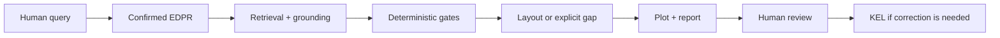
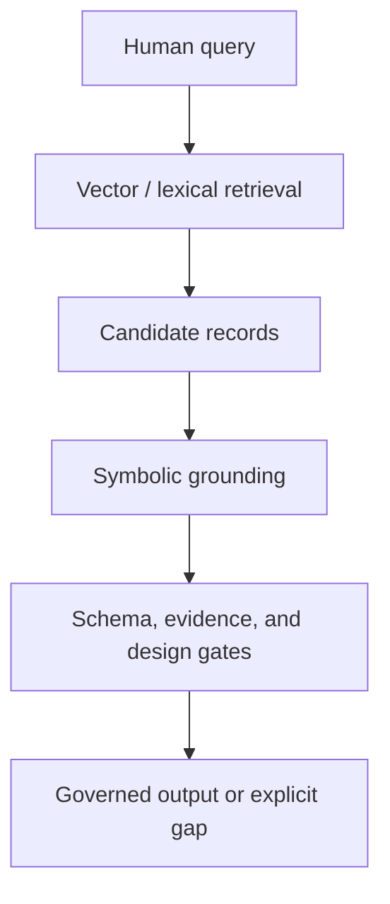

# Knowledge-Graph-Governed AI4D as a Continuation of S-Lay Inline Structure Research: An Industrial Structural Design Case Study

**Working manuscript:** Paper 01A, Draft v0.4
**Planned venue:** engrXiv
**Authors:** Sreekanth Manakkattil Sivaraman; Jagannatha Venkataramana Reddy
**Corresponding author:** <u>[TO BE COMPLETED]</u>
**Draft date:** 16 September 2026

> <u>**Draft status.** This is a concise case-study manuscript. It is not yet submission-ready and does not present validated design results. Underlined text marks pending author/originator work.</u>

## Abstract

Engineering organizations store reusable design knowledge in drawings, reports, finite-element studies, spreadsheets, review comments, and expert memory. Much of it is difficult to reuse because component identity, assembly topology, load case, assumptions, response location, and design reasoning are not represented as connected records. This paper presents a case study in applying state-of-the-art AI methods to industrial structural design, using subsea inline structures installed by S-lay as the engineering domain. The work is positioned as a continuation of two earlier S-lay inline-structure studies by the authors: those studies generated the engineering evidence base, and the present paper examines how that evidence can be converted into an ontology-grounded, reviewable AI4D workflow for professional engineers. The proposed method is described independent of any particular software repository. It separates component definitions, assembly rules, behavior evidence, current problem representation, deterministic tools, and governed feedback into EDES, EDAS, EDIKB, EDPR, toolchain, and KEL layers. A large language model is used as a constrained language interface; deterministic tools validate, retrieve, build layouts, plot, and report. The paper explains the S-lay inline-structure ontology, FBS-OAM assembly framing, P-map/APF problem representation, hybrid RAG pipeline, and KEL feedback loop. It does not claim final design sizing, code compliance, validated optimization, or replacement of project-specific analysis.

**Keywords:** engineering knowledge management; AI4D; knowledge graph; hybrid RAG; S-lay installation; inline structure; FBS-OAM; P-map; APF; KEL

## 1. Introduction

This paper is the third step in a continuing research chain on S-lay inline structures. The first two studies developed the domain evidence base for inline-structure concepts and installation response. The present work asks a different question: how can that engineering knowledge be organized so that modern AI methods can help a professional engineer retrieve, reason about, and improve it without hiding the assumptions or bypassing engineering review? Industrial structural design rarely starts from a blank sheet. Engineers reuse previous layouts, installation lessons, analysis reports, review comments, and local practices. For subsea inline structures, that reuse is difficult because design behavior depends on coupled geometry, contact, stiffness, mass, connector behavior, installation boundary conditions, and response location.

LLMs make this knowledge easier to query, but fluent text is not engineering validity. An LLM can produce a plausible layout while omitting a required support, applying evidence outside its domain, or drawing a concept that hides a missing association. The practical question is therefore not whether an LLM can answer; it is whether the answer is traceable, evidence-bounded, tool-checkable, and reviewable.

The case study treats engineering AI first as knowledge management and governance. The contribution is a layered method that connects an S-lay inline-structure ontology, explicit problem representation, governed retrieval, deterministic layout/plot tools, and a feedback loop for reviewed knowledge evolution. A repository implementation can be provided as optional reproducibility support, but the research contribution is the software-independent toolchain and workflow that can grow as further evidence, correlation data, and ML models are added.

> <u>**Figure 1 production note.** Replace with a publication-quality workflow diagram.</u>

The intended reader is a practicing engineer who needs to understand how AI methods are being applied to a familiar structural-design problem. The paper therefore explains the toolchain and workflow as a transferable method. Any repository reference is secondary and optional, serving only to document one implementation of the method.

## 2. Literature survey

The case study combines four bodies of prior work. First, engineering-design AI has long used explicit knowledge representations to separate what a system is, what it does, and why it is needed. Gero's design-prototype work established design knowledge as reusable structure rather than isolated calculation notes [1]. Goel, Rugaber, and Vattam formalized structure-behavior-function modeling for complex engineered systems, giving a useful basis for separating physical objects, behavior, and purpose [2]. For S-lay inline structures, that separation is necessary but incomplete unless assembly features and relations are also represented.

Second, assembly representation research provides the language needed to describe connected engineered objects. The NIST Open Assembly Model work represents parts, assembly features, liaisons, positions, orientations, and tolerances [3]. This paper adopts that assembly view for inline-structure concepts: a valve, shroud, branch, base structure, top structure, and connector are not only shapes; they are associated objects with interfaces, positions, orientations, load-transfer roles, and contact responsibilities.

Third, design-problem formulation research motivates the EDPR layer. Dinar et al.'s Problem Map framework represents requirements, functions, artifacts, behaviors, and issues as linked problem-formulation records [4]. Automated Problem Formulation work similarly separates the action, product, and function of a request so that an AI system can distinguish designing, validating, comparing, ranking, clarifying, and explaining [5]. In this manuscript, EDPR applies those ideas to a bounded engineering workflow before any layout is generated, so the AI-assisted response starts from a reviewable design basis rather than from an uninspected prompt interpretation.

Fourth, recent AI systems motivate retrieval and tool governance, but they do not remove the need for engineering controls. Retrieval-augmented generation showed that language models can combine generated answers with explicit retrieved memory [6]. ReAct and Toolformer showed that language models can coordinate reasoning with external actions or tools [7], [8]. Human-in-the-loop LLM and knowledge-graph design frameworks further support the need for reviewable interaction between human experts, graph records, and generated concepts [9]. This case study uses these ideas conservatively: retrieval supports recall, tools enforce deterministic checks, and KEL records expert-reviewed corrections rather than treating raw model output as design authority.

The gap addressed here is therefore practical integration for professional engineering practice. The paper does not introduce a new general FBS, OAM, P-map, APF, or RAG theory. It shows how those ideas can be combined with prior S-lay inline-structure research to form a traceable AI4D case study where component identity, assembly topology, evidence applicability, visualization quality, and feedback governance must be visible to engineering reviewers. The planned next stage is to enrich the evidence base with additional simulation, correlation, and ML-derived knowledge rather than treating the current workflow as complete.

## 3. S-lay inline-structure ontology

An S-lay inline structure is an interacting assembly, not a single object. It may include header pipe, inline valve or thickened section, branch pipe, top structure, base structure, shroud, connectors, supports, and transitions. During installation, the assembly passes through the firing line and stinger rollers, so local stiffness, elevation, mass, support position, and roller-contact path can affect strain and bending moment.

The case-study knowledge model uses stable `GD-` identifiers so drawings, data records, plots, and validation reports refer to the same objects.

| Code | Plain name | Engineering role |
|---|---|---|
| `GD-HdPipe` | Header pipe | Main pipe and structural/contact reference |
| `GD-BrPipe` | Branch pipe | Straight branch segment |
| `GD-B` | Branch assembly | L- or Z-shaped branch topology |
| `GD-VLV` | Valve | Enlarged stiff component with envelope/contact constraints |
| `GD-TP` / `GD-TT` | Thick / tapered thick pipe | Simplified or tapered stiff section |
| `GD-SH` | Shroud | Sloped or protective contact envelope |
| `GD-ST` | Top structure | Support/containment/branch anchoring frame |
| `GD-SB` | Base structure | Lower protection/support, often roller-contact relevant |
| `GD-Con` | Connector/support | Load-transfer element |

The source papers used related external-structure notation such as `EA-ST` and `EA-SB`. This manuscript uses unified case-study notation `GD-ST` and `GD-SB`; the change is terminology only. The underlying S-lay inline-structure evidence base comes from the two source ILT studies listed in the references [10], [11].

Associations are as important as components. A branch connector must terminate at a declared feature, not merely appear near a top frame. A base structure may own the roller-contact envelope while the pipeline or valve remains the structural section. These relations must be explicit because they cannot be inferred reliably from drawing proximity.

## 4. Transferable AI4D toolchain and knowledge architecture

The proposed AI4D toolchain separates knowledge by responsibility. The layers may be implemented in files, databases, graph stores, document stores, or enterprise engineering systems; the paper does not depend on a particular repository structure.

| Layer | Responsibility |
|---|---|
| EDES | Component identity, geometry, parameters, interfaces, local constraints |
| EDAS | Assembly topology, valid layout anchors, associations, contact and section ownership |
| EDIKB | Behavior rules, numeric evidence, uncertainty, guidance, future study candidates |
| EDPR | Current problem, objectives, constraints, unknowns, retrieval plan, solver intent |
| Governed tools | Validation, retrieval, solving, layout materialization, plotting, governance stamps |
| KEL | Experience, feedback, root cause, expert review, implementation, promotion |

This separation supports failure diagnosis. A weak output may be caused by problem parsing, component definition, assembly representation, evidence retrieval, evidence applicability, tool execution, visualization, workflow bypass, or missing study data. KEL uses that diagnosis to improve the workflow without turning unreviewed comments into official knowledge. The same architecture can be implemented with different software choices as long as the gates, records, and human-review responsibilities are preserved.

## 5. FBS-OAM for structural assembly knowledge

Function-Behavior-Structure (FBS) is useful because inline structures exist to perform functions, produce behavior, and use physical structure [1], [2]. For this domain, FBS alone is not enough because the design object is an assembly. The proposed toolchain therefore uses an FBS-OAM knowledge view: FBS captures function, behavior, and structure; OAM-style concepts make objects, assembly features, associations, positions, orientations, and load-transfer methods explicit [3].

| FBS-OAM item | ILS interpretation |
|---|---|
| Function | Route flow, protect valve, support connector, permit installation, reduce strain |
| Behavior | Strain, moment, contact load, support reaction, stiffness transition |
| Structure/object | Pipe, valve, branch, shroud, GD-ST, GD-SB, connector, thick section |
| Assembly feature | Weld end, connector slot, support interface, branch terminal, contact area |
| Association | Branch-to-header, branch-to-GD-ST, support-to-pipe, valve-to-protection |
| Position/orientation | L branch, Z branch, horizontal/vertical terminal, valve station, connector spacing |

This matters because structural behavior is driven by interactions. A header valve and a branch valve trigger different support logic. A shroud around a stiff component is not only a cover; it changes contact and stiffness behavior. A connector system may reduce one local issue while increasing stiffness elsewhere.

## 6. EDPR, P-map, and APF

Natural-language design requests are compact but ambiguous. A request for an ILT with a vertical connector, valve, and minimum strain includes product intent, topology clues, component requirements, objectives, missing assumptions, and evidence needs. EDPR is the problem-instance layer that turns such a request into a reviewable design basis.

P-map records the current problem state: requirements, artifacts, behaviors, issues, and links [4]. APF separates the action, product, and function so that the system knows whether it is designing, comparing, ranking, validating, explaining, or asking for clarification [5].

| Framework item | Example in an ILS request |
|---|---|
| APF action | design, compare, rank, validate, explain, clarify |
| APF product | ILT layout, valve protection concept, branch assembly |
| APF function | route flow, protect valve, support connector, reduce strain |
| P-map artifact | `GD-B`, `GD-ST`, `GD-SB`, `GD-VLV`, `ILT-Z-*` |
| P-map behavior | peak strain, bending moment, contact load, support stiffness |
| P-map issue | missing roller geometry, unresolved topology, weak evidence |

The governed workflow requires EDPR confirmation before layout generation. In engineering terms, this is a design-basis check before calculation or drawing.

## 7. Hybrid RAG pipeline

Symbolic records are necessary for engineering authority, but exact keyword matching is not enough. Engineers may say "strongback" when the case-study ontology term is `GD-ST`, or "valve cannot ride rollers" when the grounded meaning includes `GD-VLV`, `GD-SB`, roller-contact limits, missing roller geometry, moment evidence, and prior KEL lessons.

Hybrid RAG is used as semantic recall, not as final authority [6]. The related tool-use literature supports the idea that language models can coordinate external actions, but in this workflow those actions remain gated by deterministic engineering checks [7], [8].

| Phrase | Candidate grounding |
|---|---|
| strongback / top frame | `GD-ST`, top-structure associations |
| base frame / roller protection | `GD-SB`, valve/base protection gates |
| valve cannot ride rollers | `GD-VLV`, `GD-SB`, missing clearance/load inputs |
| vertical connector | `GD-B.variant = Z`, `ILT-Z-*`, branch-to-GD-ST association |
| similar past mistake | KEL root-cause records and implemented gates |
| is this optimized? | EDIKB evidence, future-study/correlation-gap records |

A semantically similar paragraph becomes useful only after grounding, evidence checking, and governance. The target is hybrid RAG for recall, symbolic grounding for engineering meaning, deterministic gates for validity, and KEL for loophole detection.

## 8. Governed workflow and KEL

The authoritative design path is a governed workflow, not an isolated prompt response. The workflow validates EDPR, retrieves context, solves or proposes layouts, materializes a reviewable concept, plots the concept, and packages review artifacts. A direct plot or lower-level tool output is not authoritative unless it passes through the required design-governance gates. This paper describes that workflow at method level; a repository or software implementation is only one possible way to execute it.

The workflow is deliberately stated as a sequence of responsibilities rather than as a sequence of software commands:

1. confirm EDPR problem understanding;
2. retrieve and ground EDES, EDAS, EDIKB, KEL, and relevant documents;
3. check topology, evidence, support/protection, and plot/report gates;
4. emit an EDAS-compatible layout, explicit gap, or request for missing information;
5. generate a reviewable plot and machine-readable report;
6. capture feedback through KEL when correction or learning is needed.

KEL records the experience, feedback, root cause, expert decision, implementation evidence, and promotion state. Its human-review role is consistent with recent human-in-the-loop LLM and knowledge-graph design work, but KEL adds lifecycle control for lessons and graph evolution [9]. Recent KEL work showed that root cause must be captured per implemented candidate. The same visible error can arise from missed retrieval, missing EDAS rule, insufficient EDIKB evidence, plot-report weakness, or workflow bypass.

| Experience class | Principle captured |
|---|---|
| EDPR not shown before design | Confirm problem understanding before concept generation |
| Header valve without support/protection | Apply explicit GD-SB/protection logic where applicable |
| Branch connector outside GD-ST | Every `GD-B` branch needs declared `GD-ST` association |
| Evidence available but missed | Retrieve EDIKB/KEL evidence and limitations |
| Plot visibility failure | Treat plot readability/report completeness as gates |
| Missing correlation data | Create future-study candidates, not optimization claims |

## 9. Controlled examples template

<u>**Originator note.** Add only controlled examples after prompts, tool versions, artifacts, reviewer notes, KEL records, root-cause analysis, knowledge updates, and future-study candidates are frozen.</u>

| Item | Example 1 | Example 2 | Example 3 |
|---|---|---|---|
| Prompt + confirmed EDPR | <u>TBD</u> | <u>TBD</u> | <u>TBD</u> |
| Response + follow-up prompts | <u>TBD</u> | <u>TBD</u> | <u>TBD</u> |
| Plot/report artifacts | <u>TBD</u> | <u>TBD</u> | <u>TBD</u> |
| KEL + RCA + KB/tool update | <u>TBD</u> | <u>TBD</u> | <u>TBD</u> |
| ML/correlation/future-study candidate | <u>TBD</u> | <u>TBD</u> | <u>TBD</u> |
| Reviewer conclusion | <u>TBD</u> | <u>TBD</u> | <u>TBD</u> |

Reviewers should score requirement fidelity, topology validity, evidence precision, traceability, plot readability, appropriate clarification/refusal, KEL traceability, and future-study handling.

## 10. Adoption, limitations, and development path

An organization should begin with a bounded use case: read-only retrieval, evidence tracing, EDPR drafting, governed plotting, and feedback capture. EDES should be owned by component specialists, EDAS by layout engineers, EDIKB by analysis specialists, EDPR by project engineering, and KEL lifecycle by a governance role.

The current toolchain supports conceptual reasoning and evidence tracing. It does not perform final sizing, direct structural verification, fatigue assessment, fabrication approval, installation approval, or code compliance. The solver is first-pass and evidence-scoped. The EDIKB is bounded by the two source studies and curated case-study records. The vector index is a first-pass retrieval layer, not a validated production semantic search system.

Future work should complete the R7/R8 claim-to-evidence matrix, run three controlled examples, archive EDPR/retrieval/solution/layout/plot/KEL artifacts, expand EDIKB with reviewed evidence and uncertainty metadata, and use future-study candidates to plan parametric FEA, correlation studies, and bounded surrogate models. In this sense, the paper is not the end point of the research chain; it is the transition from manually interpreted ILS evidence to an AI-assisted knowledge system that can later absorb ML-derived correlations.

## 11. Conclusions

This case study frames engineering AI as governed knowledge work. The LLM interprets language, proposes problem records, plans retrieval, and explains results. The toolchain defines components, assemblies, evidence, gates, plots, feedback records, and lifecycle controls. Engineers confirm intent, judge evidence applicability, approve knowledge changes, and retain responsibility for project verification.

For S-lay inline structures, the design object is an interacting assembly. Component identity, topology, connection systems, support/protection assumptions, behavior evidence, and response limits must be explicit before an AI-assisted recommendation can be trusted. The future path continues the original ILS research programme: governed knowledge graphs plus hybrid retrieval, symbolic grounding, deterministic tools, KEL root-cause learning, parametric studies, uncertainty-aware ML, and engineering review.

## Data, Software, and Reproducibility Statement

The workflow is described in repository-independent terms. An optional implementation repository may be cited for reproducibility, audit trails, example schemas, and controlled example artifacts, but the method does not depend on that repository.

<u>[AUTHOR REVIEW: decide whether to cite the implementation repository in the submitted preprint, and if so freeze a release tag before submission.]</u>

The reviewed source PDFs are not redistributed. Bibliographic records, checksums, and EDIKB source-family mappings identify the reviewed copies. <u>Generated run artifacts, controlled examples, and release tags should be frozen before submission.</u>

## AI-Assistance Statement

AI assistance was used to organize, draft, and revise this manuscript. The named authors remain responsible for verifying every citation, engineering statement, numerical value, figure, interpretation, and final submission. AI-generated text and diagrams are not treated as engineering evidence.

## References

[1] J. S. Gero, "Design Prototypes: A Knowledge Representation Schema for Design," AI Magazine, vol. 11, no. 4, pp. 26-36, 1990. doi:10.1609/aimag.v11i4.854.

[2] A. K. Goel, S. Rugaber, and S. Vattam, "Structure, Behavior, and Function of Complex Systems: The Structure-Behavior-Function Modeling Language," AI EDAM, vol. 23, no. 1, pp. 23-35, 2009. doi:10.1017/S0890060409000080.

[3] X. Fiorentini, I. Gambino, V. C. Liang, S. Foufou, S. Rachuri, M. Mani, and C. E. Bock, "An Ontology for Assembly Representation," NISTIR 7436, National Institute of Standards and Technology, 2007. doi:10.6028/NIST.IR.7436.

[4] M. Dinar, A. Danielescu, C. MacLellan, J. J. Shah, and P. Langley, "Problem Map: An Ontological Framework for a Computational Study of Problem Formulation in Engineering Design," Journal of Computing and Information Science in Engineering, vol. 15, no. 3, 031007, 2015. doi:10.1115/1.4030076.

[5] Y. Li, H. Wang, B. Xue, M. Zhang, and Y. Jin, "Solver-Independent Automated Problem Formulation via LLMs for High-Cost Simulation-Driven Design," Findings of the Association for Computational Linguistics: ACL 2026, pp. 2138-2153, 2026. doi:10.18653/v1/2026.findings-acl.102.

[6] P. Lewis, E. Perez, A. Piktus, F. Petroni, V. Karpukhin, N. Goyal, H. Kuttler, M. Lewis, W.-T. Yih, T. Rocktaschel, S. Riedel, and D. Kiela, "Retrieval-Augmented Generation for Knowledge-Intensive NLP Tasks," Advances in Neural Information Processing Systems, 2020. doi:10.48550/arXiv.2005.11401.

[7] S. Yao, J. Zhao, D. Yu, N. Du, I. Shafran, K. R. Narasimhan, and Y. Cao, "ReAct: Synergizing Reasoning and Acting in Language Models," International Conference on Learning Representations, 2023.

[8] T. Schick, J. Dwivedi-Yu, R. Dessi, R. Raileanu, M. Lomeli, L. Zettlemoyer, N. Cancedda, and T. Scialom, "Toolformer: Language Models Can Teach Themselves to Use Tools," arXiv:2302.04761, 2023. doi:10.48550/arXiv.2302.04761.

[9] Y. Xu, J. Xie, X. Liu, H. Cui, and M. Liu, "A Human-in-the-Loop Conceptual Design Framework Jointly Driven by Large Language Models and Knowledge Graphs," Advanced Engineering Informatics, vol. 74, part A, 104646, 2026. doi:10.1016/j.aei.2026.104646.

[10] S. M. Sivaraman and J. V. Reddy, <u>[AUTHOR REVIEW: insert final bibliographic details for the first S-lay ILT/source EDIKB paper.]</u>

[11] S. M. Sivaraman and J. V. Reddy, <u>[AUTHOR REVIEW: insert final bibliographic details for the second S-lay ILT/source EDIKB paper.]</u>

[12] <u>[AUTHOR REVIEW: add final subsea design-standard, active-learning, surrogate-modeling, and additional engineering-KG references if required by the final scope.]</u>

## Submission-readiness register

- <u>[ ] Approve title, author order, affiliations, corresponding author, acknowledgments, and conflicts declaration.</u>
- <u>[ ] Build the R7/R8 claim-to-evidence matrix.</u>
- <u>[ ] Create final figures and verify reuse/redraw rights.</u>
- <u>[ ] Freeze the controlled examples and, if cited, the optional implementation repository release tag.</u>
- <u>[ ] Verify every acronym, citation, figure, and engineering statement.</u>
