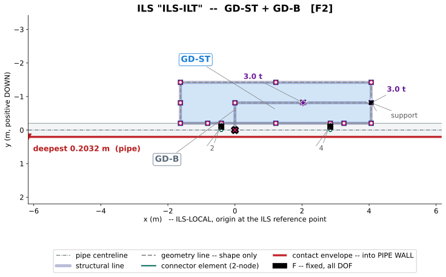
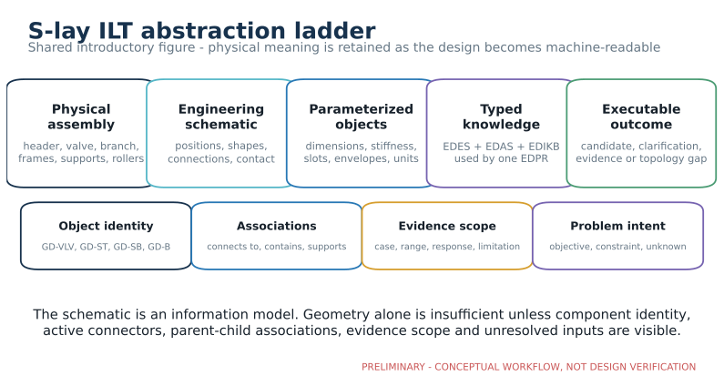
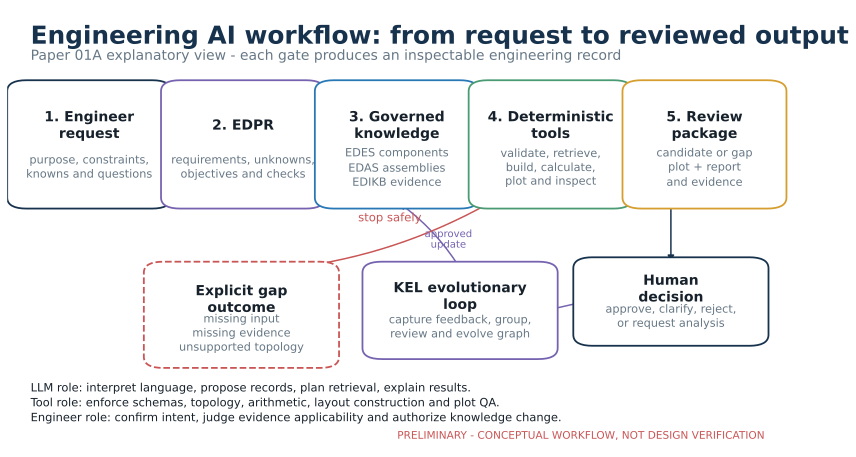
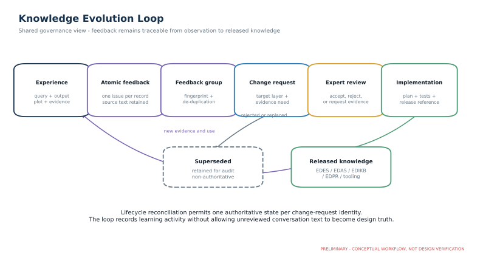
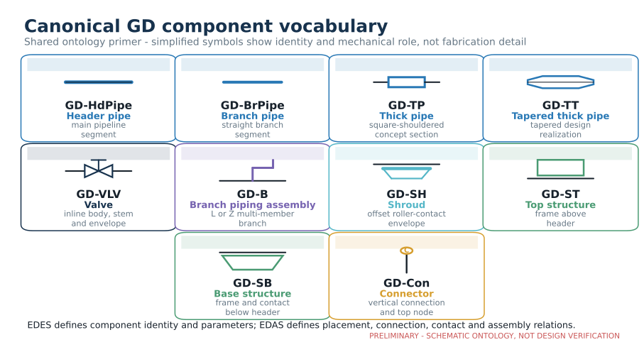

# Knowledge-Graph-Governed AI4D for Industrial Structural Design: An S-Lay Inline Structure Case Study

**Working manuscript:** Paper 01A, Draft v0.1
**Planned venue:** engrXiv
**Authors:** Sreekanth Manakkattil Sivaraman; Jagannatha Venkataramana Reddy
**Corresponding author:** [TO BE COMPLETED]
**Draft date:** 14 September 2026

> **Draft status.** This manuscript is complete enough for technical and narrative review, but it is not yet submission-ready. Figures are represented by production notes, quantitative EDIKB statements still require claim-level checks, and the comparative evaluation in Section 7 remains to be executed. Bracketed [AUTHOR REVIEW] notes identify required decisions or evidence.

## Abstract

Engineering organizations accumulate valuable design knowledge in drawings, calculations, finite element analysis reports, specifications, spreadsheets, review comments, and expert experience. Much of that knowledge is difficult to reuse because documents describe similar objects with different terms, omit the assumptions needed to interpret a result, or record a conclusion without a machine-readable link to its geometry and load case. This paper presents Slay-ILS-Designer, an ontology-grounded artificial intelligence for design (AI4D) case study for the conceptual design of subsea inline structures installed with an S-lay pipeline. The framework treats engineering AI first as a data- and knowledge-management problem. It separates component definitions, assembly rules, behavior evidence, and the current design problem into four governed layers: the Engineering Design Equipment Specification (EDES), Engineering Design Assembly Specification (EDAS), Engineering Design Intuition Knowledge Base (EDIKB), and Engineering Design Problem Representation (EDPR). A large language model interprets requests and explains results, while deterministic validators, retrieval tools, layout builders, plotting tools, and design gates control operations that require repeatability. Human feedback enters a Knowledge Evolution Loop (KEL), where it is decomposed, grouped, reviewed, implemented, and retained with provenance rather than being written directly into approved knowledge. A worked valve-layout request shows why a plausible drawing is insufficient: a 12-inch header and a valve moment capacity equal to 80% of pipeline capacity do not establish the valve envelope, roller clearance, support geometry, connector spacing, load cases, or combined valve-and-base-structure behavior needed to select a defensible arrangement. The revised workflow therefore exposes missing inputs and stops layout emission where evidence or topology is inadequate. Repository verification demonstrates executable schemas, plotting and validation coverage, and a conflict-free KEL lifecycle; it does not establish design-code compliance or comparative superiority over other AI methods. The case study provides practicing engineers with a route from familiar engineering records to traceable, tool-assisted conceptual design, while preserving project-specific analysis and professional judgment as explicit gates.

**Keywords:** engineering knowledge management; artificial intelligence for design; ontology; knowledge graph; large language model; subsea inline structure; S-lay installation; human-in-the-loop engineering; conceptual design; design provenance

## Preliminary Visual Guide

The following sketches are generated from the current repository architecture and are included for early technical review. They are placeholders for publication figures and do not certify an engineering design.

**Preliminary Figure A.** ILS-Plotter output showing the canonical geometry and connector topology at manuscript-readable scale. The companion JSON report retains the resolved parameters, active connectors, associations and warning findings.

**Preliminary Figure B.** Transformation from physical assembly to schematic, parameterized objects, typed knowledge and an executable outcome.

**Preliminary Figure C.** Engineering-facing request-to-review workflow, including explicit gap outcomes and human-governed knowledge change.

**Preliminary Figure D.** Feedback decomposition, grouping, expert review, implementation and released-knowledge lifecycle.

## 1. Introduction

Industrial structural design rarely starts from a blank sheet. Engineers consult earlier drawings, calculation reports, fabrication lessons, installation records, standard details, and the judgment of colleagues who remember why a previous arrangement succeeded or failed. This experience is valuable, but its storage is usually document-centered. A report may state that one support arrangement reduced strain, while the geometry, connector type, response location, and assumptions needed to reuse the result are scattered across figures, tables, and appendices. A drawing may define the arrangement but not the behavior observed during installation. A review comment may correct a decision without being converted into a reusable rule.

The problem is often described as poor retrieval, but retrieval is only one part of it. Finding the correct report does not guarantee that a new problem matches the old case. The engineer still has to determine whether the component type, dimensions, topology, boundary conditions, installation phase, and response definition are compatible. A language model can summarize documents and translate requests, but fluent text does not supply missing engineering data or make unlike cases comparable.

This paper examines that problem through subsea inline structures, including inline tee structures (ILTs), installed as part of an S-lay pipeline. These structures combine header piping, branches, valves, thick sections or anchor features, top and base structures, supports, connectors, and sometimes mudmats. During installation, the assembly passes through the vessel firing line and stinger overbend. Local changes in stiffness, elevation, mass, contact, and connection location can change pipeline curvature, strain, and component bending moment. The design object is therefore an interacting assembly rather than a collection of independent parts [7], [8].

Slay-ILS-Designer is a repository-based experiment in organizing this knowledge for AI-assisted conceptual engineering. Its premise is practical: an engineering assistant becomes useful when it can identify objects consistently, preserve requirements, retrieve compatible evidence, construct only representable assemblies, disclose unknowns, and produce outputs an engineer can inspect. These abilities depend on data structure and governance before they depend on generative sophistication.

The paper asks four questions:

1. How can fragmented engineering information become reusable and reviewable design knowledge?
2. How do separate component, assembly, behavior, and problem representations improve conceptual-design reasoning?
3. Which tasks suit a large language model, and which require deterministic tools or engineering review?
4. How can design feedback improve the knowledge system without turning an unreviewed comment into approved knowledge?

The contribution is an applied framework and implementation case study. It connects a physical S-lay ILT ontology, derived from two preceding domain studies [7], [8], to a layered data architecture; explains how a natural-language request becomes an explicit problem record; shows how repository-backed plotting and validation constrain output; and demonstrates how feedback passes through a governed knowledge-evolution lifecycle. It does not claim that the software sizes a project design, replaces FEA, demonstrates code compliance, or learns validated rules autonomously.

## 2. S-Lay Inline Structures and Their Ontology

### 2.1 The physical engineering problem

An S-lay pipeline leaves the installation vessel through a firing line and passes across a curved stinger before entering the suspended catenary. The overbend is a displacement-dominated region in which the pipeline changes curvature while being supported by rollers. When an inline component or structural assembly reaches this region, its local stiffness, outside profile, connection system, and mass distribution may alter the contact sequence and load path.

The first domain study [7] introduced two linked classifications. The physical classification distinguishes inline-welded items from externally attached items. Inline-welded items interrupt or form part of the pipeline load path; externally attached items include structural frames, rings, and offset contact elements. The mechanical classification groups behavior by the mechanism that changes the overbend response:

- **Type A - stiffness-dominant behavior:** the component or attachment restricts bending or changes sectional stiffness. Distributed stiffness is Type A1 and stiffness concentrated at discrete attachments is Type A2.
- **Type B - elevation-dominant behavior:** the object changes pipeline contact elevation and therefore curvature. Distributed elevation is Type B1 and elevation applied at discrete points is Type B2.
- **Type C - combined behavior:** stiffness and elevation mechanisms act together.

A base structure and top structure can use nominally similar connectors but behave differently because the base can contact the rollers and apply an offset load path [8]. An isolated thick section and the same section nested inside an elevated shroud likewise cannot be treated as interchangeable cases [7].

> **Figure 1 placeholder - S-lay ILT physical context.** Redraw the vessel firing line, stinger rollers, overbend, pipeline travel direction, and a representative ILT. A temporary internal crop may use Figure 4 or Figure 7 of [7]. The final figure should be a rights-cleared vector reconstruction.

### 2.2 Component primer: what the GD codes represent

The repository gives every reusable component class a stable identifier beginning with `GD-`. The prefix is a local machine-readable namespace; it is not proposed as universal industry notation. Authors and engineers can continue to use readable names, while data records use the code to distinguish objects that may look similar in a small schematic but have different geometry, load paths, or assembly behavior. The source papers use **EA-ST** and **EA-SB** when discussing the external-attachment taxonomy; the corresponding repository component identities are `GD-ST` and `GD-SB`.

**Figure 2. Canonical GD component vocabulary (preliminary).** The symbols introduce the ten established component classes used in these papers. They communicate identity and mechanical role; they are not fabrication drawings or proof of design adequacy.

| Code | Readable component | What it represents in the engineering model | Key data or relationship |
|---|---|---|---|
| `GD-HdPipe` | Header pipe | A uniform segment of the main pipeline and its structural section/contact reference | Pipe outside diameter and wall thickness, segment length, axial position |
| `GD-BrPipe` | Branch pipe | One uniform pipe segment within a branch run | Branch section and length; it does not own roller contact |
| `GD-TP` | Thick pipe | A square-shouldered reduced-order thick section for concept studies | Body length, thickness, center position, stiffness and mass ratios |
| `GD-TT` | Tapered thick pipe | A thick body connected to the header through explicit tapered transitions | Thick-body and taper dimensions, section continuity, center position |
| `GD-VLV` | Valve | An enlarged inline valve body with stem and installation envelope | Body length and diameter, stem envelope, mass, parent line; direct roller passage is prohibited |
| `GD-B` | Branch piping assembly | A multi-member L or Z branch from the header tee toward a supported endpoint | Branch dimensions, orientation, valve position, terminal support connector |
| `GD-SH` | Shroud | An offset protective/contact envelope around an inline component | Offset and end dimensions; it can own contact but does not replace the pipe section |
| `GD-ST` | Top structure | A closed structural frame above the header for support or protection | Frame length/height, stiffness, active connector slots and associations |
| `GD-SB` | Base structure | A structural frame below the header whose lower surface can contact rollers | Base length/depth, slopes, stiffness, contact geometry and active connectors |
| `GD-Con` | Connector | The interface through which two component features transfer load | Endpoints, fixed/pinned/slotted/deadband/welded type, degrees of freedom and stiffness |

Three distinctions prevent common interpretation errors. `GD-TP` is the deliberately simplified square-shouldered concept representation, whereas `GD-TT` makes the tapered transitions explicit. `GD-BrPipe` is one straight pipe part, whereas `GD-B` is the complete L- or Z-shaped branch assembly. `GD-SH` and `GD-SB` may alter the roller-contact path without becoming the header structural section.

EDES defines these reusable component objects, their parameters, interfaces, and local constraints. EDAS then states how selected instances may be positioned, nested, chained, and connected in a complete ILS. This separation lets a drawing show the same component vocabulary while an assembly record distinguishes valid and invalid combinations.

### 2.3 From a realistic assembly to a schematic

A realistic ILT contains detail essential for fabrication but excessive for early reasoning. The AI representation begins with a controlled schematic that preserves component identity, longitudinal position, elevation, dimensions, connection type, support relationship, and the distinction between a structural section and a roller-contact envelope.

The second domain study [8] separates the main external structures into a top structure (EA-ST) and base structure (EA-SB). The top structure occupies the region above the header and can protect or support inline and branch equipment. The base structure occupies the underside, can protect equipment, and can contact installation rollers. Either may connect directly to the pipeline; a second structure can connect to the first. A mudmat may connect to either structure or remain independent. The same study introduces branch-layout and connector taxonomies and parameterized views for EA-ST, EA-SB, Z branches, and L branches.

> **Figure 3 placeholder - realistic assembly to parameterized schematic.** Four panels should show: (a) realistic ILT, (b) overall schematic, (c) separated header, valve, branch, EA-ST, EA-SB, connectors and supports, and (d) the objects labelled with design parameters and interfaces. Temporary references are Figure 7 of [7] and Figures 1-5 and 22-25 of [8]. Final geometry will be rebuilt as editable vector artwork using repository definitions.

The transformation can be read as:

    real assembly
      -> named engineering objects
      -> parameters and interfaces
      -> connection and association records
      -> behavior evidence with applicability limits
      -> a problem-specific design record

An ontology is the controlled description that makes this sequence consistent. It defines what objects exist, what properties they can carry, how they may be related, and what each relation means. In engineering terms, it performs part of the role of a tag register, design basis, standard drawing vocabulary, calculation index, and rules catalogue.

### 2.4 Parameters, connectors, and associations

For EA-ST, relevant data include connector locations, stiffness between connections, frame elevation relative to the pipe centerline, geometry, and active connection system. EA-SB additionally needs the dimensions of the roller-contacting base and any deadband. A branch layout requires its shape, dimensions, tee-relative positions, valve instances, and support connections [8].

The connector taxonomy in [8] includes fixed (F), pinned (P), slotted (S), and deadband (D) behavior. These primitives form systems such as F1, F2, F1D, F2D, PS, and PSD. The notation separates the component from the way load is transferred. The same EA-ST geometry with different connection systems is not the same mechanical case.

Associations are equally important. A connector identifies both objects it joins and the feature used at each end. A branch valve belongs to a particular branch instance. A boss lies coaxially around the header and does not replace it. A base structure may provide a contact envelope while the pipeline or an inline component retains ownership of the structural section. These relations cannot be inferred reliably from drawing proximity and must be explicit.

### 2.5 The S-lay ILT ontology

| Engineering question | Layer | Typical record |
|---|---|---|
| What is this component? | EDES | Identity, geometry, parameters, functions, constraints, assembly features |
| How can these objects form a valid assembly? | EDAS | Topology, placement, chaining, nesting, associations, contact and section ownership |
| What behavior is supported by evidence? | EDIKB | Trend, numeric row, source, case, parameter range, response location, limitation |
| What is being requested now? | EDPR | Objectives, constraints, knowns, unknowns, candidate objects, retrieval and verification plan |

A Standard ILS Layout Library sits beside EDAS as reusable starting arrangements. A standard layout remains subject to assembly validation, evidence checks, problem constraints, and project-specific verification.

> **Figure 4 placeholder - ontology map.** Map objects visible in Figure 3 to function, component, parameter, connection, assembly, behavior/evidence, requirement, and issue nodes. Show EDES, EDAS, EDIKB, and EDPR ownership.

The first domain paper supplies the IW/EA taxonomy, Type A/B/C taxonomy, and evidence on distributed stiffness, elevation, and selected combined cases [7]. The second extends the basis to EA-ST, EA-SB, connector systems, branch assemblies, and added-mass position [8]. A paper citation establishes lineage; a quantitative design statement still requires the precise figure or table, case, parameter range, response location, and limitation.

## 3. Why Engineering AI Starts With Data Management

### 3.1 Documents contain knowledge but do not expose it consistently

A calculation report is designed for human review. Its title page, assumptions, figures, tables, and conclusions form a narrative. An AI workflow requires the same information to be addressable as records. The difference resembles the difference between storing a drawing PDF and maintaining an equipment register linked to the drawing. Both are needed; they serve different purposes.

Consider the statement, "the PS arrangement gave a lower response." Reuse requires answers to several questions. Was PS applied to EA-ST or EA-SB? What were the connector locations and structure geometry? Which response was lower, and where was it measured? What was the comparison case? Did the model include the anchor bulkheads, a valve, branch mass, roller contact, and the project pipe properties? Is the statement a trend within a study or a code-compliant design value? Without those fields, retrieval returns relevant prose but cannot establish applicability.

The framework therefore treats a design fact as a package:

| Data element | Engineering purpose |
|---|---|
| Stable identifier | Distinguishes the object or claim from similarly named items |
| Controlled type | States whether it is a component, assembly, behavior rule, evidence row, requirement, or issue |
| Parameters and units | Makes geometry and analysis conditions comparable |
| Relations | Records attachment, containment, support, sequence, and ownership |
| Evidence anchor | Links the claim to a paper, table, figure, calculation, or test |
| Applicability | Defines geometry, topology, load case, response location, and limits |
| Status and version | Separates proposed, reviewed, accepted, implemented, and superseded knowledge |
| Missing-data state | Prevents an omitted value from being mistaken for zero or a default |

This is data management in the engineering sense. It includes naming, units, document control, interface definition, configuration status, and change authority. Machine readability adds the ability to query and validate these controls automatically.

### 3.2 Controlled vocabulary and stable identity

Engineering documents often use local names: base frame, lower frame, protection frame, sled base, and lower structure may refer to related objects but not always the same object. An ontology does not eliminate project language. It maps that language to stable concepts and keeps the original phrase as provenance.

In Slay-ILS-Designer, component codes such as GD-ST, GD-SB, GD-VLV, GD-B, and GD-BrPipe provide stable identities. The label visible in a report can change without changing the identifier used by tools. This is similar to using a tag number rather than relying only on an equipment description.

Stable identity also applies to relations. "Near the valve" is not an adequate assembly association. The record must state whether a structure contains the valve envelope, whether a connector joins the structure to the header, whether a support joins the branch to EA-ST, and which feature is active. These relations allow the same facts to be checked in a JSON report and displayed in a plot.

### 3.3 Parameters, units, defaults, and unknowns

A parameter should carry a name, value, unit, source, and confidence where applicable. Defaults are useful for visualization and testing, but a resolved plotting default must not silently become a project design input. The repository preserves omitted inputs in the source definition and reports resolved defaults separately.

Unknowns are first-class data. They can be:

- **blocking:** the concept cannot proceed safely or meaningfully;
- **important but assumable:** a comparison can proceed under a declared assumption;
- **evidence gaps:** geometry may be known, but supporting analysis is absent;
- **representation gaps:** the ontology or assembly language cannot express the requested case.

This classification is more useful than allowing the LLM to complete every empty field. It tells the engineer what information is needed and why.

### 3.4 Provenance and evidence scope

Provenance answers, "Where did this claim come from?" Applicability answers, "Why may it be used here?" Both are required.

The EDIKB separates behavior rules from numeric evidence rows. A rule can indicate a trend, while an evidence row records a case and response. Each quantitative use should identify the publication, source family, table or figure, case, parameter range, response location, and limitation. The first and second domain papers explicitly frame their results as bounded studies [7], [8]. For example, [8] intentionally omitted the thick inline components needed to anchor the structures so that connection-layout effects could be isolated. Its strain results are therefore suitable for relative behavior interpretation within the stated model, not direct transfer to a complete project assembly.

> **Figure 5 placeholder - one traceable engineering fact.** Show a source-paper case flowing into an EDIKB evidence row, then into an applicable behavior rule, an EDPR retrieval, and a qualified output statement. Include a visible branch where an applicability mismatch stops the claim.

### 3.5 Versioning and governed change

Engineering knowledge changes. A new analysis may qualify an earlier trend; a project may reveal a topology that the current ontology cannot represent; or a reviewer may identify that a plot concealed a missing association. The appropriate response is not to overwrite the old record. The system should preserve the observation, proposed correction, review decision, implementation evidence, and supersession relationship.

This is analogous to controlled revision of a design specification. A conversation can initiate a change, but it does not approve it.

## 4. The Slay-ILS-Designer Knowledge Architecture

### 4.1 Separation of responsibilities

The framework uses four principal layers and two supporting lifecycle mechanisms.

**EDES - Engineering Design Equipment Specification.** EDES defines individual components. It records identity, geometry, free and derived parameters, constraints, functions, assembly features, contact behavior, and local structure-derived mechanisms. It answers what an object is and what interfaces it exposes.

**EDAS - Engineering Design Assembly Specification.** EDAS owns assembly construction. It defines chain, nested, off-line, and branch topologies; placement rules; associations; header continuity; connector attachment; and arbitration between structural-section and contact ownership. EDAS answers whether a set of components can be assembled in the represented way. It does not decide whether a valid layout is behaviorally desirable.

**EDIKB - Engineering Design Intuition Knowledge Base.** EDIKB stores expected behavior and its evidence. It contains trends, numeric cases, derived features, applicability conditions, confidence or uncertainty notes, and design guidance. It answers what response may be expected within a stated evidence domain. It points to EDES components and EDAS topologies rather than duplicating them.

**EDPR - Engineering Design Problem Representation.** EDPR is the current problem instance. It records the source request, objectives, constraints, functions, artifacts, behaviors, issues, known and unknown inputs, candidate components, candidate assemblies, retrieval plan, ranking criteria, and verification needs. It uses the other ontologies but does not redefine them.

**KEL evolutionary loop.** KEL is the project's authoritative mechanism for governed knowledge evolution. It preserves an experience record, decomposes feedback into atomic and grouped issues, proposes graph-change requests, records expert review, links implementation evidence, and controls promotion or supersession.

**Plotter and deterministic tools.** The layout builder, validators, solver bridge, plotter, and plot checkers operate on the governed records. They make the output reproducible and expose errors that should not depend on language-model judgment.

| Layer or mechanism | Owns | Must not be used as |
|---|---|---|
| EDES | Component form, parameters, functions, interfaces | Assembly selector or evidence table |
| EDAS | Valid topology, placement, association, ownership | Strain-recommendation source |
| EDIKB | Behavior evidence and applicability | Component geometry master |
| EDPR | Current requirements and reasoning plan | Permanent knowledge definition |
| Standard layouts | Reusable candidate anchors | Automatically approved designs |
| KEL | Reviewable knowledge change | Automatic learning from any comment |
| Plotter/validators | Repeatable construction and QA | Structural analysis or code certification |

This separation follows a principle found in product and assembly information modeling: product information should be represented independently enough to support multiple applications, while assemblies require explicit hierarchy and associations [2], [3]. P-map work similarly shows the value of representing requirements, functions, artifacts, behaviors, and issues as linked elements of an evolving design problem [1], [4].

### 4.2 From a human request to EDPR

A human request often combines several kinds of statement. "Design an ILT with a vertical connector and minimize header and branch strain" contains an artifact request, a topology-related constraint, and two response objectives. EDPR decomposes the sentence while retaining the source phrase.

The repository implementation combines P-map concepts [1] with an automated problem-formulation pattern inspired by [6]. A requirement can be interpreted as a tuple containing the evaluation region or condition, the metric or variable, and the comparison or threshold. The purpose is not to make every engineering sentence mathematical. It is to expose whether "minimize strain" means a ranking objective, whether "80% capacity" means a hard limit, and whether the required data exist.

An EDPR record should therefore answer:

1. What was explicitly requested?
2. Which functions and artifacts are implied by domain terminology?
3. What is known, unknown, or assumed?
4. Which components and assembly patterns may satisfy the request?
5. Which behavior evidence is relevant?
6. Which deterministic checks and project verifications are required?
7. What must the system avoid doing?

This decomposition improves review. An engineer can disagree with a mapped requirement before the workflow produces a layout.

### 4.3 Retrieval and candidate construction

The pipeline uses several forms of retrieval:

- ontology retrieval identifies components, interfaces, and assembly patterns;
- structured-data retrieval selects compatible behavior records and numeric rows;
- source-evidence retrieval provides the publication or analysis anchor;
- problem retrieval carries the current EDPR requirements and unknowns.

Candidate layouts can begin with a standard anchor, but EDAS must still validate the constructed definition. EDIKB then determines whether direct combined evidence, an accepted superposition rule, a cautious conceptual assumption, or a future FEA study is appropriate. Direct combined-case evidence has priority because assembly response may be non-additive [7].

### 4.4 End-to-end workflow

The implemented workflow is:

    human request
      -> LLM-assisted EDPR draft
      -> EDPR validation
      -> EDES and standard-layout retrieval
      -> EDAS construction and topology checks
      -> EDIKB behavior and evidence retrieval
      -> deterministic screening or gap decision
      -> layout materialization
      -> repository plot and machine-readable report
      -> human review
      -> KEL evolutionary lifecycle

> **Figure 6 placeholder - governed workflow.** Draw the sequence above with separate visual lanes for the engineer, LLM, governed knowledge, deterministic tools, and KEL review. Mark every point that can emit a clarification, evidence gap, or representation gap.

Prior human-supervised conceptual-design research links LLM and knowledge-graph operations with expert review [5]. KEL is the repository's evolutionary loop: it adds explicit graph-change requests and repository-level records for decomposition, grouping, review, implementation, promotion, supersession, and lifecycle reconciliation.

A key property is that a gap is a valid output. If a two-branch-valve request does not identify whether two valves lie on one branch or one valve lies on each of two branches, and the assembly language lacks reviewed instances and parent-branch associations, the workflow reports a representation gap. It does not select a visually plausible topology.

## 5. Roles of the LLM, Deterministic Tools, and Engineer

### 5.1 The LLM as an interface and reasoning assistant

A large language model is useful where the input or output is expressed in human language. It can identify candidate meanings in a request, propose a structured EDPR record, formulate retrieval queries, explain why evidence may apply, and convert feedback into candidate issues. These operations benefit from the model's ability to work with incomplete phrasing and domain vocabulary.

They also require controls. The same language ability that makes the model flexible can produce a convincing explanation for an unsupported layout. The architecture therefore treats LLM output as a proposal that must pass schema, topology, evidence, and reporting gates.

### 5.2 Deterministic responsibilities

The following operations should give the same result for the same repository state and input:

- JSON-schema and ontology-reference validation;
- required-parameter checks;
- component construction and section/contact ownership;
- connector-orientation and topology rules;
- numeric filtering and arithmetic;
- moment-capacity utilization calculation;
- known representation-gap detection;
- plot generation from the accepted component definitions;
- plot export checks, scale checks, clipping checks, and overlap correction;
- KEL fingerprinting, grouping, lifecycle validation, and conflict reporting.

The plotter is particularly important. An LLM should not draw the engineering concept freehand. It should instruct the repository tool to build the layout from EDES/EDAS objects. The resulting image, parameter panel, connector state, association report, warnings, and source definition can then be reviewed together.

Plot QA is a presentation gate rather than an engineering certification. The current checker verifies export integrity, visible content, finite bounds, scale, and selected overlap conditions. It can reposition labels and add leaders without changing geometry. It cannot determine whether the concept is structurally adequate or whether all project conditions have been modeled.

### 5.3 Engineering authority

The engineer remains responsible for interpreting requirements, approving assumptions, deciding whether evidence is applicable, defining project load cases and acceptance criteria, reviewing topology, commissioning analysis, and accepting changes to controlled knowledge. Human review is an active part of the architecture rather than a statement placed at the end of the workflow.

| Activity | LLM | Deterministic tool | Engineer |
|---|---:|---:|---:|
| Interpret natural-language request | Propose | Validate structure | Confirm intent |
| Select ontology candidates | Propose | Check identifiers | Review relevance |
| Build assembly | Request | Construct and validate | Approve concept |
| Retrieve evidence | Form query | Filter records | Judge applicability |
| Calculate utilization | Explain | Compute | Approve inputs and criterion |
| Plot layout | Request | Render and check | Inspect |
| Convert feedback | Decompose proposal | Fingerprint and group | Confirm issue |
| Change governed knowledge | Draft request | Validate lifecycle | Review and authorize |
| Verify final design | Assist documentation | Run approved analyses | Responsible authority |

## 6. Case Study: A 12-Inch Header With an Inline Valve

### 6.1 Source request

The worked request was:

> "An ILS layout is required. Header line is 12inch and it has a Valve. It has a bending moment capacity of 80% of the pipeline. Design a suitable layout."

The explicit information is limited but meaningful:

- an inline-structure layout is required;
- the header nominal size is 12 inches;
- the header contains a valve;
- the valve bending-moment capacity is stated as 80% of the pipeline capacity.

The request does not explicitly ask for strain minimization. It does not state that a base structure or top frame is required. It also does not define the pipeline wall thickness, valve and actuator envelope, flange dimensions, local thick-section geometry, valve mass, roller geometry, required clearance, installation load cases, allowable pipeline moment, connection system, connector spacing basis, or project acceptance criteria.

### 6.2 Why the first plausible concept was inadequate

An early conversational response produced a schematic with a base structure and P-S-type supports. Human review identified that the output did not state the base shape and length, did not define the two base-to-pipeline connection types, and did not emit its interpretation of the problem in EDPR terms. Further review found five deeper issues:

1. The response had not established strain optimization as an objective, yet it presented the geometry as if optimized.
2. The base depth exceeded the valve-protection need even though [7] indicates that increased vertical offset can increase strain within its studied Type B1 domain.
3. The base length was not correlated with compatible strain evidence.
4. The P-S support choice had no evidence for the combined stiff valve and base-structure assembly.
5. The response neither asked whether a top frame was required nor explained connector spacing.

The important failure was not poor graphics. The drawing concealed decisions that had no stated requirement, parameter basis, or evidence. A technically neat plot would not have corrected the reasoning.

### 6.3 Revised problem representation

The revised workflow separates the problem into requirements, unknowns, candidate objects, and gates.

| EDPR element | Case interpretation |
|---|---|
| Required artifact | Inline layout containing a GD-VLV valve on a 12-inch header |
| Hard constraint | Valve moment demand must not exceed 0.8 times the defined pipeline allowable moment basis |
| Objective | No optimization objective is stated; do not invent strain minimization |
| Candidate protection | EA-SB or other protection concept only after need, geometry, and contact mode are established |
| Candidate top structure | Optional; ask whether protection/support above the valve is required |
| Blocking geometry | Valve, actuator, flange, local thick section, roller envelope, and required clearance |
| Blocking design data | Installation load cases and pipeline allowable-moment definition |
| Required association data | Structure-to-pipeline connections, active slots, valve ownership, and connector locations |
| Required evidence | Combined GD-VLV plus GD-SB response and connector basis |
| Output state | Clarification or evidence gap until the above are resolved |

The capacity statement is represented as a constraint, not a topology selector. For a defined analysis case, the utilization would be:

    U_M = M_valve,max / (0.80 M_pipeline,allow)

and the case would require U_M <= 1.0. The prompt supplies neither moment demand nor the numerical and code basis for pipeline allowable moment. The calculation therefore cannot be completed.

### 6.4 Implemented design gates

KEL v0.2 converted the feedback into deterministic checks.

**Valve-protection input gate.** When valve protection is being selected, the workflow requires the roller-passage scope, protection mode, valve/actuator/flange and thick-section envelopes, roller geometry, clearance, load cases, acceptance measure, connector-spacing basis, connection system, connector evidence, and compatible moment evidence. Missing project inputs produce the code VALVE_PROTECTION_INPUTS_MISSING. Missing behavior support produces VALVE_PROTECTION_EVIDENCE_MISSING and proposes a combined GD-VLV plus GD-SB study.

**Canonical base-structure gate.** If EA-SB protection is selected, the emitted assembly must contain canonical GD-SB geometry. A generic rectangular frame does not satisfy the rule.

**Moment-capacity gate.** Where compatible demand and allowable values are supplied, the deterministic utilization calculation rejects a case above unity.

**Objective-preservation gate.** An 80% capacity limit does not create a strain-minimization objective. The workflow records optimization only when the request or reviewed EDPR includes it.

**Report and plot exposure.** Layout and plot reports must expose geometry parameters, active connectors, and assembly associations so that the engineer can see the basis of the schematic.

The result for the incomplete valve prompt is a structured clarification outcome rather than a generated layout. This is useful engineering progress: it identifies exactly what must be supplied before a protection arrangement and connector system can be defended.

> **Figure 7 placeholder - initial concept and governed outcome.** Left: reconstructed early schematic annotated with missing base dimensions, unexplained P-S supports, absent top-frame decision, and unreported connector spacing. Right: EDPR/gate report showing explicit requirements, unknowns, and VALVE_PROTECTION_INPUTS_MISSING. Do not label the left concept as a validated design.

### 6.5 Related topology regression: vertical connector

A separate regression example addresses the instruction that a branch connector must be vertical. Earlier language interpretation could select an L-branch archetype because "branch direction" and "connector orientation" were conflated. The current rule keeps branch routing, connector orientation, and drawing orientation separate. A required vertical connector restricts candidates to the GD-B Z variant and ILT-Z family of anchors. If the recommended L anchor has a compatible Z counterpart, the deterministic selector maps to it; otherwise it chooses only among eligible Z anchors or reports that no eligible anchor exists.

This example illustrates why ontology relations matter. A vertical connector is not merely a label rotation on the page. It changes the admissible branch assembly.

### 6.6 Human feedback as governed knowledge evolution

The review comments were not copied directly into EDES, EDAS, or EDIKB. KEL represents the transition:

    design run
      -> human feedback
      -> atomic issues
      -> grouped and de-duplicated feedback
      -> graph-change request
      -> expert review
      -> implementation plan and tests
      -> accepted, implemented, rejected, or superseded state

The distinction matters because a comment can contain several claims with different target layers. "The base is too deep, its length is unsupported, and P-S was not justified" contains geometry, behavior-evidence, and reasoning-presentation issues. Atomic decomposition allows each issue to receive its own evidence requirement and review decision. Semantic fingerprints and grouping preserve repeated feedback without creating uncontrolled duplicate rules.

The repository status at the drafting baseline contains one atomic v0.2 feedback record, one grouped record, two v0.2 graph-change records, eleven earlier feedback-to-problem mappings, and a lifecycle reconciliation report. One graph-change request has completed the formal implemented lifecycle, eleven remain pending expert action, one stale record is superseded, and no authoritative lifecycle conflict is reported. This status is evidence that the lifecycle is executable; it is also evidence that tool implementation and knowledge approval are distinct states.

## 7. Preliminary Evaluation

### 7.1 Evaluation purpose

The present evaluation asks whether the framework makes engineering reasoning more inspectable. It does not yet measure whether the full governed workflow outperforms an unconstrained or retrieval-only LLM across repeated trials. That comparison requires frozen prompts, models, sampling settings, task sets, and independent review criteria and is reserved for the next evaluation stage.

Six practical questions are used:

1. Does EDPR preserve explicit requirements and expose missing inputs?
2. Does EDAS prevent a known invalid or mismatched topology?
3. Do plot and report outputs expose parameters, connectors, and associations?
4. Can behavior statements be traced to an EDIKB source and applicability boundary?
5. Does the workflow stop on missing evidence or representation?
6. Can human feedback be traced into a controlled change lifecycle?

### 7.2 Repository verification baseline

The repository was verified on 14 September 2026 at commit 1d8831600dddeeeec48a9d68ff152089f377afaf. The KEL test suite completed 23 tests successfully. The plotter and solver integration suite completed 29 tests successfully. The KEL status tool reported no invalid JSON documents and no authoritative lifecycle conflicts.

| Evaluation property | Repository observation | Interpretation |
|---|---|---|
| Problem completeness | EDPR fixtures contain requirements, constraints, knowns, unknowns, behavior concerns, retrieval plans, and open questions | Structure supports inspectable problem formulation |
| Topology validity | Vertical-connector regression requires GD-B Z and ILT-Z candidates | Known orientation error is deterministically rejected |
| Parameter visibility | Plot/report contracts expose EA-ST data, active connectors, associations, findings, and resolved defaults | Review data can accompany the image |
| Evidence traceability | R7/R8 publications are mapped to EDIKB source families; claim-level requirements are defined | Publication lineage exists; some quantitative row checks remain |
| Fail-closed behavior | Incomplete valve protection and unresolved two-branch-valve topology produce explicit blocker codes | Missing evidence or representation is not silently completed |
| Feedback governance | Atomic/group schemas, fingerprints, expert review, implementation plans, promotion, and reconciliation are executable | Persistent change is reviewable and state-controlled |
| Regression coverage | 23 KEL and 29 plotter/solver tests passed | Implemented behavior is reproducible at this baseline |

These observations establish implementation behavior. They do not prove that every ontology rule is correct, that the test suite covers all engineering cases, or that a successful plot is physically valid.

### 7.3 Case-study comparison

The before-and-after case can be assessed without claiming a final design:

| Review criterion | Early conversational output | Governed workflow |
|---|---|---|
| Explicit problem interpretation | Not emitted | EDPR separates requirement, constraint, unknowns, and objective status |
| Base geometry | Shape/length basis absent | EA-SB requires canonical parameters or reports missing data |
| A/B connections | Type not clearly provided | Connector system and active associations are reportable fields |
| Strain objective | Implicitly introduced | Preserved as absent unless explicitly requested |
| Vertical offset | Larger than needed without evidence | Offset requires geometry and applicable evidence |
| Support choice | P-S selected without combined-case basis | Missing connector evidence becomes an evidence gap |
| Top-frame need | Not asked | Recorded as an open design decision |
| Connector spacing | Unexplained | Requires a spacing basis and supporting evidence |
| Valve moment check | Capacity percentage treated as design guidance | Capacity becomes an equation and fails closed without demand/allowable inputs |
| Plot source | Concept could appear authoritative | Repository plotter records definition, defaults, findings, and QA status |

The correction is therefore a change in information quality, not evidence that the final valve layout has been solved. The framework converts an apparently complete answer into a reviewable statement of what is known, what is missing, and which analysis would close the gap.

### 7.4 Remaining evaluation work

Before preprint submission, the study should run a controlled set of prompts covering valid standard layouts, ambiguous connector orientation, missing EA-ST/EA-SB parameters, unsupported valve-protection assumptions, evidence-scope mismatch, two-branch-valve topology, plot/report completeness, and duplicate feedback. At minimum, compare an unguided LLM, repository retrieval without enforced gates, and the full governed workflow. Reviewers should score requirement fidelity, topology validity, parameter and association completeness, evidence precision, traceability, and appropriate clarification or refusal. The protocol and raw outputs should be published with the manuscript.

## 8. Application in an Engineering Organization

### 8.1 Start from a bounded use case

An organization should begin with one decision family where historical evidence exists and where conceptual support has value. For example, the first scope might compare known EA-ST connection arrangements within a fixed installation model. Beginning with a bounded domain makes terminology, evidence applicability, and review responsibilities manageable.

### 8.2 Build a source register before a graph

The first practical artifact is a source inventory:

- drawings and layout schematics;
- design bases and specifications;
- calculation and FEA reports;
- parameter-study tables;
- fabrication and installation lessons;
- review comments and deviations;
- design codes and company practices;
- subject-matter experts and document owners.

Each source needs an identifier, revision, status, owner, confidentiality classification, and permitted use. Graph construction should not remove document control.

### 8.3 Define ontology ownership

Component specialists should own EDES definitions. System/layout engineers should own EDAS topology and association rules. Analysis specialists should own EDIKB evidence and applicability. Project engineering should own EDPR acceptance and project constraints. A designated knowledge-governance group can administer identifiers, schemas, and KEL state transitions, but technical acceptance remains with the appropriate discipline authority.

### 8.4 Convert evidence with scope

Historical results should be extracted with their context. A strain value without model geometry, load case, response location, and limitations should remain a document reference rather than becoming a reusable numeric rule. Conflicting evidence should be preserved and qualified, not averaged automatically.

### 8.5 Integrate with existing engineering systems

The knowledge layers can reference existing document management, product lifecycle management, requirements, simulation, and calculation systems. The repository need not become the sole data store. Its role can be to maintain controlled identifiers and relations while source documents and large analysis datasets remain in their authoritative systems.

The same principle applies to human review. A KEL package can be exported as JSON for review, attached to an engineering change workflow, or stored in a separate governed repository. Integration should preserve the chain from source design run to feedback, decision, implementation evidence, and released knowledge version.

### 8.6 Treat adoption as an engineering change

The system should enter service through staged assurance:

1. read-only retrieval and evidence tracing;
2. problem-structure drafting with mandatory human confirmation;
3. candidate generation from reviewed standard layouts;
4. deterministic topology and reporting gates;
5. behavior screening within documented evidence domains;
6. integration with project analysis and design-code checks;
7. monitored release with audit and rollback.

At each stage, the organization should define who may create, review, accept, and use each record type.

## 9. Limitations and Development Path

### 9.1 Current technical limitations

The natural-language parser and main reasoning step still require an external or manually operated LLM. The repository contains schemas, prompts, tools, and examples rather than a fully deployed multi-user application.

The solver performs first-pass grouping and ranking. It does not yet implement complete objective-specific weighting, and heterogeneous responses must not be compared without engineering interpretation. The current EDIKB covers a bounded set of S-lay studies. Its evidence cannot be generalized automatically across pipe sizes, stinger configurations, component geometries, top tensions, contact models, or omitted assembly features.

The source studies themselves state important boundaries. The Type A/B/C work uses defined FEA models and reports relative trends, with limitations in roller modeling, mesh comparability, and parameter coverage [7]. The assembly study intentionally excludes thick anchoring components, places studied connectors on the pipe centerline, and uses a limited set of branch and connector combinations [8]. Complete project behavior may be non-additive, and combined evidence has priority over isolated-component inference.

Plot QA detects selected export, scale, clipping, and overlap conditions. It does not validate a load path, check fabrication feasibility, or certify structural adequacy. The two-branch-valve configuration remains an explicit representation gap pending expert review of topology and instance ownership.

### 9.2 Research limitations

The current paper is a single-domain case study. The ontology has been shaped by S-lay ILT practice and by the two supplied domain studies. Generalization to other engineering systems has not been demonstrated.

The present verification establishes that coded rules behave as tested. It does not quantify LLM accuracy, reviewer agreement, time savings, design quality, or error reduction. The evaluation package described in Section 7 must be completed before stronger performance claims are made.

The manuscript's literature base is sufficient for this draft's P-map, assembly-model, human-in-the-loop, APF, and domain framing [1]-[8]. A submission version should add canonical Function-Behavior-Structure sources, broader engineering knowledge-graph literature, tool-using and retrieval-augmented language-model research, engineering lessons-learned literature, and the project-relevant subsea design standards. [AUTHOR REVIEW: approve and supply the intended code editions before adding compliance language.]

### 9.3 Parametric analysis and machine learning

A knowledge graph built from historical projects will contain sparse regions and outliers. Even dozens of past designs may not cover the combinations created by pipe diameter, wall thickness, stinger radius, top tension, component stiffness, offset, length, connector position, gap, mass, and topology. Missing coverage should drive an analysis programme.

A future loop can:

1. query EDIKB for the applicable evidence domain;
2. identify gaps around the proposed design;
3. generate a reviewed parametric FEA plan;
4. validate and ingest the results with provenance;
5. train surrogate models only where the dataset and validation support them;
6. estimate uncertainty and refuse extrapolation beyond the qualified domain;
7. use active-study selection to target the most valuable new cases.

Machine learning would then support behavior approximation, sensitivity analysis, gap detection, and optimization. It would not replace geometry, topology, provenance, or engineering acceptance.

> **Figure 8 placeholder - evidence expansion loop.** Show historical designs and published studies feeding a coverage map, gaps generating parametric FEA cases, reviewed results extending EDIKB, and a bounded surrogate model serving the conceptual workflow with uncertainty and out-of-domain checks.

## 10. Conclusions

Slay-ILS-Designer demonstrates an engineering-centered approach to AI-assisted conceptual design. It begins by representing the physical assembly: header, inline components, branch piping, structures, connectors, contact surfaces, parameters, and associations. It then separates component definition, assembly construction, behavior evidence, and the current problem into EDES, EDAS, EDIKB, and EDPR.

This separation changes the role of the LLM. The model interprets language, proposes structured records, plans queries, and explains results. Deterministic tools validate schemas, enforce selected topology and evidence gates, compute defined checks, construct layouts, and produce inspectable plots and reports. Engineers confirm intent, judge evidence applicability, define project criteria, approve knowledge changes, and retain responsibility for verification.

The valve case shows the value of this arrangement. A 12-inch header and an 80% relative moment capacity are insufficient to select the shape, depth, length, connectors, and spacing of a protection structure. The governed output makes the missing geometry, load cases, clearance, moment basis, and combined evidence visible. Stopping at that boundary is a more useful conceptual-design result than presenting an unsupported arrangement as complete.

The repository baseline confirms that the architecture can express and test this workflow, including feedback grouping, lifecycle reconciliation, design-intent gates, canonical plotting, and explicit representation gaps. The next evidence step is a controlled comparison across representative prompts and independent engineering review. The longer-term step is to use knowledge gaps to direct parametric analysis and qualified surrogate modeling. The enduring requirement is that every recommendation remain connected to the design problem, assembly definition, evidence scope, tool result, and human decision that supports it.

## Data, Software, and Reproducibility Statement

The Slay-ILS-Designer source, schemas, knowledge records, examples, validation tools, plotting tools, tests, and paper planning artifacts are available at:

https://github.com/sreekx007/Slay-ILS-Designer-V1.0

The two source-paper PDFs are not redistributed in the repository. Bibliographic records, checksums, and EDIKB source-family mappings identify the reviewed copies. Generated run artifacts should be curated and frozen before manuscript submission. [AUTHOR REVIEW: select a release tag and archival DOI for the submission package.]

## AI-Assistance Statement

AI assistance was used to help organize the manuscript, draft and revise prose, inspect repository records, and propose figure descriptions. The named authors remain responsible for verifying every citation, engineering statement, numerical value, figure, interpretation, and final submission. AI-generated text and diagrams are not treated as engineering evidence.

## Conflict of Interest Statement

[AUTHOR REVIEW: insert the authors' conflict-of-interest declaration.]

## Acknowledgments

[AUTHOR REVIEW: insert acknowledgments, employer or institutional review information, and any required funding statement.]

## References

[1] M. Dinar, A. Danielescu, C. MacLellan, J. J. Shah, and P. Langley, "Problem Map: An Ontological Framework for a Computational Study of Problem Formulation in Engineering Design," Journal of Computing and Information Science in Engineering, vol. 15, no. 3, 031007, 2015. doi:10.1115/1.4030076.

[2] S. Rachuri, Y.-H. Han, S. Foufou, S. C. Feng, U. Roy, F. Wang, R. D. Sriram, and K. W. Lyons, "A Model for Capturing Product Assembly Information," Journal of Computing and Information Science in Engineering, vol. 6, no. 1, pp. 11-21, 2006. doi:10.1115/1.2164451.

[3] S. Rachuri, M. M. Baysal, U. Roy, S. Foufou, C. Bock, S. J. Fenves, E. Subrahmanian, K. W. Lyons, and R. D. Sriram, Information Models for Product Representation: Core and Assembly Models, NISTIR 7173, National Institute of Standards and Technology, 2004. doi:10.6028/NIST.IR.7173.

[4] M. Dinar, Y.-S. Park, and J. J. Shah, "Challenges in Developing an Ontology for Problem Formulation in Design," Proceedings of the 20th International Conference on Engineering Design (ICED15), Milan, Italy, pp. 165-176, 2015.

[5] Y. Xu, J. Xie, X. Liu, H. Cui, and M. Liu, "A Human-in-the-Loop Conceptual Design Framework Jointly Driven by Large Language Models and Knowledge Graphs," Advanced Engineering Informatics, vol. 74, part A, 104646, 2026. doi:10.1016/j.aei.2026.104646.

[6] Y. Li, H. Wang, B. Xue, M. Zhang, and Y. Jin, "Solver-Independent Automated Problem Formulation via LLMs for High-Cost Simulation-Driven Design," Findings of the Association for Computational Linguistics: ACL 2026, pp. 2138-2153, 2026. doi:10.18653/v1/2026.findings-acl.102.

[7] S. M. Sivaraman and J. V. Reddy, "Toward AI-Assisted Conceptual Design of Subsea Inline Structures: Classification and Strain Behaviour of Inline Components during S-Lay Installation," International Journal for Research in Applied Science & Engineering Technology, vol. 14, no. VII, pp. 1127-1176, 2026. doi:10.22214/ijraset.2026.84268.

[8] S. M. Sivaraman and J. V. Reddy, "Advancing AI Assisted Conceptual Design of Subsea Inline Structures: Mechanical Behaviour of Pipeline-Mounted Structural Assemblies during S-Lay Installation," International Journal for Research in Applied Science & Engineering Technology, vol. 14, no. VIII, pp. 394-442, 2026. doi:10.22214/ijraset.2026.84577.

## Appendix A. Plain-Language Glossary

| Term | Meaning in this paper |
|---|---|
| AI4D | Use of AI methods within an engineering design process |
| Ontology | Controlled definition of objects, properties, relationships, and meanings |
| Knowledge graph | Linked records that instantiate the ontology |
| LLM | Language model used to interpret and generate human-readable information |
| EDES | Master component/equipment knowledge |
| EDAS | Assembly topology and construction knowledge |
| EDIKB | Behavior evidence and design-intuition knowledge |
| EDPR | Structured representation of one current design problem |
| KEL | Governed evolutionary loop for turning experience and feedback into reviewed graph changes |
| Fail closed | Stop with an explicit gap or clarification rather than inventing missing design information |
| Provenance | Trace from a record or claim to its source and revision |
| Applicability | Conditions under which evidence may support a new problem |
| FEA | Numerical structural analysis used here as project or parametric evidence, not performed by the LLM |

## Appendix B. Submission-Readiness Register

- [ ] Approve title, author order, affiliations, corresponding author, acknowledgments, and conflicts declaration.
- [ ] Build the R7/R8 claim-to-evidence matrix at table/figure/case level.
- [ ] Create final Figures 1-8 and verify reuse/redraw rights.
- [ ] Curate the early-output and governed-output artifacts for Figure 7.
- [ ] Freeze the controlled evaluation protocol, run artifacts, reviewer rubric, and results.
- [ ] Add canonical FBS, engineering KG, RAG/tool-use, lessons-learned, surrogate/active-learning, and applicable code references.
- [ ] Replace the commit placeholder with a tagged release and archival DOI.
- [ ] Verify every acronym, term, cross-reference, number, caption, and citation.
- [ ] Conduct independent mechanical-domain and non-AI-reader reviews.
- [ ] Build and inspect the final engrXiv PDF and complete the venue metadata.
