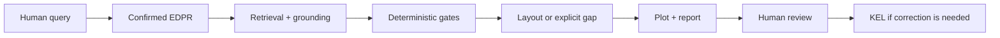
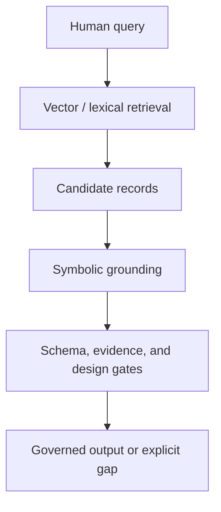

# Knowledge-Graph-Governed AI4D for Industrial Structural Design: An S-Lay Inline Structure Framework

**Working manuscript:** Paper 01A, Draft v0.3
**Planned venue:** engrXiv
**Authors:** Sreekanth Manakkattil Sivaraman; Jagannatha Venkataramana Reddy
**Corresponding author:** <u>[TO BE COMPLETED]</u>
**Draft date:** 15 September 2026

> <u>**Draft status.** This is a concise framework manuscript. It is not yet submission-ready and does not present validated design results. Underlined text marks pending author/originator work.</u>

## Abstract

Engineering organizations store reusable design knowledge in drawings, reports, finite-element studies, spreadsheets, review comments, and expert memory. Much of it is difficult to reuse because the component identity, assembly topology, load case, assumptions, response location, and design reasoning are not represented as connected records. This paper presents Slay-ILS-Designer, an ontology-grounded AI4D framework for conceptual reasoning about subsea inline structures installed by S-lay. The framework separates component definitions, assembly rules, behavior evidence, current problem representation, deterministic tools, and governed feedback into EDES, EDAS, EDIKB, EDPR, toolchain, and KEL layers. A large language model is used as a constrained language interface; deterministic tools validate, retrieve, build layouts, plot, and report. The paper explains the S-lay inline-structure ontology, FBS-OAM assembly framing, P-map/APF problem representation, hybrid RAG pipeline, and KEL feedback loop. It does not claim final design sizing, code compliance, validated optimization, or replacement of project-specific analysis.

**Keywords:** engineering knowledge management; AI4D; knowledge graph; hybrid RAG; S-lay installation; inline structure; FBS-OAM; P-map; APF; KEL

## 1. Introduction

Industrial structural design rarely starts from a blank sheet. Engineers reuse previous layouts, installation lessons, analysis reports, review comments, and local practices. For subsea inline structures, that reuse is difficult because design behavior depends on coupled geometry, contact, stiffness, mass, connector behavior, installation boundary conditions, and response location.

LLMs make this knowledge easier to query, but fluent text is not engineering validity. An LLM can produce a plausible layout while omitting a required support, applying evidence outside its domain, or drawing a concept that hides a missing association. The practical question is therefore not whether an LLM can answer; it is whether the answer is traceable, evidence-bounded, tool-checkable, and reviewable.

Slay-ILS-Designer treats engineering AI first as knowledge management and governance. The contribution is a layered framework that connects an S-lay inline-structure ontology, explicit problem representation, governed retrieval, deterministic layout/plot tools, and a feedback loop for reviewed knowledge evolution.

> <u>**Figure 1 production note.** Replace with a publication-quality workflow diagram.</u>

## 2. S-lay inline-structure ontology

An S-lay inline structure is an interacting assembly, not a single object. It may include header pipe, inline valve or thickened section, branch pipe, top structure, base structure, shroud, connectors, supports, and transitions. During installation, the assembly passes through the firing line and stinger rollers, so local stiffness, elevation, mass, support position, and roller-contact path can affect strain and bending moment.

The repository uses stable `GD-` identifiers so drawings, data records, plots, and validation reports refer to the same objects.

| Code | Plain name | Engineering role |
|---|---|---|
| `GD-HdPipe` | Header pipe | Main pipe and structural/contact reference |
| `GD-BrPipe` | Branch pipe | Straight branch segment |
| `GD-B` | Branch assembly | L- or Z-shaped branch topology |
| `GD-VLV` | Valve | Enlarged stiff component with envelope/contact constraints |
| `GD-TP` / `GD-TT` | Thick / tapered thick pipe | Simplified or tapered stiff section |
| `GD-SH` | Shroud | Sloped or protective contact envelope |
| `GD-ST` | Top structure | Support/containment/branch anchoring frame |
| `GD-SB` | Base structure | Lower protection/support, often roller-contact relevant |
| `GD-Con` | Connector/support | Load-transfer element |

The source papers used related external-structure notation such as `EA-ST` and `EA-SB`. This manuscript uses repository notation `GD-ST` and `GD-SB`; the change is terminology only.

Associations are as important as components. A branch connector must terminate at a declared feature, not merely appear near a top frame. A base structure may own the roller-contact envelope while the pipeline or valve remains the structural section. These relations must be explicit because they cannot be inferred reliably from drawing proximity.

## 3. Knowledge architecture

The framework separates knowledge by responsibility.

| Layer | Responsibility |
|---|---|
| EDES | Component identity, geometry, parameters, interfaces, local constraints |
| EDAS | Assembly topology, valid layout anchors, associations, contact and section ownership |
| EDIKB | Behavior rules, numeric evidence, uncertainty, guidance, future study candidates |
| EDPR | Current problem, objectives, constraints, unknowns, retrieval plan, solver intent |
| Governed tools | Validation, retrieval, solving, layout materialization, plotting, governance stamps |
| KEL | Experience, feedback, root cause, expert review, implementation, promotion |

This separation supports failure diagnosis. A weak output may be caused by problem parsing, component definition, assembly representation, evidence retrieval, evidence applicability, tool execution, visualization, workflow bypass, or missing study data. KEL uses that diagnosis to improve the workflow without turning unreviewed comments into official knowledge.

## 4. FBS-OAM for structural assembly knowledge

Function-Behavior-Structure (FBS) is useful because inline structures exist to perform functions, produce behavior, and use physical structure. For this domain, FBS alone is not enough because the design object is an assembly. The framework therefore uses an FBS-OAM view: FBS captures function, behavior, and structure; OAM-style concepts make objects, assembly features, associations, positions, orientations, and load-transfer methods explicit.

| FBS-OAM item | ILS interpretation |
|---|---|
| Function | Route flow, protect valve, support connector, permit installation, reduce strain |
| Behavior | Strain, moment, contact load, support reaction, stiffness transition |
| Structure/object | Pipe, valve, branch, shroud, GD-ST, GD-SB, connector, thick section |
| Assembly feature | Weld end, connector slot, support interface, branch terminal, contact area |
| Association | Branch-to-header, branch-to-GD-ST, support-to-pipe, valve-to-protection |
| Position/orientation | L branch, Z branch, horizontal/vertical terminal, valve station, connector spacing |

This matters because structural behavior is driven by interactions. A header valve and a branch valve trigger different support logic. A shroud around a stiff component is not only a cover; it changes contact and stiffness behavior. A connector system may reduce one local issue while increasing stiffness elsewhere.

## 5. EDPR, P-map, and APF

Natural-language design requests are compact but ambiguous. A request for an ILT with a vertical connector, valve, and minimum strain includes product intent, topology clues, component requirements, objectives, missing assumptions, and evidence needs. EDPR is the problem-instance layer that turns such a request into a reviewable design basis.

P-map records the current problem state: requirements, artifacts, behaviors, issues, and links. APF separates the action, product, and function so that the system knows whether it is designing, comparing, ranking, validating, explaining, or asking for clarification.

| Framework item | Example in an ILS request |
|---|---|
| APF action | design, compare, rank, validate, explain, clarify |
| APF product | ILT layout, valve protection concept, branch assembly |
| APF function | route flow, protect valve, support connector, reduce strain |
| P-map artifact | `GD-B`, `GD-ST`, `GD-SB`, `GD-VLV`, `ILT-Z-*` |
| P-map behavior | peak strain, bending moment, contact load, support stiffness |
| P-map issue | missing roller geometry, unresolved topology, weak evidence |

The governed workflow requires EDPR confirmation before layout generation. In engineering terms, this is a design-basis check before calculation or drawing.

## 6. Hybrid RAG pipeline

Symbolic records are necessary for engineering authority, but exact keyword matching is not enough. Engineers may say "strongback" when the repository term is `GD-ST`, or "valve cannot ride rollers" when the grounded meaning includes `GD-VLV`, `GD-SB`, roller-contact limits, missing roller geometry, moment evidence, and prior KEL lessons.

Hybrid RAG is used as semantic recall, not as final authority.

| Phrase | Candidate grounding |
|---|---|
| strongback / top frame | `GD-ST`, top-structure associations |
| base frame / roller protection | `GD-SB`, valve/base protection gates |
| valve cannot ride rollers | `GD-VLV`, `GD-SB`, missing clearance/load inputs |
| vertical connector | `GD-B.variant = Z`, `ILT-Z-*`, branch-to-GD-ST association |
| similar past mistake | KEL root-cause records and implemented gates |
| is this optimized? | EDIKB evidence, future-study/correlation-gap records |

A semantically similar paragraph becomes useful only after grounding, evidence checking, and governance. The target is hybrid RAG for recall, symbolic grounding for engineering meaning, deterministic gates for validity, and KEL for loophole detection.

## 7. Governed workflow and KEL

The authoritative design entry point is `tools/run_design_workflow.py`. Lower-level tools validate EDPR, retrieve context, solve, materialize layouts, plot, and package review artifacts. A direct plot or lower-level output is not authoritative unless it passes through the governed workflow and receives the required design-governance stamp.

The workflow is:

1. confirm EDPR problem understanding;
2. retrieve and ground EDES, EDAS, EDIKB, KEL, and relevant documents;
3. check topology, evidence, support/protection, and plot/report gates;
4. emit an EDAS-compatible layout, explicit gap, or request for missing information;
5. generate repository plot and machine-readable report;
6. capture feedback through KEL when correction or learning is needed.

KEL records the experience, feedback, root cause, expert decision, implementation evidence, and promotion state. Recent KEL work showed that root cause must be captured per implemented candidate. The same visible error can arise from missed retrieval, missing EDAS rule, insufficient EDIKB evidence, plot-report weakness, or workflow bypass.

| Experience class | Principle captured |
|---|---|
| EDPR not shown before design | Confirm problem understanding before concept generation |
| Header valve without support/protection | Apply explicit GD-SB/protection logic where applicable |
| Branch connector outside GD-ST | Every `GD-B` branch needs declared `GD-ST` association |
| Evidence available but missed | Retrieve EDIKB/KEL evidence and limitations |
| Plot visibility failure | Treat plot readability/report completeness as gates |
| Missing correlation data | Create future-study candidates, not optimization claims |

## 8. Controlled examples template

<u>**Originator note.** Add only controlled examples after prompts, tool versions, artifacts, reviewer notes, KEL records, root-cause analysis, knowledge updates, and future-study candidates are frozen.</u>

| Item | Example 1 | Example 2 | Example 3 |
|---|---|---|---|
| Prompt + confirmed EDPR | <u>TBD</u> | <u>TBD</u> | <u>TBD</u> |
| Response + follow-up prompts | <u>TBD</u> | <u>TBD</u> | <u>TBD</u> |
| Plot/report artifacts | <u>TBD</u> | <u>TBD</u> | <u>TBD</u> |
| KEL + RCA + KB/tool update | <u>TBD</u> | <u>TBD</u> | <u>TBD</u> |
| ML/correlation/future-study candidate | <u>TBD</u> | <u>TBD</u> | <u>TBD</u> |
| Reviewer conclusion | <u>TBD</u> | <u>TBD</u> | <u>TBD</u> |

Reviewers should score requirement fidelity, topology validity, evidence precision, traceability, plot readability, appropriate clarification/refusal, KEL traceability, and future-study handling.

## 9. Adoption, limitations, and development path

An organization should begin with a bounded use case: read-only retrieval, evidence tracing, EDPR drafting, governed plotting, and feedback capture. EDES should be owned by component specialists, EDAS by layout engineers, EDIKB by analysis specialists, EDPR by project engineering, and KEL lifecycle by a governance role.

The current framework supports conceptual reasoning and evidence tracing. It does not perform final sizing, direct structural verification, fatigue assessment, fabrication approval, installation approval, or code compliance. The solver is first-pass and evidence-scoped. The EDIKB is bounded by source studies and repository records. The vector index is a first-pass retrieval layer, not a validated production semantic search system.

Future work should complete the R7/R8 claim-to-evidence matrix, run three controlled examples, archive EDPR/retrieval/solution/layout/plot/KEL artifacts, expand EDIKB with reviewed evidence and uncertainty metadata, and use future-study candidates to plan parametric FEA, correlation studies, and bounded surrogate models.

## 10. Conclusions

Slay-ILS-Designer frames engineering AI as governed knowledge work. The LLM interprets language, proposes problem records, plans retrieval, and explains results. The repository defines components, assemblies, evidence, gates, plots, feedback records, and lifecycle controls. Engineers confirm intent, judge evidence applicability, approve knowledge changes, and retain responsibility for project verification.

For S-lay inline structures, the design object is an interacting assembly. Component identity, topology, connection systems, support/protection assumptions, behavior evidence, and response limits must be explicit before an AI-assisted recommendation can be trusted. The future path is governed knowledge graphs plus hybrid retrieval, symbolic grounding, deterministic tools, KEL root-cause learning, parametric studies, uncertainty-aware ML, and engineering review.

## Data, Software, and Reproducibility Statement

The Slay-ILS-Designer repository is available at:

https://github.com/sreekx007/Slay-ILS-Designer-V1.0

The reviewed source PDFs are not redistributed in the repository. Bibliographic records, checksums, and EDIKB source-family mappings identify the reviewed copies. <u>Generated run artifacts, controlled examples, and release tags should be frozen before submission.</u>

## AI-Assistance Statement

AI assistance was used to organize, draft, and revise this manuscript. The named authors remain responsible for verifying every citation, engineering statement, numerical value, figure, interpretation, and final submission. AI-generated text and diagrams are not treated as engineering evidence.

## References

[1] J. S. Gero, "Design Prototypes: A Knowledge Representation Schema for Design," AI Magazine, vol. 11, no. 4, pp. 26-36, 1990.

[2] A. K. Goel, S. Rugaber, and S. Vattam, "Structure, Behavior, and Function of Complex Systems: The Structure-Behavior-Function Modeling Language," AI EDAM, vol. 23, no. 1, pp. 23-35, 2009.

[3] <u>[AUTHOR REVIEW: add final FBS-OAM / assembly-ontology references.]</u>

[4] <u>[AUTHOR REVIEW: add final P-map / problem representation references.]</u>

[5] Y. Xu, J. Xie, X. Liu, H. Cui, and M. Liu, "A Human-in-the-Loop Conceptual Design Framework Jointly Driven by Large Language Models and Knowledge Graphs," Advanced Engineering Informatics, vol. 74, part A, 104646, 2026. doi:10.1016/j.aei.2026.104646.

[6] Y. Li, H. Wang, B. Xue, M. Zhang, and Y. Jin, "Solver-Independent Automated Problem Formulation via LLMs for High-Cost Simulation-Driven Design," Findings of the Association for Computational Linguistics: ACL 2026, pp. 2138-2153, 2026. doi:10.18653/v1/2026.findings-acl.102.

[7] S. M. Sivaraman and J. V. Reddy, <u>[AUTHOR REVIEW: insert final bibliographic details for the first S-lay ILT/source EDIKB paper.]</u>

[8] S. M. Sivaraman and J. V. Reddy, <u>[AUTHOR REVIEW: insert final bibliographic details for the second S-lay ILT/source EDIKB paper.]</u>

[9] <u>[AUTHOR REVIEW: add final RAG, tool-use, engineering KG, active-learning, surrogate-modeling, and subsea design-standard references.]</u>

## Submission-readiness register

- <u>[ ] Approve title, author order, affiliations, corresponding author, acknowledgments, and conflicts declaration.</u>
- <u>[ ] Build the R7/R8 claim-to-evidence matrix.</u>
- <u>[ ] Create final figures and verify reuse/redraw rights.</u>
- <u>[ ] Freeze the controlled examples and repository release tag.</u>
- <u>[ ] Verify every acronym, citation, figure, and engineering statement.</u>
