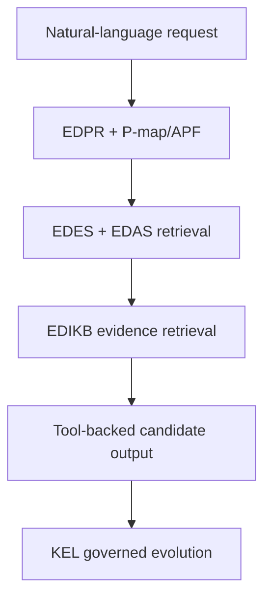
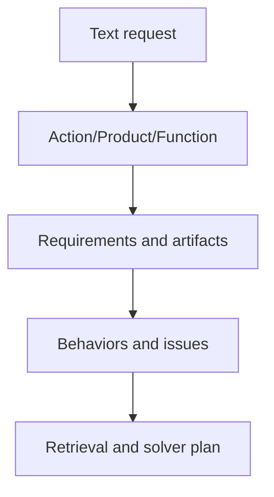

# Paper 1B Outline - Independent Framework Version

## Working Title

**A Governed Neuro-Symbolic Design Assistant for Subsea Inline Structures Using Knowledge Graphs, Tool-Backed Reasoning, and Knowledge Evolution**

Alternative titles:

1. **Neuro-Symbolic Knowledge Graphs for Governed Engineering Design Assistance: A Subsea Inline Structure Case Study**
2. **A Human-Governed LLM and Knowledge-Graph Framework for Conceptual Structural Assembly Design**
3. **From Ontology to Experience: Governed Knowledge Evolution for LLM-Assisted Subsea Structural Design**

## Core Position

This version frames the work as a research architecture rather than primarily as an industrial AI4D case study. The central contribution is a governed neuro-symbolic framework where:

- symbolic knowledge is represented in EDPR, EDES, EDAS, EDIKB, P-map/APF, and KEL records;
- neural language capability is used for parsing, explanation, feedback interpretation, and interaction;
- deterministic tools perform validation, retrieval, layout materialization, plotting, and quality checks;
- expert review controls permanent knowledge graph evolution.

## Abstract Draft

Large language models can assist engineering design only when their outputs are constrained by explicit domain knowledge, deterministic tools, and reviewable evidence. This paper presents a governed neuro-symbolic design assistant for conceptual subsea inline structure design. The framework separates problem representation, component knowledge, assembly knowledge, behavior evidence, and experience governance into distinct graph-oriented layers: EDPR, EDES, EDAS, EDIKB, and KEL. A P-map/APF formulation converts natural-language requests into requirements, functions, artifacts, behaviors, issues, and retrieval targets. Component and assembly ontologies based on FBS-OAM support valid structural assembly generation, while repository tools validate, build, plot, and inspect candidate layouts. A Knowledge Evolution Loop records each design interaction, decomposes feedback into atomic issues, groups graph-change requests, and requires expert review before promotion into official knowledge. A subsea inline tee case study demonstrates how the framework detects failures that are typical of unconstrained LLM design responses: incorrect topology, missing valve protection, ungrounded geometry, insufficient connection labeling, and missing stress/strain assumptions. The paper argues that the framework provides a practical route from historical design records to governed AI-assisted engineering, while also exposing why limited historical datasets must be supplemented by parametric studies and ML-assisted exploration before high-confidence automation is possible.

## Research Questions

1. How can an LLM be constrained to act as a useful engineering design assistant rather than an unconstrained generator?
2. How should component, assembly, behavior, and problem knowledge be separated in a structural design knowledge graph?
3. How can human feedback from design review be converted into governed knowledge graph updates?
4. How can the framework distinguish between answerable design requests and knowledge/representation gaps?
5. Where should future ML be inserted without weakening engineering traceability?

## Claimed Novelty

| Area | Claim |
|---|---|
| Layered engineering KG | EDPR/EDES/EDAS/EDIKB separates problem, component, assembly, and behavior knowledge for structural assemblies. |
| FBS-OAM applied to ILS/ILT | Function, behavior, structure, object, assembly, and assembly features are treated as graph nodes for industrial subsea structures. |
| P-map/APF design-query gate | User requests are converted into explicit issue/action/product/function structures before retrieval and solving. |
| Tool-backed LLM workflow | The LLM is required to use validators, retrievers, layout builders, plotters, and QA reports rather than produce freehand design answers. |
| KEL governance | Design failures become atomic feedback, grouped change requests, expert reviews, and traceable implementation plans. |
| Fail-closed representation gaps | The system reports unresolved topology or evidence gaps instead of inventing unsupported layouts. |

## Architecture Overview

## Detailed Section Plan

### 1. Introduction

Introduce:

- LLMs can parse, summarize, and reason with engineering language, but they are unreliable if used without domain constraints.
- Structural engineering design requires validity, evidence, traceability, and review.
- Subsea inline structures are a useful case because they combine piping, structural support, protection, connection, and installation behavior.
- The proposed framework is not a single model; it is a toolchain and governance loop.

### 2. Related Work

Subsections to develop using the registered sources and remaining literature:

- Knowledge graphs for engineering design.
- FBS and design ontology.
- Assembly modeling and OAM.
- LLMs, RAG, and tool-using agents.
- Human-in-the-loop design knowledge evolution.
- Surrogate modeling, active learning, and parametric studies in structural design.

### 3. Domain Problem

Explain ILS/ILT conceptual design as:

- an assembly topology problem;
- a parameterized geometry problem;
- a behavior prediction problem;
- an optimization problem;
- a knowledge reuse problem.

Design variables may include:

- header diameter and thickness;
- branch diameter and topology;
- connector orientation;
- valve location and envelopes;
- support/protection type;
- top/side/base frame configuration;
- connection positions;
- allowable roller contact and clearances;
- stress/strain objective functions.

### 4. Ontology and Knowledge Layers

Use this section to define the exact framework:

| Layer | Symbolic role | Why it is separate |
|---|---|---|
| EDPR | Problem instance | A design request should not mutate the master ontology. |
| EDES | Component schema | Component facts should not be duplicated inside every layout. |
| EDAS | Assembly schema | Assembly validity is different from component identity. |
| EDIKB | Behavior evidence | Behavior trends and numeric study evidence need scope, uncertainty, and provenance. |
| KEL | Experience governance | Feedback must be reviewed before it changes official knowledge. |

### 5. FBS-OAM for Structural Assemblies

Argument:

FBS is necessary for relating function, expected behavior, derived behavior, and structure. OAM is necessary because the structure in this domain is not a monolithic artifact. It is an assembly of objects with connection features, orientations, contacts, welds, slots, supports, and load-transfer associations.

Example:

| Engineering object | FBS-OAM interpretation |
|---|---|
| Header pipe | Structure-bearing artifact with section ownership and routing function. |
| Branch connector | Assembly feature and flow-routing function with topology constraints. |
| EA-ST | Structural association that may support/locate branch connector and frame connections. |
| EA-SB | Protection/support assembly for valve roller/contact load assumptions. |
| Valve | Functional piping component with protection and contact-load limitations. |

### 6. P-map/APF as the Design-Query Compiler

Frame P-map/APF as a compiler from human request to engineering computation:

Why this matters:

- User queries are underspecified.
- Design requests mix geometry, function, constraints, and preferred outcomes.
- P-map/APF exposes unknowns and ambiguities.
- KEL can attach feedback to exact problem-map failures.

### 7. Tool-Backed Workflow

The framework uses deterministic tools for:

- EDPR validation;
- P-map/APF completeness checking;
- EDES/EDAS/EDIKB retrieval;
- evidence ranking;
- layout materialization from EDAS anchors;
- plot generation from repository components;
- plot QA;
- KEL experience capture and feedback processing.

This is a central distinction from generic RAG. The system does not simply retrieve text and ask the LLM to answer; it validates each stage and returns machine-readable gaps when the stage cannot be completed.

### 8. Knowledge Evolution Loop

KEL should be presented as the governance mechanism:

| KEL stage | Research significance |
|---|---|
| Experience record | Captures what the assistant actually did. |
| Sufficiency rating | Distinguishes weak answer from weak knowledge graph. |
| Atomic feedback | Converts natural-language criticism into one issue/action per record. |
| Feedback grouping | Avoids duplicate graph-change noise. |
| Graph change request | Proposes layer-specific updates. |
| Expert review | Prevents automatic contamination of official engineering knowledge. |
| Implementation plan | Connects accepted learning to actual repo/tool/schema updates. |

### 9. Case Study and Failure Analysis

Use Q1 as the experimental narrative.

Suggested experiment layout:

| Mode | Expected behavior |
|---|---|
| Unguided LLM | Produces plausible prose/plot but may violate topology, component shape, and connection rules. |
| RAG-only LLM | Improves terminology but may still synthesize unsupported layouts. |
| Governed workflow | Parses problem, retrieves layers, uses EDAS/plotter, reports gaps, and records feedback through KEL. |

Core case-study findings:

- Vertical connector requires a Z branch, not an arbitrary branch routing.
- Valve protection cannot be generic or selected automatically; it must respect EDES/EDAS component geometry, contact assumptions, design inputs, and compatible evidence.
- EA-ST associations must be explicit and plotted.
- The plot must be large, inspectable, and generated by the repository plotter.
- Stress/strain optimization must be present in the EDPR objective before it is applied; limits and conclusions must be linked to evidence.

### 9.1 Implemented Prototype Boundary

KEL v0.2 now implements feedback decomposition/grouping, lifecycle reconciliation,
vertical-connector Z selection, EA-ST report completeness, EA-SB valve-protection
clarification and evidence gates, and target-layer implementation/status tooling.
The repository also makes its current boundary explicit: the two-branch-valve
topology has not been accepted by an expert, so the workflow emits a
machine-readable representation gap and no authoritative plot.

### 10. Dataset Limits and ML Extension

Independent framing:

The KG can organize knowledge, but it cannot invent dense evidence coverage. A company may have decades of experience and still lack sufficient coverage for:

- rare topologies;
- diameter/scale extrapolation;
- unusual branch/valve combinations;
- missing load cases;
- incomplete historical metadata;
- nonlinear component interactions.

ML should be introduced after the KG establishes variables, topology classes, evidence scope, and uncertainty. The paper should position ML as an extension of the governed framework rather than an alternative to it.

Future ML modules:

- FEA-backed surrogate models;
- graph neural or relational models over assembly topology;
- active learning for parametric study selection;
- anomaly/outlier detection in historical designs;
- uncertainty-aware recommendation models;
- automated candidate generation constrained by EDAS validity.

### 11. Discussion

Key discussion claims:

- Governance is a design feature, not administrative overhead.
- Knowledge graph incompleteness is expected and should be surfaced.
- Tool-backed plots are essential in engineering design because pictures are themselves claims.
- KEL transforms LLM failure into engineering process improvement.
- The method is applicable beyond subsea structures to other assembly-heavy industrial design domains.

### 12. Limitations

State clearly:

- Current natural-language EDPR parsing is specified but may still require manual/external LLM execution.
- The current repository is a prototype and conceptual-design support tool.
- It does not replace FEA, fatigue, installation analysis, code compliance, or formal approval.
- Published and project-specific evidence coverage must be expanded before operational deployment.
- Expert review is required for official KG evolution.

### 13. Future Work

- Expand EDES/EDAS coverage for more subsea components and layout families.
- Add complete evidence-backed EDIKB coverage for stress/strain/load cases.
- Build parametric FEA pipelines and structured result ingestion.
- Develop ML surrogates tied to KG variables and topology descriptors.
- Introduce optimization loops over EDAS-valid assemblies.
- Create an evaluation benchmark comparing unguided LLM, RAG-only, and governed neuro-symbolic workflow.
- Produce an expert-review dashboard for KEL records.
- Generalize the framework to other structural assembly domains.

## Supplied Literature Anchors

Use the stable citation IDs in `REFERENCE_LIBRARY.md` while drafting:

| Draft claim | Required anchor |
|---|---|
| P-map representation and problem-space evolution | R1; use R4 for ontology granularity and annotation challenges. |
| OAM/CPM assembly objects, hierarchy, features, and associations | R2 and R3. |
| KnowLoop as the front-half human/expert-supervised conceptual-design precedent | R5. |
| Solver-independent APF for high-cost simulation-driven design | R6. |
| EDIKB Paper 1 classifications and isolated-component behavior | R7. |
| EDIKB Paper 2 EA-ST, EA-SB, connector, branch, and mass-position behavior | R8. |

R7 and R8 are the author's primary published domain sources and must be cited wherever the manuscript attributes EDIKB classifications, parametric trends, connection-system behavior, or branch-layout behavior to prior analysis. The manuscript must still identify the relevant table, figure, case, parameter range, and limitation for quantitative claims.

## My Recommendation

This version is academically cleaner. It gives stronger language for conferences, preprints, and AI/engineering reviewers:

- governed neuro-symbolic design assistant;
- ontology-grounded knowledge graph;
- tool-backed reasoning;
- human-governed knowledge evolution;
- fail-closed representation gaps.

However, Version A is better for your immediate professional story because it explains why this matters in company engineering practice. The best final preprint should merge them:

- Title from Version B.
- Motivation and industrial relevance from Version A.
- Architecture and research claims from Version B.
- Case study from both.
