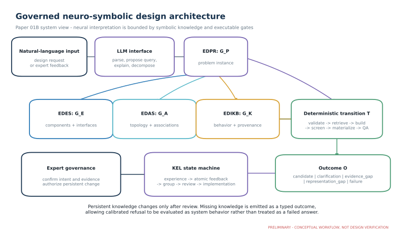

# A Governed Neuro-Symbolic Design Assistant for Structural Assembly Design: The S-Lay Inline Structure Case

**Working manuscript:** Paper 01B, Draft v0.1
**Planned repository:** arXiv
**Provisional category:** cs.AI; possible cs.CE cross-list
**Authors:** Sreekanth Manakkattil Sivaraman; Jagannatha Venkataramana Reddy
**Draft date:** 14 September 2026

> **Draft status.** This manuscript defines the architecture, formal objects, benchmark, and current implementation evidence. The comparative LLM experiment has not yet been run, so Section 8 reports repository verification rather than model-performance results. All figures are preliminary placeholders or generated sketches.

## Abstract

Large language models can translate engineering language and coordinate software tools, but unconstrained generation does not preserve physical topology, evidence scope, or change authority. This paper presents a governed neuro-symbolic architecture for conceptual design of assembly-intensive engineering systems, instantiated in Slay-ILS-Designer for subsea inline structures installed by S-lay. The system separates a problem instance graph (EDPR), component graph (EDES), assembly graph (EDAS), and behavior/evidence graph (EDIKB). Language-model operations propose problem mappings, retrieval plans, explanations, and feedback decompositions. Deterministic transitions validate schemas, restrict topology, retrieve compatible evidence, construct layouts, calculate defined checks, produce plots and reports, and emit typed gaps when knowledge is insufficient. A Knowledge Evolution Loop (KEL) converts design experience into atomic feedback, semantic groups, graph-change requests, expert decisions, implementation plans, and reconciled lifecycle states. Two regression cases expose the value of the separation. A vertical connector requirement changes the admissible branch family from L to Z; it is not a drawing rotation. A request for a valve on a 12-inch header with moment capacity equal to 80% of pipeline capacity does not justify base geometry or connector selection because envelopes, roller clearance, load cases, allowable-moment basis, and combined-assembly evidence are missing. The current repository passes 23 KEL tests and 29 plotter/solver tests and reports no authoritative lifecycle conflicts. These results demonstrate executable governance and design gates, not comparative LLM superiority or structural adequacy. We specify a four-baseline evaluation, ablations, task families, and metrics for topology validity, requirement fidelity, parameter completeness, evidence precision, traceability, and calibrated gap behavior. The work positions engineering design assistance as a constrained transition system in which neural language capability operates over explicit symbolic state and persistent knowledge changes require expert authorization.

**Keywords:** neuro-symbolic AI; knowledge graph; engineering design; large language model; tool use; human-in-the-loop; provenance; calibrated refusal; subsea pipeline; structural assembly

## 1. Introduction

Language models offer a useful interface to engineering information because requirements, reports, calculations, and reviews are primarily written for people. The same models are unreliable design authorities when a plausible sentence or image can conceal a missing dimension, an invalid connection, or evidence drawn from an incompatible analysis. Retrieval-augmented generation improves access to documents but does not itself decide whether two mechanical cases are comparable.

Assembly-intensive design makes this limitation visible. The validity of a subsea inline structure depends on component identity, parent-child associations, connection degrees of freedom, geometric envelopes, load paths, installation contact, and the domain of supporting analysis. A response may mention every expected component while still connecting them incorrectly. It may retrieve a true strain trend from an isolated component and apply it to a combined assembly where the response is non-additive.

We propose that an engineering design assistant be modeled as a governed neuro-symbolic transition system. The neural part interprets language and generates candidate structured content. The symbolic state makes requirements, components, topology, evidence, and provenance addressable. Deterministic tools execute checks whose result must be stable. Human experts control persistent changes to accepted knowledge.

Slay-ILS-Designer instantiates this model for S-lay inline structures (ILS), including inline tee structures (ILTs). The domain is useful because it combines pipeline components, branches, valves, top and base structures, connectors, roller contact, and installation-induced strain. Two preceding studies supply a physical and mechanical taxonomy and a bounded FEA-derived behavior basis [7], [8].

The research questions are:

1. Does layered symbolic representation reduce invalid or unsupported outputs relative to unguided and retrieval-only workflows?
2. Which knowledge layers and deterministic gates contribute to topology validity, parameter completeness, evidence traceability, and appropriate gap emission?
3. Can expert feedback be decomposed and grouped into reviewable knowledge-change proposals without losing provenance?
4. How should missing evidence and missing representation be exposed as system outcomes?
5. Which parts of the architecture can transfer to other assembly-intensive domains?

The paper contributes: (i) a four-layer engineering knowledge model; (ii) a tool-backed reasoning pipeline with typed gap semantics; (iii) a governed feedback lifecycle; (iv) domain-grounded regression cases; and (v) a reproducible comparative evaluation design. Current results are limited to implementation verification. Controlled model comparisons remain planned work.

## 2. Domain and Ontology

### 2.1 Minimum S-lay context

During S-lay installation, the pipeline travels from the vessel firing line across a curved stinger and into the suspended catenary. Inline hardware passing through the overbend can change local bending stiffness, elevation, mass, contact, and curvature. A complete ILT may contain a header, tee and branch, valves, thick anchor regions, a top structure (EA-ST), a base structure (EA-SB), connectors, supports, and a mudmat.

The first domain study classifies physical items as inline-welded or externally attached and classifies mechanical behavior as stiffness-dominant Type A, elevation-dominant Type B, or combined Type C [7]. The second characterizes EA-ST, EA-SB, connection systems, branch assemblies, and mass-position effects [8]. These are evidence-bounded taxonomies rather than universal constitutive laws.

**Figure 1. Preliminary repository-generated ILT schematic.** The image is emitted from the canonical ILS-ILT archetype and includes component labels, resolved parameters, connectors, associations, and findings. Its retained warning state illustrates that successful export is not equivalent to a valid design or complete evidence package.

### 2.2 Abstraction ladder

The domain becomes machine-operable through five levels: physical asset, engineering schematic, parameterized objects, typed knowledge, and executable outcome.

**Figure 2. S-lay ILT abstraction ladder (preliminary).** The final version will add a rights-cleared realistic panel based on [7], parameter notation based on [8], and canonical repository field names.

The typed objects include components, parameters, assembly features, associations, behavior records, evidence anchors, requirements, and issues. A connector has endpoints and degrees of freedom; a valve has a parent line and envelope; a structure has geometry and contact behavior. This prevents the graph from becoming a bag of related terms.

### 2.3 Ontology layers

Let the knowledge state be K = (G_E, G_A, G_K), and let G_P be the current problem instance.

- G_E, implemented by EDES, contains component classes, parameters, functions, constraints, geometry, and interfaces.
- G_A, implemented by EDAS, contains admissible assembly patterns, placement, associations, connection rules, and section/contact ownership.
- G_K, implemented by EDIKB, contains behavior claims, numeric cases, provenance, applicability, uncertainty, and guidance.
- G_P, implemented by EDPR, contains query-specific requirements, objectives, constraints, knowns, unknowns, candidates, and tool plans.

A standard-layout library provides reusable anchors but is not a fifth source of truth. An anchor must be materialized through EDAS and evaluated against EDPR and EDIKB.

The separation is semantically significant. EDAS can declare a nested shroud and thick pipe buildable while EDIKB warns that their combined behavior is non-additive. EDES can define EA-SB geometry without claiming that EA-SB is needed in the current problem. EDPR may refer to a missing component or relation without mutating the master ontology.

## 3. Related Work

P-map represents engineering problem formulation through requirements, functions, artifacts, behaviors, issues, and relations [1]. Work on P-map ontology development also identifies annotation ambiguity, granularity, expressiveness, and reviewer agreement as practical problems [4]. EDPR adopts these object families and adds execution-oriented fields for retrieval, formal checks, candidates, assumptions, and verification.

The Core Product Model and Open Assembly Model separate reusable product information from application-specific views and represent hierarchy, assembly features, and associations [2], [3]. EDES and EDAS follow the same motivation while specializing it for structural and piping components, topology, contact, and layout emission.

KnowLoop combines LLM and knowledge-graph operations with expert supervision in conceptual design [5]. KEL shares the human-governance premise and adds persistent lifecycle artifacts: atomic feedback, grouping and fingerprints, graph-change requests, expert review, implementation plans, promotion, supersession, and conflict reconciliation.

Solver-independent automated problem formulation uses LLMs to translate requirements into executable objectives and constraints without repeatedly invoking expensive simulations [6]. The present architecture similarly separates formulation from downstream solvers, but additionally represents assembly topology, evidence applicability, plotting, and persistent knowledge governance.

[AUTHOR REVIEW: add canonical Function-Behavior-Structure sources, primary RAG and tool-agent papers, neuro-symbolic systems literature, engineering KG surveys, and uncertainty/calibrated-refusal literature before submission. These gaps are kept explicit rather than filled from secondary summaries.]

## 4. Formal Knowledge Model

### 4.1 Typed records and relations

Each graph contains typed records with globally stable identifiers. A minimal record is:

    v = (id, type, attributes, provenance, status)

and a relation is:

    e = (id, source, relation_type, target, attributes, provenance)

Schema validation constrains field shape. Domain validators add rules that are awkward or insufficient in schema alone, such as section overlap, boss bore clearance, branch orientation, active connector slots, and lifecycle uniqueness.

Cross-layer references are directional. EDPR selects EDES objects, EDAS patterns, and EDIKB evidence. EDAS uses EDES interfaces. EDIKB states that a rule applies to an EDES component or EDAS pattern. None of these references gives the LLM permission to rewrite the target layer.

### 4.2 Evidence objects

An evidence-backed claim is represented as:

    q = (claim, applies_to, conditions, response, source, limitation, confidence)

For quantitative use, conditions must include the case, geometry and parameter range; response must include quantity, unit, owner, and location; source must resolve to a publication figure/table or analysis artifact. Retrieval relevance is necessary but insufficient. An applicability predicate A(q, G_P, candidate) must be satisfied before the claim supports an output.

Where complete combined evidence is absent, the system distinguishes direct evidence, reviewed superposition, declared conceptual assumption, and a future-analysis requirement. This ordering is important because [7] reports non-additive combined behavior and [8] deliberately excludes some anchoring components from its assembly study.

### 4.3 Outcomes and fail-closed semantics

Let T be the deterministic transition operating on a validated problem, retrieved subgraphs, and tool state:

    T(G_P, G_E, G_A, G_K, tools) -> O

The outcome O is a tagged union:

    O = Candidate | Clarification | EvidenceGap |
        RepresentationGap | ValidationFailure

A gap is therefore a modeled result. Clarification means project inputs are missing. EvidenceGap means a candidate can be represented but behavior support is inadequate. RepresentationGap means the ontology or assembly language cannot express the requested configuration unambiguously. ValidationFailure means an explicit rule is violated.

This formulation permits gap quality to be evaluated. A system can be rewarded for identifying the correct missing inputs instead of being scored only on whether it emitted a design.

**Figure 3. Governed neuro-symbolic architecture (preliminary).** Neural interpretation proposes state; symbolic layers and deterministic tools constrain transitions; experts authorize persistent change.

## 5. Governed Reasoning Pipeline

The runtime separates probabilistic proposal from deterministic acceptance.

1. **Parse.** The LLM maps the source request into an EDPR proposal and retains every source phrase.
2. **Validate.** Schema and policy checks reject malformed identifiers, missing required fields, and inconsistent problem structure.
3. **Retrieve.** The system resolves EDES components, EDAS patterns or anchors, EDIKB rules and rows, and source evidence.
4. **Check applicability.** Evidence predicates compare topology, geometry, load case, response owner, and limitations.
5. **Solve or screen.** Deterministic code filters candidates and calculates defined metrics. The LLM may explain tradeoffs but does not invent data.
6. **Materialize.** EDAS and EDES construct the selected assembly definition.
7. **Plot and inspect.** ILS-Plotter emits geometry, parameter and association panels, warnings, and QA results.
8. **Emit.** The result is a candidate or typed gap with provenance.
9. **Review.** Human response may close the task or initiate KEL.

For a candidate c, validity is conjunctive:

    valid(c) = schema(c) and topology(c, G_A)
               and interfaces(c, G_E) and requirements(c, G_P)

Evidence support is evaluated separately:

    supported(c) = exists q in G_K such that A(q, G_P, c)

A build-valid candidate can therefore remain unsupported. This avoids using topology validation as evidence of acceptable response.

### 5.1 Deterministic design gates

Current gates include:

- a vertical connector restricts every selected branch to GD-B variant Z and ILT-Z anchors;
- an EA-SB protection concept must contain canonical GD-SB geometry;
- valve protection requires envelopes, contact/roller scope, clearance, load cases, acceptance measure, connection system, spacing basis, connector evidence, and moment evidence;
- moment utilization is computed from demand, capacity ratio, and a defined pipeline allowable basis;
- two branch valves require an accepted topology and two distinct valve instances with parent-branch ownership;
- unknown candidate identifiers fail rather than being matched approximately;
- plot reports expose EA-ST parameters, active connectors, associations, defaults, findings, and QA status.

### 5.2 Plot as an observable system output

The plotter is part of the reasoning interface. It constructs geometry from repository definitions and does not accept a freehand LLM sketch as the authoritative layout. Reports retain input provenance, resolved defaults, build findings, and export state. The overlap checker can move labels and add leaders without changing engineering geometry. These controls make a visual result auditable while preserving the distinction between drawing QA and structural verification.

> **Figure 4 placeholder - transition trace.** Show one EDPR field flowing through retrieval, an EDAS topology check, an EDIKB applicability check, materialization, plot/report emission, and a claim-level provenance link.

## 6. Knowledge Evolution Loop

An engineering assistant cannot remain static, but automatic conversational memory is an unsuitable change mechanism. KEL models knowledge evolution as governed state.

Let an experience record x contain the request, EDPR, retrievals, solution or gap, plots, reports, confidence, and review status. Human feedback f is decomposed into atomic records a_i. Each atomic item retains its source span and receives a normalized fingerprint h(a_i). Similar items form a group g without deleting the originals. A graph-change request r proposes a target layer, change type, evidence requirement, and acceptance criteria.

An expert review d assigns accepted, rejected, or needs-evidence status with rationale. Accepted work receives an implementation plan p and implementation evidence. Promotion creates one authoritative lifecycle state; reconciliation detects duplicate identities and moves stale copies to superseded storage.

**Figure 5. Knowledge Evolution Loop (preliminary).** Feedback is decomposed and grouped before expert review. Persistent knowledge changes only after authorization and implementation evidence.

KEL makes three distinctions that are often collapsed:

1. observation is not approval;
2. code implementation is not knowledge acceptance;
3. retained history is not authoritative current state.

This permits a project to learn from failures while maintaining the controls expected of engineering information.

## 7. Experimental Design

### 7.1 Baselines

| Mode | Description |
|---|---|
| B0: Unguided | LLM receives only the user request |
| B1: Retrieval-only | LLM receives request and retrieved repository text without enforced schemas or gates |
| B2: Ontology-constrained | EDPR/EDES/EDAS/EDIKB structure and validation are active; full KEL is excluded |
| B3: Governed | Complete workflow with deterministic gates, plot/report contract, typed gaps, and KEL capture |

The same model, prompt budget, sampling policy, and source snapshot should be used across modes where applicable. Each stochastic condition should be repeated. Reviewers should be blind to baseline identity when practical.

### 7.2 Task families

The benchmark should contain:

- standard layouts with sufficient inputs;
- ambiguous connector wording;
- vertical and horizontal connector requirements;
- missing EA-ST and EA-SB parameters;
- valve protection with incomplete and complete evidence;
- isolated-component evidence presented for a combined assembly;
- two valves on one branch versus one valve on each of two branches;
- unknown candidate identifiers;
- plots with required parameters and associations;
- repeated, paraphrased, and compound feedback.

Each task needs a reviewed gold record containing permitted candidates, required clarifications, forbidden inferences, applicable evidence, and expected output type.

### 7.3 Metrics

| Metric | Definition |
|---|---|
| Requirement fidelity | Fraction of explicit requirements preserved, penalizing invented objectives |
| Topology validity | Fraction of emitted layouts satisfying EDAS and interface rules |
| Parameter completeness | Required values exposed or explicitly marked missing |
| Association completeness | Required endpoints, parents, and active connectors represented |
| Evidence precision | Fraction of behavior claims supported by compatible evidence |
| Traceability coverage | Fraction of output claims linked to problem, knowledge, tool, and source |
| Gap accuracy | Correct typed gap divided by cases requiring that gap |
| Unsafe completion rate | Unsupported cases emitted as apparently complete candidates |
| Feedback retention | Atomic source issues preserved after grouping |
| Lifecycle consistency | Change identities with exactly one authoritative state |

### 7.4 Ablations

Ablations should remove EDAS topology gates, EDIKB applicability checks, plot/report completeness checks, typed-gap handling, and KEL grouping/reconciliation one at a time. The purpose is to identify which mechanism changes each error class. Removing all mechanisms merely reproduces B0 and does not explain contribution.

> **Figure 6 placeholder - evaluation matrix.** Plot task families against B0-B3 and show the artifact captured at each stage. Add an ablation panel linking mechanisms to expected error classes.

### 7.5 Statistical and review protocol

For binary metrics, report counts, proportions, and confidence intervals. For repeated generations, treat prompt instances as the primary unit and account for within-task repetitions. Use at least two qualified reviewers for engineering-validity labels and report agreement before adjudication. Keep language quality separate from technical validity. Predefine how a partial clarification, mixed-validity candidate, and correct refusal are scored.

## 8. Current Implementation Evidence

The repository was tested on 14 September 2026 at implementation baseline 1d8831600dddeeeec48a9d68ff152089f377afaf. Twenty-three KEL tests and twenty-nine plotter/solver tests passed. The KEL status tool reported no invalid JSON and no authoritative lifecycle conflicts.

The tests cover feedback decomposition and grouping, lifecycle reconciliation, expert-review and implementation-plan policies, connector orientation, valve-protection blockers, moment utilization, canonical GD-SB use, two-valve representation gaps, component rendering, boss/header preservation, solver-to-layout mapping, export checks, label correction, and report behavior.

These results establish executable invariants for the tested cases. They are not results for B0-B3 and do not support a claim of improved design quality. Table 1 therefore reports implementation status rather than comparative performance.

| Capability | Implemented evidence | Remaining research evidence |
|---|---|---|
| Typed problem representation | EDPR schemas and validated examples | Parser accuracy across benchmark |
| Component/assembly separation | EDES/EDAS schemas and validators | Coverage and reviewer agreement |
| Evidence provenance | R7/R8 source-family mapping | Row-level audit and precision metric |
| Fail-closed gates | Regression tests and blocker codes | Gap recall and false-positive rate |
| Plot observability | SVG/PNG reports and QA tests | Reviewer utility study |
| KEL governance | Schemas, tools, lifecycle status | Feedback-retention evaluation |
| Comparative architecture claim | Experimental specification | B0-B3 and ablation results |

## 9. Case Analysis

### 9.1 Vertical connector

The phrase "vertical connector" was initially vulnerable to conflation with branch direction or drawing orientation. The revised EDPR has a dedicated connector-orientation field. The deterministic selector restricts candidate identifiers to ILT-Z and checks that emitted GD-B components use variant Z. The case demonstrates a topology-level consequence from a small linguistic distinction.

### 9.2 Valve capacity and protection

The request for a 12-inch header, inline valve, and valve moment capacity equal to 80% of pipeline capacity appears sufficiently specific to invite a layout. It is not. The ratio defines a possible acceptance constraint:

    U_M = M_valve,max / (0.80 M_pipeline,allow) <= 1

Neither demand nor the allowable-moment basis is given. The request also lacks valve, actuator, flange, thick-section and roller envelopes; required clearance; load cases; EA-SB dimensions; connector system; spacing basis; and combined valve/base behavior evidence.

An early plausible output introduced a deep, long base and P-S supports without providing these bases, did not ask whether a top structure was required, and did not emit its EDPR interpretation. The revised system returns a clarification or evidence gap. The relevant research point is not that one geometry was replaced by another. It is that output completeness is defined over requirements, parameters, relations, and evidence rather than visual plausibility.

> **Figure 7 placeholder - case error trace.** Compare the initial apparent completion with the governed output. Annotate invented objective, missing dimensions, unsupported connector choice, unasked top-frame decision, missing moment inputs, and the resulting typed blockers.

### 9.3 Two-branch-valve representation gap

The current assembly language cannot safely infer whether "two branch valves" means two instances on one branch or one instance on each of two branches. It requires two IDs and parent-branch associations after an expert accepts the topology. The system emits TWO_BRANCH_VALVE_TOPOLOGY_UNRESOLVED. This case separates missing world knowledge from missing representational capacity and offers a direct test for calibrated gap behavior.

## 10. Discussion

The architecture makes generation conditional on explicit state. This has a cost: ontologies, schemas, validators, and evidence mappings require maintenance. The benefit is that failure becomes observable. A missing parameter is a field, an incompatible topology is a validation result, and an evidence mismatch is a traceable predicate rather than an intuition hidden in generated prose.

The framework is neuro-symbolic in an operational sense. Language models handle ambiguity and communication; symbolic records preserve identity and relations; deterministic programs enforce selected invariants; experts govern persistent state. The contribution does not depend on claiming that every engineering rule can be formalized. Unformalized judgment is represented as a review requirement.

The four-layer division should transfer to other assembly-intensive domains if their objects, interfaces, assembly patterns, behavior evidence, and problem instances can be separated. Domain-specific component codes and gates would change. The distinction between build validity and behavioral support, and between feedback and approved knowledge, should remain useful.

KEL also creates a path for active evidence acquisition. Repeated EvidenceGap outcomes can be grouped by missing parameter region or topology. An expert can convert the group into a parametric simulation plan, and validated results can extend EDIKB. Future surrogate models can operate inside a documented domain and return uncertainty or out-of-domain status.

## 11. Limitations and Threats to Validity

**Construct validity.** The proposed metrics may not capture all qualities of engineering reasoning. Reviewer agreement and clear gold records are required.

**Internal validity.** Prompt wording, model version, sampling, context order, and reviewer knowledge can confound baseline differences. These factors must be frozen or reported.

**External validity.** The current domain and evidence derive from S-lay ILT studies [7], [8]. Transfer to other systems is untested.

**Evidence validity.** R7 and R8 contain bounded models and relative trends. R8 omits thick anchoring components and models studied connectors at pipe centerline. Quantitative claims need case-level provenance and cannot be treated as project design values.

**Implementation validity.** Passing tests proves only the encoded behavior. It does not establish that the encoded rule is a complete engineering requirement.

**Human governance.** KEL records expert decisions but cannot guarantee reviewer competence, independence, or organizational authority.

**Literature coverage.** The current reference set is incomplete for a final AI paper. Canonical FBS, neuro-symbolic, RAG, tool-use, knowledge-graph, uncertainty, and human-factors references must be added and checked from primary sources.

## 12. Conclusion

This paper defines an LLM-assisted engineering workflow as a governed transition over separate problem, component, assembly, and evidence graphs. EDPR preserves current intent; EDES defines objects; EDAS constrains topology; EDIKB bounds behavior claims; deterministic tools validate and materialize outputs; and KEL governs persistent change.

The S-lay cases show why this structure matters. Connector orientation changes admissible topology. A capacity percentage does not supply geometry, load cases, or behavior evidence. A two-valve phrase can expose a representational gap. In each case, the system can emit a typed, reviewable outcome instead of completing the design by linguistic plausibility.

The repository demonstrates that the architecture and selected invariants are executable. Comparative performance remains to be established through the specified B0-B3 benchmark and ablations. The resulting research question is measurable: whether explicit symbolic state, deterministic gates, and expert-governed evolution reduce invalid completion while preserving useful language-model assistance.

## Data and Software Availability

The repository is available at https://github.com/sreekx007/Slay-ILS-Designer-V1.0. Source-paper PDFs are not redistributed. The repository stores bibliographic records, checksums, source-family mappings, schemas, tools, tests, and manuscript artifacts. [AUTHOR REVIEW: create a release tag and archival DOI before submission.]

## AI-Assistance Statement

AI assistance supported manuscript organization, drafting, repository inspection, and preliminary vector diagrams. The authors remain responsible for all citations, engineering claims, formal definitions, experiments, figures, and final text. Generated content is not engineering evidence.

## References

[1] M. Dinar, A. Danielescu, C. MacLellan, J. J. Shah, and P. Langley, "Problem Map: An Ontological Framework for a Computational Study of Problem Formulation in Engineering Design," Journal of Computing and Information Science in Engineering, vol. 15, no. 3, 031007, 2015. doi:10.1115/1.4030076.

[2] S. Rachuri et al., "A Model for Capturing Product Assembly Information," Journal of Computing and Information Science in Engineering, vol. 6, no. 1, pp. 11-21, 2006. doi:10.1115/1.2164451.

[3] S. Rachuri et al., Information Models for Product Representation: Core and Assembly Models, NISTIR 7173, 2004. doi:10.6028/NIST.IR.7173.

[4] M. Dinar, Y.-S. Park, and J. J. Shah, "Challenges in Developing an Ontology for Problem Formulation in Design," Proceedings of ICED15, pp. 165-176, 2015.

[5] Y. Xu, J. Xie, X. Liu, H. Cui, and M. Liu, "A Human-in-the-Loop Conceptual Design Framework Jointly Driven by Large Language Models and Knowledge Graphs," Advanced Engineering Informatics, vol. 74, 104646, 2026. doi:10.1016/j.aei.2026.104646.

[6] Y. Li, H. Wang, B. Xue, M. Zhang, and Y. Jin, "Solver-Independent Automated Problem Formulation via LLMs for High-Cost Simulation-Driven Design," Findings of ACL 2026, pp. 2138-2153, 2026. doi:10.18653/v1/2026.findings-acl.102.

[7] S. M. Sivaraman and J. V. Reddy, "Toward AI-Assisted Conceptual Design of Subsea Inline Structures: Classification and Strain Behaviour of Inline Components during S-Lay Installation," IJRASET, vol. 14, no. VII, pp. 1127-1176, 2026. doi:10.22214/ijraset.2026.84268.

[8] S. M. Sivaraman and J. V. Reddy, "Advancing AI Assisted Conceptual Design of Subsea Inline Structures: Mechanical Behaviour of Pipeline-Mounted Structural Assemblies during S-Lay Installation," IJRASET, vol. 14, no. VIII, pp. 394-442, 2026. doi:10.22214/ijraset.2026.84577.

## Appendix A. Reproducibility Checklist

- [ ] Freeze repository tag, model identifiers, prompts, sampling settings, and context order.
- [ ] Publish benchmark tasks, gold EDPRs, permitted evidence, forbidden inferences, and expected outcomes.
- [ ] Record all B0-B3 outputs and deterministic reports.
- [ ] Predefine reviewer rubric and adjudication.
- [ ] Run the ablations and repeated trials.
- [ ] Report counts, uncertainty intervals, and reviewer agreement.
- [ ] Complete claim-level R7/R8 provenance.
- [ ] Replace preliminary figures with reviewed vector versions.
- [ ] Add and verify the missing AI and design-theory literature.
- [ ] Build and inspect the arXiv LaTeX package.
