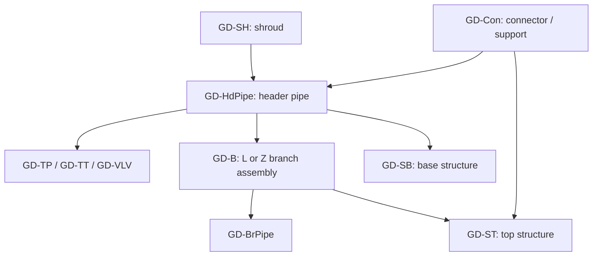
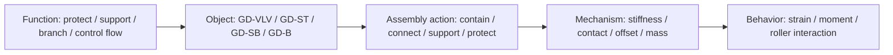
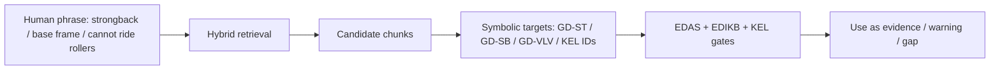
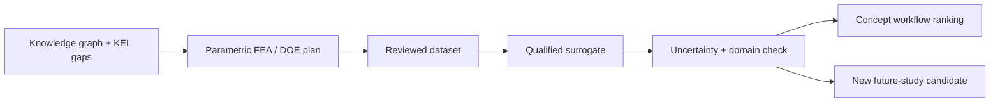

# Paper 01C Draft - Engineering AI4D for S-Lay Inline Structures: A Data-Science-Aware Engineering View

**Working manuscript:** Paper 01C, Draft v0.1  
**Audience:** practicing structural/mechanical/subsea engineers familiar with data science, AI, ML, RAG, and knowledge-graph terminology  
**Relationship to Paper 01A:** companion engineering-audience version with less introductory explanation of AI/ML and more emphasis on data architecture, retrieval, governance, evaluation, and future surrogate/correlation workflows  
**Planned venue:** engineering AI / offshore engineering / applied data-science preprint route to be selected  
**Authors:** Sreekanth Manakkattil Sivaraman; Jagannatha Venkataramana Reddy  
**Corresponding author:** <u>[TO BE COMPLETED]</u>  
**Draft date:** 15 September 2026

> <u>**Originator note.** This is a manuscript variant, not a replacement for Paper 01A or 01B. It assumes the reader already understands the broad idea of data pipelines, embeddings, retrieval, model evaluation, uncertainty, and ML governance. Underlined text marks pending author decisions, figure-production tasks, or evidence still to be frozen before submission.</u>

## Abstract

Industrial structural design increasingly uses digital artifacts, but most reusable engineering judgment still lives in drawings, finite-element reports, calculation notes, review comments, and local terminology. This paper presents Slay-ILS-Designer as a data-science-aware engineering framework for conceptual reasoning about S-lay subsea inline structures. The framework combines a controlled ontology for S-lay inline-structure components and assemblies with explicit problem representation, evidence-scoped retrieval, deterministic validation, repository-generated layout plots, and a governed Knowledge Evolution Loop (KEL). It treats large language models as language and orchestration interfaces rather than as engineering authorities. The knowledge layers separate component definitions (EDES), assembly constraints (EDAS), behavior evidence (EDIKB), current problem formulation (EDPR), and reviewed learning from experience (KEL). A hybrid retrieval layer can improve semantic recall over varied engineering language, while symbolic grounding and deterministic gates decide whether the retrieved material may support a design statement. The paper is intended for engineers comfortable with AI/ML concepts who want to see how those concepts can be constrained for practical structural-assembly work. It does not claim validated design performance, code compliance, or autonomous optimization. Those claims require controlled examples, frozen tool versions, independent review, and project-specific analysis.

**Keywords:** engineering AI; knowledge graph; hybrid RAG; symbolic grounding; structural design; S-lay installation; subsea inline structures; design governance; KEL; applied ML

## 1. Why this paper exists

AI discussion in engineering often starts with the model: which LLM, which embedding model, which agent framework, or which surrogate architecture. For S-lay inline structures, that starting point is too late in the chain. The difficult part is not only producing fluent design prose. The difficult part is preserving the engineering meaning of a layout: which object is present, what it is connected to, which load path is implied, what evidence applies, which parameters are defaulted, and where the workflow must stop because the knowledge base is insufficient.

Slay-ILS-Designer is therefore framed as an engineering data architecture with AI interfaces. The repository stores controlled component, assembly, evidence, and problem records. The LLM helps translate between human language and structured records. Deterministic tools validate schemas, check P-map/APF completeness, retrieve context, materialize known layout anchors, generate plots, and package feedback. KEL records feedback, root cause, expert decision, implementation evidence, and promotion state.

This version of the paper is written for engineers who already understand why ungrounded RAG, generic embeddings, and unvalidated generated text can fail. The focus is how those ideas can be made useful in a structural-assembly workflow without allowing semantic similarity or LLM confidence to replace engineering evidence.

```mermaid
flowchart LR
    Q[Human design query] --> EDPR[EDPR problem record]
    EDPR --> HRAG[Hybrid retrieval]
    HRAG --> SG[Symbolic grounding]
    SG --> Gates[Deterministic engineering gates]
    Gates --> Layout[EDAS-valid layout / explicit gap]
    Layout --> Plot[Plot + machine-readable report]
    Plot --> Review[Engineer review]
    Review --> KEL[KEL if feedback or update]
```

> <u>**Figure 1 production note.** Replace this symbolic workflow with a publication-grade lane diagram showing LLM, retrieval, symbolic grounding, deterministic gates, plotting, human review, and KEL.</u>

## 2. Domain object: S-lay inline structures as interacting assemblies

A subsea inline structure is not a single component. It is a pipeline-region assembly containing header pipe, inline equipment, branch pipe, connectors, top structure, base structure, shroud or transition parts, and sometimes mudmat or added protection. During S-lay installation, the assembly passes through the firing line and stinger. Local geometry, mass, support position, connector stiffness, roller contact, and offset between structural members can change strain and bending moment in the header and branch.

The two source studies provide the domain foundation: one establishes thick-section, taper, shroud, and Type A/B/C behavior concepts; the other establishes top/base structure behavior, connector arrangements, branch families, and added-mass placement. This manuscript uses the repository notation `GD-ST` and `GD-SB`; source-paper notation such as `EA-ST` and `EA-SB` is treated as lineage terminology rather than a conceptual difference.

> <u>**Figure 2 production note.** Rebuild this as a clear component-vocabulary figure with the current repository symbols and manuscript-scale fonts.</u>

## 3. Data model: why EDES, EDAS, EDIKB, EDPR, and KEL stay separate

For an AI/ML-aware reader, the central architectural choice is separation of concerns. A single vector store or flat graph would be simpler, but it would mix object definitions, topology, evidence, current problem intent, and feedback lifecycle. The repository therefore separates knowledge into layers with different authority rules.

| Layer | Engineering role | Data-science role | Failure avoided |
|---|---|---|---|
| EDES | Defines reusable component classes, parameters, interfaces, constraints | Controlled entity schema | Prevents synonym drift from changing object identity |
| EDAS | Defines valid assembly patterns, topology, associations, layout anchors | Graph topology and constraint layer | Prevents visual proximity from becoming an assumed connection |
| EDIKB | Stores behavior rules, numeric evidence, limitations, future-study candidates | Evidence and feature store | Prevents retrieved prose from becoming universal behavior law |
| EDPR | Represents the current problem, objectives, constraints, unknowns, retrieval plan | Query/problem object | Prevents a prompt from being treated as a complete design basis |
| KEL | Records experience, feedback, RCA, review, implementation, promotion | Human-in-the-loop learning ledger | Prevents unreviewed feedback from changing approved knowledge |
| Plot/report tools | Build inspectable artifacts from accepted records | Reproducible output generator | Prevents freehand LLM drawings from hiding missing associations |

The separation also provides an audit trail for model evaluation. If an output is wrong, the failure can be classified: problem parsing, retrieval, symbolic grounding, EDAS topology, EDIKB applicability, plot/report presentation, missing correlation data, or KEL implementation.

## 4. FBS-OAM framing for structural assemblies

Function-Behavior-Structure is useful but not sufficient on its own for these layouts because the same physical object can have different assembly roles. Slay-ILS-Designer uses an FBS-OAM style view: function, behavior, structure, object identity, assembly action, and mechanism/load-path role.

A valve is not just a larger inline cylinder. It may be a flow-control function, a stiff local body, a roller-contact limitation, a mass/stiffness feature, and a trigger for GD-SB or GD-SH protection. A top frame is not just a rectangle above the header. It can contain a branch valve, anchor a branch connector, or provide a load path that should avoid unnecessary F2 stiffness. A base structure is not just a lower frame. It may become the roller-contact object and therefore change installation behavior.

## 5. EDPR, P-map, and APF as problem-state control

The LLM should not move directly from user prompt to layout. The prompt must first become an EDPR record. The P-map component preserves linked requirements, artifacts, functions, behaviors, issues, and evidence needs. The APF component makes objectives and constraints explicit enough to test: region or condition, metric or variable, and comparison or target.

For data-science-aware engineers, EDPR can be viewed as a structured query object plus an evaluation contract. It defines what retrieval should search for, what a candidate layout must satisfy, and which missing values are blocking. This reduces prompt leakage into the design stage. If the user asks for minimum strain but does not provide stinger radius or top tension, EDPR can mark those inputs as unknown and define whether to proceed conceptually or stop.

| Prompt phrase | EDPR interpretation | Engineering gate |
|---|---|---|
| "Valve welded inline with the pipeline" | Candidate GD-VLV on GD-HdPipe; ask roller-contact and capacity basis | Header-valve protection / support check |
| "Horizontal connector on branch" | L-branch terminal association to GD-ST likely required | Branch-to-GD-ST association check |
| "Vertical connector" | Z-branch family likely required | Z-branch standard-layout check |
| "Estimate peak strain" | Requires evidence domain, stinger radius, tension, geometry and response-location assumptions | EDIKB applicability and limitation check |
| "Low strain option" | Ranking objective, not guaranteed optimization | Evidence-scoped ranking and future-study gap check |

## 6. Hybrid retrieval: semantic recall is not authority

The repository now includes a first-pass vector-index implementation using a deterministic no-network lexical fallback. Its purpose is to retrieve semantically related chunks across EDPR, EDES, EDAS, EDIKB, KEL, documents, README, and manifest records. In a production version, embeddings can improve recall, but the authority rule remains the same: retrieval proposes candidates; symbolic grounding and gates decide usability.

A useful retrieval hit may be a component definition, an assembly rule, a behavior row, a root-cause record, or a future-study candidate. A high similarity score is not a design argument. It is a pointer to a record that must be resolved and checked.

## 7. KEL as an engineering learning loop

KEL is not a generic chat memory. It is a governed lifecycle for lessons. A design interaction can produce experience records, feedback records, grouped issues, graph-change requests, expert reviews, implementation evidence, and promotion or supersession decisions.

The important addition from recent workflow development is per-candidate root-cause analysis. If the LLM omitted a base structure under a header valve, the cause might be missing EDAS constraint, missed EDES limitation, failure to retrieve EDIKB/KEL evidence, or bypass of a design gate. These causes imply different fixes. KEL therefore records the specific cause for each implemented lesson instead of only an overall error summary.

| KEL failure family | Typical root cause | Tool/knowledge update pattern |
|---|---|---|
| EDPR not shown before work | workflow bypass | enforce problem-understanding gate |
| Valve without support/protection | missing or missed compulsory constraint | EDAS/design-rule gate plus plot/report check |
| Branch valve outside top frame | standard layout not retrieved or not applied | EDAS layout anchor and association gate |
| F2 used without reason | stiffness effect not considered | connector selection rationale and low-strain default |
| Plot labels unreadable | report/plot presentation gap | plotter style and report export change |
| Connector spacing claimed optimized | missing correlation/covariance evidence | future-study candidate and cautious wording |

## 8. Controlled-example template

<u>**Originator note.** Controlled worked examples have not yet been inserted. This section is a template for three examples once runs are frozen.</u>

| Evaluation item | Example 1 | Example 2 | Example 3 |
|---|---|---|---|
| Full user prompt | <u>TBD</u> | <u>TBD</u> | <u>TBD</u> |
| Confirmed EDPR understanding | <u>TBD</u> | <u>TBD</u> | <u>TBD</u> |
| LLM response summary | <u>TBD</u> | <u>TBD</u> | <u>TBD</u> |
| Subsequent user prompts | <u>TBD</u> | <u>TBD</u> | <u>TBD</u> |
| Plot artifact and report | <u>TBD</u> | <u>TBD</u> | <u>TBD</u> |
| KEL candidate generated | <u>TBD</u> | <u>TBD</u> | <u>TBD</u> |
| Root-cause analysis | <u>TBD</u> | <u>TBD</u> | <u>TBD</u> |
| Knowledge-base/tool update | <u>TBD</u> | <u>TBD</u> | <u>TBD</u> |
| ML/correlation/future-study candidate | <u>TBD</u> | <u>TBD</u> | <u>TBD</u> |
| Reviewer decision | <u>TBD</u> | <u>TBD</u> | <u>TBD</u> |

The examples should not be selected because they make the system look good. They should be selected because they test failure modes that matter: mandatory protection, branch-top-frame association, evidence retrieval, plot readability, and controlled gap reporting.

## 9. ML and correlation study path

For this audience, the ML opportunity is not to train a black-box layout generator first. The better initial target is a governed correlation and surrogate program over known structural parameters: pipe size, wall thickness, stinger radius, top tension, component length, component OD, support spacing, connector stiffness class, branch position, frame length, mass offset, and topology class.

KEL and future-study candidates can direct which parameter combinations need new analysis. The knowledge graph can record the design space, coverage gaps, and applicability limits. A surrogate model can then be trained only over reviewed analysis domains and must report uncertainty and out-of-domain conditions.

## 10. Limitations

This draft describes a framework and implementation direction. It does not yet report validated performance metrics, time savings, reviewer agreement, code compliance, or project-ready stress/strain values. The current vector index is a local deterministic fallback, not a production embedding system. The current solver is first-pass and evidence-scoped; it does not perform full structural optimization. The current EDIKB is bounded by the source studies and repository records.

<u>Before submission, the authors should freeze three controlled examples, publish the exact repository commit, prepare the claim-to-evidence matrix, and verify all engineering statements against source papers and run artifacts.</u>

## 11. Conclusion

A useful engineering AI workflow for S-lay inline structures must combine semantic flexibility with engineering constraint. Slay-ILS-Designer does this by separating ontology, assembly, evidence, problem state, deterministic tools, and feedback governance. For data-science-aware engineers, the main lesson is that RAG, embeddings, LLMs, and future ML surrogates are only useful when grounded in controlled objects, explicit topology, scoped evidence, and reviewable lifecycle records.

## Data, Software, and Reproducibility Statement

The Slay-ILS-Designer source, schemas, knowledge records, validation tools, plotting tools, vector-index prototype, and paper planning artifacts are available at:

https://github.com/sreekx007/Slay-ILS-Designer-V1.0

<u>Generated run artifacts, controlled examples, and release tags should be frozen before this version is submitted.</u>

## AI-Assistance Statement

AI assistance was used to organize, draft, and revise this manuscript variant. The named authors remain responsible for verifying every citation, engineering statement, figure, interpretation, and submission decision. AI-generated text and diagrams are not treated as engineering evidence.

## Pre-submission checklist

- <u>[ ] Confirm venue and title.</u>
- <u>[ ] Freeze three controlled examples and artifact paths.</u>
- <u>[ ] Build claim-to-evidence matrix for R7/R8 source studies.</u>
- <u>[ ] Replace symbolic diagrams with final figures.</u>
- <u>[ ] Add final references for FBS, engineering KG, RAG/tool-use, lessons learned, surrogate modeling, and active learning.</u>
- <u>[ ] Verify all repository paths and commit hashes.</u>
