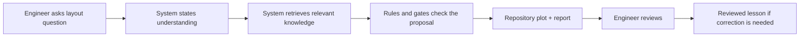
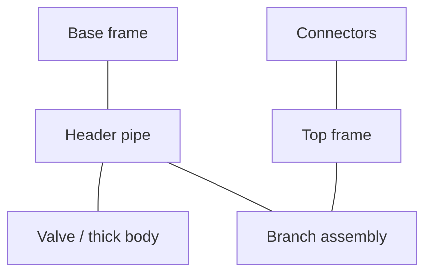
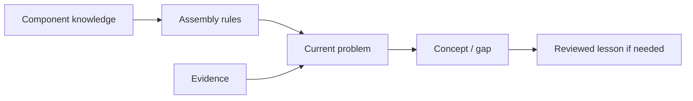
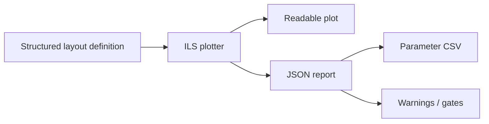
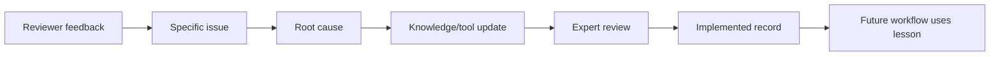
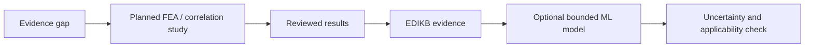

# Paper 01D Draft - A Practical Engineer's Guide to AI-Assisted S-Lay Inline Structure Layouts

**Working manuscript:** Paper 01D, Draft v0.1  
**Audience:** practicing structural/mechanical/subsea engineers with little or no assumed background in data science, AI, ML, RAG, or knowledge graphs  
**Relationship to Paper 01A:** companion plain-language engineering version that explains the AI/data-management ideas more slowly and avoids assuming AI vocabulary  
**Planned venue:** engineering practice / engrXiv / industry-facing preprint route to be selected  
**Authors:** Sreekanth Manakkattil Sivaraman; Jagannatha Venkataramana Reddy  
**Corresponding author:** <u>[TO BE COMPLETED]</u>  
**Draft date:** 15 September 2026

> <u>**Originator note.** This version is written for engineers who understand structural design but do not necessarily know AI terminology. Underlined text marks pending author decisions, figure-production work, or information to be completed before submission.</u>

## Abstract

Engineering design depends on memory: previous drawings, calculations, finite-element studies, installation lessons, review comments, and the judgment of experienced engineers. A large language model can help search and explain this information, but it can also sound confident when important engineering details are missing. This paper explains Slay-ILS-Designer, a practical framework for using AI in early S-lay inline-structure layout work without allowing the AI to become the engineering authority. The framework organizes knowledge into separate records for components, assemblies, evidence, current project requirements, and reviewed lessons learned. It also uses deterministic tools to check problem understanding, retrieve evidence, build layouts from known component definitions, create plots, and record feedback. Human feedback is handled through a Knowledge Evolution Loop (KEL), which keeps corrections reviewable before they become official knowledge. The paper is written for engineers who want to understand what the tool is trying to do, why it needs structured data, and how it should be reviewed. It does not claim that the system replaces finite-element analysis, project design checks, or engineering approval.

**Keywords:** engineering AI; subsea inline structures; S-lay installation; design knowledge; lessons learned; plotting; human review; structural layout

## 1. The problem in ordinary engineering terms

Engineers often know that a design decision was made before, but the reason is hard to reuse. A calculation report may show that one support arrangement gave lower strain, but the important details may be spread across figures, tables, assumptions, and comments. A drawing may show a branch and top frame, but it may not say why a connector was placed there. A review comment may say that a valve needs a base structure, but unless that comment becomes a reusable rule, the same mistake may happen again.

AI can help with language. It can read a question, search records, summarize evidence, and write an explanation. But AI does not automatically know whether a past result applies to a new geometry. It may not know whether the stinger radius, top tension, pipe size, valve stiffness, connector location, or roller-contact assumption is different. Therefore the main problem is not simply "Can AI answer the question?" The better question is: "Can the design knowledge be organized so that AI-assisted answers remain traceable and reviewable?"

Slay-ILS-Designer is an attempt to do that for S-lay inline structures.

> <u>**Figure 1 production note.** Replace this with a simple engineer-facing workflow diagram using plain terms: question, understanding, evidence, checked layout, plot, review, lesson learned.</u>

## 2. What is an S-lay inline structure in this paper?

An inline structure is a local assembly placed on or around a pipeline. In this paper the assembly may include a header pipe, valve, thick pipe, tapered transition, branch pipe, top frame, base frame, connector, shroud, and other support or protection items. During S-lay installation, this assembly travels through the vessel firing line and over the stinger rollers. That means the local shape, stiffness, mass, and roller-contact path matter.

Small changes can matter. A valve may have enough bending capacity but may not be allowed to ride directly on rollers. A branch connector may need to end inside the top frame. A top frame can reduce one issue but create another if the wrong connection type makes the assembly too stiff. A base frame that is much larger than the component it protects may change the strain behavior.

The repository uses short component names beginning with `GD-`. These are not meant to replace normal engineering words. They are stable labels so the software can distinguish objects clearly.

| Repository code | Plain engineering meaning | Why the distinction matters |
|---|---|---|
| `GD-HdPipe` | Main/header pipe | The main pipe is the structural reference for many checks |
| `GD-BrPipe` | Branch pipe part | A straight branch pipe segment is different from the full branch assembly |
| `GD-B` | Branch assembly | Includes branch geometry and terminal connection direction |
| `GD-VLV` | Valve | May need protection/support and may change stiffness/mass locally |
| `GD-ST` | Top structure/frame | Often supports or contains branch equipment |
| `GD-SB` | Base structure/frame | May protect equipment and may contact rollers |
| `GD-Con` | Connector/support | The connection behavior affects stiffness and load path |
| `GD-SH` | Shroud | May provide sloping roller-contact geometry |
| `GD-TP` | Simplified thick pipe | Concept-level thick section without tapered transitions |
| `GD-TT` | Tapered thick pipe | Thick section with explicit tapered transitions |

## 3. Why the tool separates components, assemblies, evidence, problems, and lessons

A human engineer can often keep many distinctions in mind. A computer system needs those distinctions written down. Slay-ILS-Designer separates knowledge into five main buckets.

| Bucket | Plain-language meaning | Example |
|---|---|---|
| EDES | What each component is | A valve has body length, diameter, mass, and roller-contact limitations |
| EDAS | How components may be assembled | A branch should connect to a declared top-frame feature |
| EDIKB | What behavior evidence exists | A study result about strain for a known geometry and load case |
| EDPR | What the current user is asking for | A 20-inch header with 8-inch branch and a low-strain objective |
| KEL | How reviewed lessons are stored | A correction that header valves need support/protection logic |

This separation is useful because each bucket has a different kind of authority. A component definition is not the same as a finite-element result. A review comment is not automatically a rule. A plot is not proof that a design is structurally acceptable. Keeping the buckets separate helps the system stop when it does not have enough information.

## 4. The first safety step: the system must say what it understood

Before proposing a layout, the system should state its understanding of the problem. This is called the EDPR step in the repository, but an engineer can think of it as the design brief.

The design brief should answer:

1. What object is being designed?
2. What components are explicitly present?
3. What constraints are known?
4. What information is missing?
5. What is the objective, such as lower strain or protection from rollers?
6. What evidence will be searched?
7. What should the system avoid assuming?

This is important because many mistakes happen before the layout stage. If the user says "valve on the header," the system should ask whether the valve can contact rollers or needs protection. If the user asks for a peak-strain estimate, the system should ask for or state assumptions about stinger radius, top tension, pipe properties, and evidence limitations. If the user asks for a branch with a vertical connector, the system should recognize that a Z-branch layout may be needed.

## 5. How the system should use evidence

A retrieved result is not automatically applicable. A past study may have used a different pipe, no valve, different connector spacing, different top tension, different roller model, or a simplified structure. The system should therefore say what evidence was found and what its limits are.

| Question | Good answer behavior |
|---|---|
| What was retrieved? | Name the source record or study family |
| What does it say? | State the trend or result carefully |
| Does it match the current layout? | Identify matching and non-matching assumptions |
| What is missing? | State missing inputs or missing combined-case evidence |
| Can it support a design claim? | Say yes, no, or only as a cautious concept-level trend |

This is why the paper avoids saying that the workflow already optimizes designs. At the current stage, it can support cautious concept selection where evidence is available, and it can identify where new analysis is needed.

## 6. Why plots and reports are part of the engineering control

The plot is not just a picture. It is a review artifact. A useful plot should make the engineering concept visible and should be backed by a report that lists the parameters, active connections, assumptions, warnings, and missing data.

A freehand AI sketch can hide problems. For example, a branch valve may look close to a top frame but not actually be inside the supported region. A connection label may be too small to read. A base structure may be much longer than the valve it is meant to protect. Therefore the repository plotter builds drawings from component definitions and emits a machine-readable report.

## 7. How feedback becomes a reusable lesson

If a reviewer finds an issue, the correction should not simply be remembered in the chat. It should become a reviewed lesson. The repository calls this KEL: Knowledge Evolution Loop.

KEL keeps the chain:

1. What happened?
2. What feedback was given?
3. What exact issue was found?
4. What was the root cause?
5. What knowledge or tool needs to change?
6. Who reviewed and accepted it?
7. What file, rule, or test proves it was implemented?

This is important because the same visible error can have different root causes. A missing base structure under a valve might mean the component knowledge was incomplete, the assembly rule was missing, the retrieval step missed an existing rule, or the workflow bypassed a gate. The fix depends on the cause.

## 8. What the current KEL experience has taught in principle

The current KEL work has already identified several recurring lesson types. This paper does not present those interactions as validated research results, but it does use them to define what the workflow must handle.

| Experience type | Practical lesson |
|---|---|
| System starts designing before stating understanding | The EDPR/design-brief step must come first |
| Valve on header without base/protection basis | Header components need explicit support/protection checks |
| Branch connector not anchored to top frame | Branch assemblies need declared GD-ST association |
| Plot labels too small or hidden | Plot readability is part of the review gate |
| Evidence not retrieved for a known behavior | Retrieval must check EDES/EDAS/EDIKB/KEL, not only generic memory |
| Connector spacing or frame length claimed as optimized | Missing correlation data must become a future-study candidate |
| Root cause recorded only generally | Root cause should be recorded for each KEL candidate |

This is how the system should improve: not by silently learning from every comment, but by turning comments into reviewed changes.

## 9. Controlled worked-example section template

<u>**Originator note.** This section is ready to receive three worked examples after the examples are run and reviewed. Do not fill it with exploratory trials.</u>

For each worked example, the paper should show the full prompt, the system's understanding, the response, the follow-up prompts, the plot, the feedback, the KEL candidate, the root cause, the knowledge update, and any future analysis candidate.

| Item | Example 1 | Example 2 | Example 3 |
|---|---|---|---|
| Full user prompt | <u>TBD</u> | <u>TBD</u> | <u>TBD</u> |
| System's stated understanding | <u>TBD</u> | <u>TBD</u> | <u>TBD</u> |
| Main response | <u>TBD</u> | <u>TBD</u> | <u>TBD</u> |
| Follow-up user prompts | <u>TBD</u> | <u>TBD</u> | <u>TBD</u> |
| Plot picture | <u>TBD</u> | <u>TBD</u> | <u>TBD</u> |
| Plot/report checks | <u>TBD</u> | <u>TBD</u> | <u>TBD</u> |
| User feedback | <u>TBD</u> | <u>TBD</u> | <u>TBD</u> |
| KEL candidate | <u>TBD</u> | <u>TBD</u> | <u>TBD</u> |
| Root-cause analysis | <u>TBD</u> | <u>TBD</u> | <u>TBD</u> |
| Knowledge-base/tool update | <u>TBD</u> | <u>TBD</u> | <u>TBD</u> |
| ML/correlation/future-study candidate | <u>TBD</u> | <u>TBD</u> | <u>TBD</u> |
| Reviewer conclusion | <u>TBD</u> | <u>TBD</u> | <u>TBD</u> |

## 10. Where ML and correlation studies fit

Machine learning should not be treated as magic engineering judgment. In this workflow, ML becomes useful after the data and evidence are organized. If the system repeatedly finds that a design question depends on connector spacing, support length, frame depth, or mass position, and the current evidence is not enough, that becomes a study candidate.

The study candidate can define what new finite-element or parametric cases are needed. After those results are reviewed, they can become new evidence records. Only then does it make sense to train a surrogate model or correlation tool for that bounded design space.

## 11. What this framework does not do yet

The framework does not replace project design. It does not certify stress, strain, fatigue, fabrication, installation, or code compliance. It does not prove that a layout is optimized. It does not automatically turn feedback into approved knowledge. It does not remove the need for engineering review.

What it does is organize the early concept reasoning so that the engineer can see what the system understood, what evidence it used, what assumptions were made, what the layout looks like, what warnings or gaps remain, what feedback was given, what lesson was accepted or rejected, and what future analysis is needed.

## 12. Conclusion

The most useful role for AI in this setting is not to act like an unsupervised designer. Its useful role is to help engineers manage and reuse design knowledge while keeping the decision chain visible. Slay-ILS-Designer does this by separating component knowledge, assembly rules, behavior evidence, current design intent, plots/reports, and reviewed lessons. For engineers unfamiliar with AI, the key idea is simple: do not ask the AI to be the engineer. Ask it to help build a traceable path from question to understanding, evidence, layout, review, lesson, and future improvement.

## Data, Software, and Reproducibility Statement

The Slay-ILS-Designer source, schemas, knowledge records, validation tools, plotting tools, and paper planning artifacts are available at:

https://github.com/sreekx007/Slay-ILS-Designer-V1.0

<u>Generated run artifacts, controlled examples, and release tags should be frozen before this version is submitted.</u>

## AI-Assistance Statement

AI assistance was used to organize, draft, and revise this manuscript variant. The named authors remain responsible for verifying every citation, engineering statement, figure, interpretation, and submission decision. AI-generated text and diagrams are not treated as engineering evidence.

## Pre-submission checklist

- <u>[ ] Confirm title, venue, author order, and corresponding author.</u>
- <u>[ ] Freeze three controlled examples and artifact paths.</u>
- <u>[ ] Replace symbolic diagrams with final figures.</u>
- <u>[ ] Verify source-study statements against the R7/R8 evidence matrix.</u>
- <u>[ ] Add final references and any required design-code context.</u>
- <u>[ ] Review with at least one engineer unfamiliar with AI terminology.</u>
