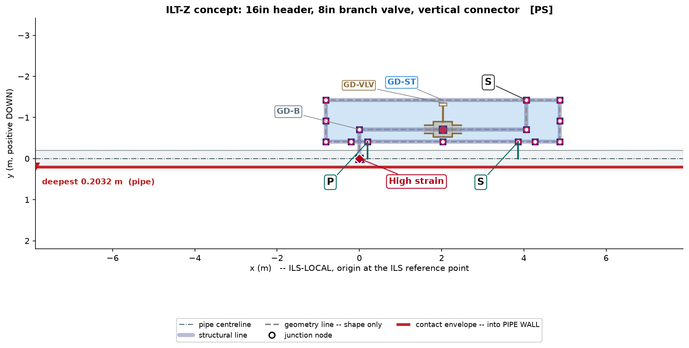

# Test Case 01 Conversation Record ILT Z Branch Valve

This markdown records the accepted paper test case in the sequence it occurred during the governed design interaction. It is intended as the source format for a later DOCX/report version.

## Case identity

| Field | Record |
|---|---|
| Test case | Test Case 01 |
| Topic | ILT-Z branch valve layout with vertical connector |
| Status | Accepted for paper recording |
| Plot artifact | `TEST_CASE_01_LAYOUT.png` |
| Layout input | `layout.json` |
| Plot report | `plot_report.json` |
| Parameter sidecar | `layout.parameters.csv` |
| Future study candidate | `knowledge/edikb/future_study_candidates/BRANCH_GEOMETRY_STRAIN_COVARIANCE_ILT_Z_01.json` |

## Conversation sequence

### Step 1 User query

> Provide an layout for following ILT:
>
> - 16inch Pipeline
> - 8inch Branch Pipe leading to Vertical Connector
> - 8inch Valve on the Branch
> - No Valves on the Header pipeline
> - 90m Stinger Radius with 150MT pipeline tension
>
> Provide info for
>
> - Possible max strain on Pipeline
> - Expected location of max strain

### Step 2 LLM response EDPR and remaining human actions

The LLM stated the human user's remaining actions before proceeding:

1. Confirm whether the branch line is a Z-branch ending in a vertical connector.
2. Confirm whether the 8 inch branch valve should be represented as an actual branch valve body, using estimated dimensions if exact dimensions are not available.
3. Confirm whether a top frame `GD-ST` is required around the branch valve and connector.
4. Confirm whether typical values may be used for missing details such as branch wall thickness, branch valve body size, connector body size, and component weights.
5. Confirm whether a layout plot is required after the concept proposal.

The LLM then emitted the problem understanding:

- The query describes a 16 inch header pipeline with an 8 inch branch pipe.
- The branch pipe leads to a vertical connector.
- The branch contains an 8 inch valve.
- There is no valve on the header pipeline.
- The installation basis is 90 m stinger radius and 150 MT pipeline tension.
- The user requested a layout proposal, possible maximum pipeline strain, and expected location of maximum strain.

The LLM mapped the problem to EDAS terms:

- A branch pipe leading to a vertical connector should normally use a `GD-B` Z-branch layout.
- A simple straight vertical branch is not sufficient.
- Because the valve is on the branch, not the header, a header base structure `GD-SB` is not automatically required.
- The branch valve and vertical connector should be contained within a top structure `GD-ST` unless the user confirms otherwise.
- For low-strain intent, the default connection system should avoid unjustified high-stiffness `F2` or `F2D`.
- A `P-S` style support basis is preferred unless evidence justifies fixed supports.

The LLM proposed the likely concept after confirmation:

| Item | Proposed representation |
|---|---|
| Header | `GD-HdPipe`, 16 inch pipeline |
| Branch assembly | `GD-B`, Z-branch variant |
| Branch valve | Represented on the branch horizontal leg, with valve body shown in plot |
| Top frame | `GD-ST`, sized to contain branch tee, branch valve, and vertical connector end |
| Support connection | Prefer `S` at branch/top-frame vertical connector unless fixed connection is justified |
| Header/top-frame connector system | Prefer low-strain `P-S` rather than defaulting to `F2` |
| Base structure | No `GD-SB` because there is no header valve or header component needing roller protection |

The LLM gave a screening strain statement:

- Possible maximum pipeline strain: approximately `0.4% to 0.7%`.
- This was stated as a screening estimate only, not an FEA result.
- Expected maximum strain location: header near the branch tee / local stiffness entry region.
- Secondary watch locations: near the `GD-ST` connector load-transfer points.

The LLM then asked the user to confirm the five human actions before producing the final layout proposal and plot.

### Step 3 User response confirmation

> 1) confirmed to end with vertical connector
> 2) Use estimated dimensions
> 3) Yes Top frame required
> 4) Use typical
> 5) Layout plot required

### Step 4 LLM response layout generation and plot

The LLM proceeded with the governed layout step, using typical and estimated dimensions.

The generated concept used:

| Design element | Selected representation | Basis |
|---|---|---|
| Header pipeline | `GD-HdPipe`, 16 inch OD | Base pipeline for local ILT assembly |
| Branch assembly | `GD-B`, Z variant | Vertical connector requires a Z-branch |
| Branch valve | Represented on the `GD-B` branch run using estimated dimensions and `GD-VLV` visual grammar | Valve is on the branch and must be visible for review |
| Top frame | `GD-ST` around branch tee, valve, and branch end | Required by user and by branch-valve containment rule |
| Connection system | `PS` intent | Avoid unjustified `F2/F2D` stiffness unless evidence supports it |
| Branch/top-frame tie | `S` connection from `B.end` to `ST.top1` | Vertical branch connector anchored to top frame using sliding support intent |
| Base structure | Not provided | No header valve or header component requiring roller-contact protection |

The LLM generated a deterministic plot using the repository plotter.



The LLM reported:

| Item | Statement |
|---|---|
| Possible max pipeline strain | Approximately `0.4% to 0.7%` |
| Estimate status | Screening estimate only, not FEA |
| Expected primary location | Header near the branch tee / local stiffness entry region |
| Secondary watch locations | Near top-frame connector load-transfer points |
| Plot QA | Passed with automatic label corrections |
| High-strain marker | Included and anchored to `B.tee` |
| Remaining warning | Simplified connector representation; full `GD-Con` connector bodies and pipe-landing associations are not explicitly modelled |

The LLM then asked for human review of:

1. Branch valve placement.
2. `P` / `S` label visibility and location.
3. `High strain` marker location.
4. Whether the concept could be recorded as the first paper test case.

### Step 5 User response acceptance and recording instruction

> 1. Acceptable
> 2. Correct
> 3. Acceptable
> 4. Record the case and give it in a doc format with information and plots embedded in Table and Figures.
>
> Note this for future studies. The geometrical parameters of the Branch pipe could be affecting strains. This need to be studied further incase there is no sufficient data available

### Step 6 LLM response record creation

The LLM recorded the accepted case as a paper test case package and created a DOCX report.

The following files were produced:

| Artifact | Path |
|---|---|
| DOCX report | `TEST_CASE_01_ILT_Z_BRANCH_VALVE_REPORT.docx` |
| Plot image | `TEST_CASE_01_LAYOUT.png` |
| Layout input | `layout.json` |
| Plot report | `plot_report.json` |
| Parameter sidecar | `layout.parameters.csv` |
| Test case README | `README.md` |

The LLM also recorded the future-study candidate:

| Field | Record |
|---|---|
| Candidate ID | `future_study:branch_geometry_strain_covariance_ilt_z_01` |
| Candidate file | `knowledge/edikb/future_study_candidates/BRANCH_GEOMETRY_STRAIN_COVARIANCE_ILT_Z_01.json` |
| Study need | Branch pipe geometry influence on header strain for ILT-Z branch valve layouts |
| Reason | The accepted test used typical branch geometry, and expert review noted that branch geometry may affect pipeline strain. |
| Before design claim | Do not claim optimized branch geometry or connector spacing unless supported by EDIKB dataset rows, FEA DOE, or validated ML/correlation evidence. |

The LLM committed the case locally:

```text
997097a Record paper test case 01 branch valve layout
```

The repository was left ahead of `origin/main` by one commit at that point.

## Accepted case summary

The accepted solution is an `ILT-Z` branch-valve concept for a 16 inch header with an 8 inch branch and vertical connector. The branch valve is represented on the `GD-B` branch run and contained within `GD-ST`. The concept uses `PS` intent rather than unjustified `F2/F2D`, and the likely high-strain location is marked at the branch tee / local stiffness entry region.

The case is accepted for paper recording as a concept-level workflow result. It is not a final engineering design claim because the connector detailing is simplified and the strain value is a screening estimate rather than a validated FEA result.

## Future study note

Branch pipe geometry parameters may influence header strain and branch strain. The following variables should be considered for future FEA, DOE, ML, or correlation study if adequate EDIKB evidence is not already available:

- `GD-B.P_b1`, branch horizontal length.
- `GD-B.P_b2`, vertical connector height.
- `GD-B.P_b3`, intermediate Z-branch rise.
- `GD-B.P_bv`, branch valve station.
- Branch OD and wall thickness.
- `GD-ST.L_top` and `GD-ST.H_top`.
- Top-frame connector spacing and connection system.
- Branch valve mass and connector mass.
- Stinger radius and pipeline tension.

The future study should resolve whether these variables materially affect peak header strain, branch strain, connector reactions, and strain redistribution outside the `GD-ST` span.
