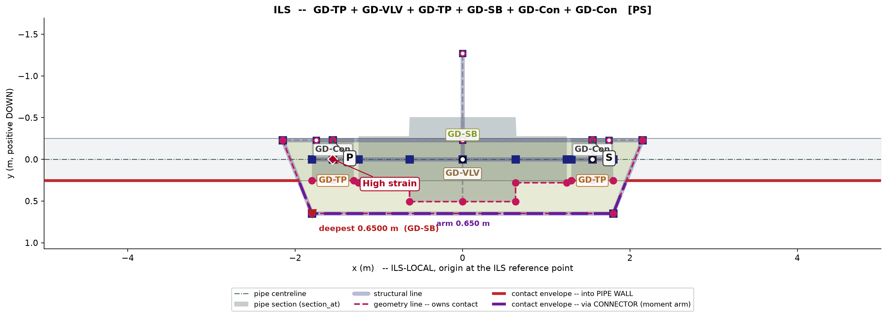

# Test Case 02: Inline valve protected by fitted GD-SB base

## 1. User query

Design a layout for below Inline structure:

- 20 inch Pipeline
- 20 inch Valve on the Headerline
- Valve cannot contact the stinger

## 2. LLM response: EDPR problem understanding

The query was interpreted as an inline ILT layout with a 20 inch header pipeline and a 20 inch valve welded inline on the header line. Since the valve cannot contact the stinger, the valve should not ride rollers and should not take roller reaction directly. The roller-contact path should therefore be transferred to a base structure below the valve region.

The LLM requested confirmation of the following design-basis items before generating the layout:

| Item | Confirmation requested |
|---|---|
| 1 | Whether the valve can neither ride rollers nor take roller reaction |
| 2 | Whether GD-SB base structure is acceptable as the protection method |
| 3 | Whether typical valve body dimensions may be used |
| 4 | Whether the design objective is minimum added strain and bending moment |
| 5 | Whether a standard layout plot is required |

## 3. User response

| Item | User confirmation |
|---|---|
| 1 | Cannot take reaction, nor ride |
| 2 | GD-SB is acceptable |
| 3 | Use typical dimensions |
| 4 | Target minimal strain and moment |
| 5 | Plot required |

## 4. LLM response: layout proposal

The accepted concept uses an inline GD-VLV valve protected by a fitted GD-SB base structure. The valve remains welded inline with the 20 inch header. The GD-SB base is placed below the valve so stinger roller contact is taken by the base structure instead of the valve body.

The base is fitted to the valve envelope with only the clearance needed for protection. This avoids unnecessary vertical offset, since EDIKB/KEL evidence records that larger support elevation offsets can increase pipeline strain.

A P-S connector system is used. The support connectors are placed outside the valve envelope and land on short GD-TP connector landing bodies through explicit GD-Con connector elements. The support connectors are not attached directly to the valve end node or to plain header pipe.

## 5. Gate check result

| Gate | Result |
|---|---|
| Header valve protection | Passed: GD-SB provided |
| Valve roller contact avoidance | Passed: valve does not take contact |
| GD-SB envelope sizing | Passed: base fitted to valve envelope |
| GD-SB elevation and strain check | Passed: base depth kept limited |
| Connector landing rule | Passed: support connectors land on GD-TP through GD-Con |
| Plot label rule | Passed after correction: one visible P and one visible S label |

## 6. Plot review feedback and correction

The first corrected plot showed repeated P and S labels. This was identified as a plotter issue rather than an assembly build error. The assembly had only two physical connector elements, CON_P and CON_S, but the plotter labelled the same connector from multiple sources: the active GD-SB slot, the pipe-side GD-Con association, and the structure-side GD-Con association.

The plotter was corrected so one physical GD-Con produces one visible connection label. The structure-side association is used as the authoritative human-review label:

| Connector | Final visible label |
|---|---|
| CON_P | P |
| CON_S | S |

The user also asked about the small element between the valve end and GD-TP. This was confirmed to be an intentional GD-TP connector landing body required by EDAS, not a stray plot element. The support connector must land on a connector-host body rather than directly on the valve end or plain header pipe.

## 7. Accepted plot

**Figure 1.** Accepted inline valve layout with fitted GD-SB base, GD-TP landing bodies, and explicit GD-Con P-S connectors.

## 8. User acceptance

The user confirmed:

| Review item | User response |
|---|---|
| GD-SB depth acceptable | Yes |
| GD-TP landing bodies acceptable | Yes |
| P and S labels clear and non-duplicated | Yes |
| Record as second worked test case | Yes |

## 9. Paper-ready concise summary

This case demonstrates the governed workflow for an inline valve that cannot contact stinger rollers. The EDPR step first converted the compact user query into explicit design-basis confirmations. The resulting layout used a GD-SB base structure to transfer roller contact below the valve region while keeping the base depth limited to avoid unnecessary elevation-induced strain. EDAS connector rules required support loads to pass through explicit GD-Con connectors landing on GD-TP connector-host bodies rather than on the valve end or plain header pipe. The final plot was accepted after correcting duplicate P/S plot labels so that one physical GD-Con produces one visible connection label.

## 10. Files in this record

| File | Purpose |
|---|---|
| TEST_CASE_02_LAYOUT.png | Accepted plot image |
| layout.json | Accepted layout definition |
| plot_report.json | Plotter/assembly report |
| workflow_report.json | EDAS/KEL workflow gate report |
| layout.parameters.csv | Parameter list for the accepted layout |
